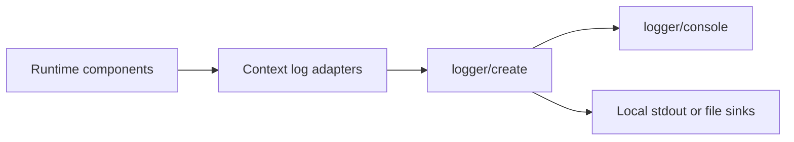
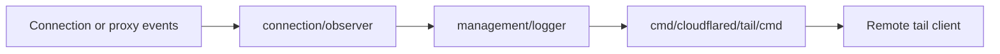
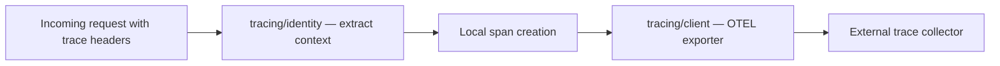
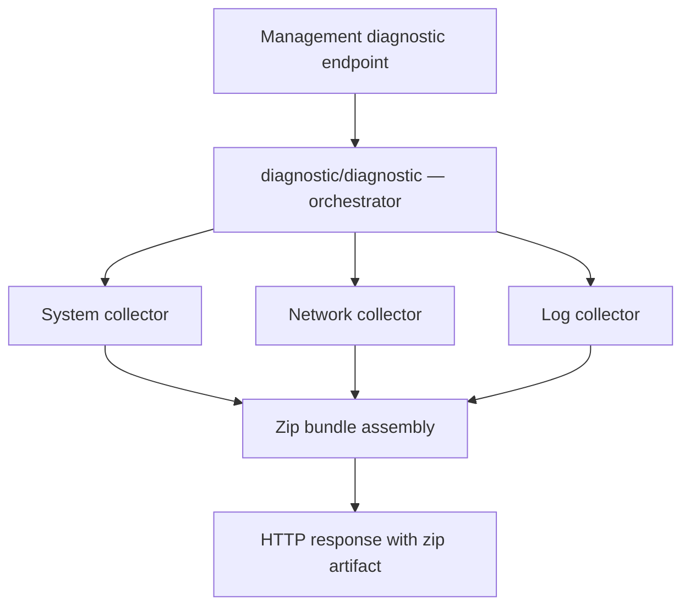

# Observability Behavior Catalog

- Baseline date: 20260321
- Baseline reference: [cloudflare/cloudflared/tree/2026.3.0](https://github.com/cloudflare/cloudflared/tree/2026.3.0)
- Primary evidence set: behavior atoms under [../atoms](../../atoms)

## Scope

This catalog records observability behavior represented in the baseline atom corpus.

Observability for this catalog includes:

- logging surfaces and logger configuration paths,
- tracing identity, propagation, and exporter paths,
- diagnostic artifact collection and report assembly paths,
- observer adapters that expose runtime state to telemetry/logging pipelines.

## Observability Domains

| Domain | Description | Representative atoms |
| --- | --- | --- |
| Logging | Logger construction, formatting, and specialized logging facades. | [logger/create](../../atoms/logger/create.md), [logger/configuration](../../atoms/logger/configuration.md), [proxy/logger](../../atoms/proxy/logger.md), [management/logger](../../atoms/management/logger.md), [supervisor/conn_aware_logger](../../atoms/supervisor/conn_aware_logger.md) |
| Tracing | Trace context parsing, identity handling, and OTEL exporter/propagation paths. | [tracing/tracing](../../atoms/tracing/tracing.md), [tracing/client](../../atoms/tracing/client.md), [tracing/identity](../../atoms/tracing/identity.md) |
| Diagnostics | System, network, and log collection orchestration and diagnostic handlers. | [diagnostic/diagnostic](../../atoms/diagnostic/diagnostic.md), [diagnostic/handlers](../../atoms/diagnostic/handlers.md), [diagnostic/system_collector](../../atoms/diagnostic/system_collector.md), [diagnostic/network/collector](../../atoms/diagnostic/network/collector.md), [diagnostic/log_collector](../../atoms/diagnostic/log_collector.md) |
| Observation adapters | Runtime observation bridge points used by metrics or logging pipelines. | [connection/observer](../../atoms/connection/observer.md), [cmd/cloudflared/tail/cmd](../../atoms/cmd/cloudflared/tail/cmd.md) |

## Logging Topologies

### Local Logging Path

Local logging captures process-local events and emits operator-facing structured/console output.

Primary evidence atoms: [logger/create](../../atoms/logger/create.md), [logger/console](../../atoms/logger/console.md), [proxy/logger](../../atoms/proxy/logger.md), [supervisor/conn_aware_logger](../../atoms/supervisor/conn_aware_logger.md).

### Upstream and Logstream Path

Upstream/logstream logging represents event/log propagation to remote management stream consumers.

Primary evidence atoms: [management/logger](../../atoms/management/logger.md), [cmd/cloudflared/tail/cmd](../../atoms/cmd/cloudflared/tail/cmd.md), [connection/observer](../../atoms/connection/observer.md).

### Upstream Logging Contract and Formats

Upstream/logstream behavior has explicit contracts and output formats in the covered atoms:

| Contract surface | Evidence atom | Contract and format specifics |
| --- | --- | --- |
| Writer contract | [management/logger](../../atoms/management/logger.md) | Implements `Write(p []byte)` and `WriteLevel(level, p)` with structured event parsing via `parseZerologEvent(p []byte) -> (*Log, error)`. |
| Stream payload type | [cmd/cloudflared/tail/cmd](../../atoms/cmd/cloudflared/tail/cmd.md) | Tail stream handlers consume `*management.Log`; rendering functions split output into `printLine` (human-readable line format) and `printJSON` (JSON format). |
| Filter contract | [cmd/cloudflared/tail/cmd](../../atoms/cmd/cloudflared/tail/cmd.md) | `parseFilters(c *cli.Context) -> (*management.StreamingFilters, error)` defines CLI-to-stream filter shaping before upstream subscription. |
| Event relay contract | [connection/observer](../../atoms/connection/observer.md) | Observer exposes sink registration and event dispatch (`RegisterSink`, `sendEvent`, `dispatchEvents`) to feed management-side logging consumers. |

- Format note: the upstream path explicitly supports two operator-facing renderings at the tail consumer edge, line and JSON, via `printLine` and `printJSON`.
- Validation note: upstream request/response error formatting on tail setup is surfaced via `handleValidationError(resp, log)` in the tail command atom.

## Tracing Architecture

The tracing subsystem provides distributed trace context propagation, identity correlation, and OTEL exporter integration across tunnel connections.

### Trace Identity and Context

Trace context enters cloudflared via incoming request headers (W3C `traceparent`/`tracestate` or Cloudflare-specific `Cf-Trace-Id`) and is propagated through proxy and RPC paths.

Primary evidence atoms: [tracing/tracing](../../atoms/tracing/tracing.md), [tracing/identity](../../atoms/tracing/identity.md).

| Surface | Contract |
| --- | --- |
| Identity extraction | `tracing/identity` parses trace context from HTTP headers and materializes a `TracingIdentity` with span context and attribute propagation. |
| Propagation scope | Trace context is forwarded through proxy request chains and RPC session registration calls (session register carries trace context as a parameter). |
| Exporter lifecycle | `tracing/client` manages OTEL exporter construction and shutdown with context-bounded flush semantics. |

### Exporter Pipeline

Primary evidence atoms: [tracing/client](../../atoms/tracing/client.md), [tracing/tracing](../../atoms/tracing/tracing.md), [tracing/identity](../../atoms/tracing/identity.md).

## Diagnostic Collection Pipelines

Diagnostic collection orchestrates system, network, and log artifact gathering into a single compressed report bundle. The pipeline is invoked through the management diagnostic handler and adapts collection strategy per platform.

### Collection Orchestration

| Collector | Scope | Platform adaptation |
| --- | --- | --- |
| System collector | OS version, memory, disk, CPU info | Linux (`/proc`), macOS (`sysctl`), Windows (WMI) — see [diagnostic/system_collector_linux](../../atoms/diagnostic/system_collector_linux.md), [diagnostic/system_collector_macos](../../atoms/diagnostic/system_collector_macos.md), [diagnostic/system_collector_windows](../../atoms/diagnostic/system_collector_windows.md) |
| Network collector | Connectivity checks, traceroute, DNS probes | Unix vs Windows socket strategies — see [diagnostic/network/collector_unix](../../atoms/diagnostic/network/collector_unix.md), [diagnostic/network/collector_windows](../../atoms/diagnostic/network/collector_windows.md) |
| Log collector | Recent cloudflared log lines from runtime or container/host sources | Host files, Docker API, Kubernetes API — see [diagnostic/log_collector_host](../../atoms/diagnostic/log_collector_host.md), [diagnostic/log_collector_docker](../../atoms/diagnostic/log_collector_docker.md), [diagnostic/log_collector_kubernetes](../../atoms/diagnostic/log_collector_kubernetes.md) |

### Diagnostic Handler Flow

Primary evidence atoms: [diagnostic/diagnostic](../../atoms/diagnostic/diagnostic.md), [diagnostic/handlers](../../atoms/diagnostic/handlers.md), [diagnostic/system_collector](../../atoms/diagnostic/system_collector.md), [diagnostic/network/collector](../../atoms/diagnostic/network/collector.md), [diagnostic/log_collector](../../atoms/diagnostic/log_collector.md).

### Collection Utility Contracts

| Utility | Role |
| --- | --- |
| [diagnostic/diagnostic_utils](../../atoms/diagnostic/diagnostic_utils.md) | Shared helpers for artifact naming, zip entry construction, and timeout-bounded collection. |
| [diagnostic/system_collector_utils](../../atoms/diagnostic/system_collector_utils.md) | Cross-platform system info normalization (memory units, disk format, CPU model extraction). |
| [diagnostic/log_collector_utils](../../atoms/diagnostic/log_collector_utils.md) | Log source detection heuristics and line-count bounded tail extraction. |
| [diagnostic/network/collector_utils](../../atoms/diagnostic/network/collector_utils.md) | Network probe result formatting and connectivity check aggregation. |
| [diagnostic/error](../../atoms/diagnostic/error.md) | Diagnostic-specific error types for collector failures and partial-result signaling. |
| [diagnostic/client](../../atoms/diagnostic/client.md) | HTTP client for invoking diagnostic endpoints on remote cloudflared instances. |
| [diagnostic/consts](../../atoms/diagnostic/consts.md) | Timeout, path, and batch-size constants governing collection behavior. |

## Full Coverage Links

- [cmd/cloudflared/tail/cmd](../../atoms/cmd/cloudflared/tail/cmd.md)
- [connection/observer](../../atoms/connection/observer.md)
- [diagnostic/client](../../atoms/diagnostic/client.md)
- [diagnostic/consts](../../atoms/diagnostic/consts.md)
- [diagnostic/diagnostic](../../atoms/diagnostic/diagnostic.md)
- [diagnostic/diagnostic_utils](../../atoms/diagnostic/diagnostic_utils.md)
- [diagnostic/error](../../atoms/diagnostic/error.md)
- [diagnostic/handlers](../../atoms/diagnostic/handlers.md)
- [diagnostic/log_collector_docker](../../atoms/diagnostic/log_collector_docker.md)
- [diagnostic/log_collector_host](../../atoms/diagnostic/log_collector_host.md)
- [diagnostic/log_collector_kubernetes](../../atoms/diagnostic/log_collector_kubernetes.md)
- [diagnostic/log_collector](../../atoms/diagnostic/log_collector.md)
- [diagnostic/log_collector_utils](../../atoms/diagnostic/log_collector_utils.md)
- [diagnostic/network/collector](../../atoms/diagnostic/network/collector.md)
- [diagnostic/network/collector_unix](../../atoms/diagnostic/network/collector_unix.md)
- [diagnostic/network/collector_utils](../../atoms/diagnostic/network/collector_utils.md)
- [diagnostic/network/collector_windows](../../atoms/diagnostic/network/collector_windows.md)
- [diagnostic/system_collector_linux](../../atoms/diagnostic/system_collector_linux.md)
- [diagnostic/system_collector_macos](../../atoms/diagnostic/system_collector_macos.md)
- [diagnostic/system_collector](../../atoms/diagnostic/system_collector.md)
- [diagnostic/system_collector_utils](../../atoms/diagnostic/system_collector_utils.md)
- [diagnostic/system_collector_windows](../../atoms/diagnostic/system_collector_windows.md)
- [logger/configuration](../../atoms/logger/configuration.md)
- [logger/console](../../atoms/logger/console.md)
- [logger/create](../../atoms/logger/create.md)
- [management/logger](../../atoms/management/logger.md)
- [proxy/logger](../../atoms/proxy/logger.md)
- [supervisor/conn_aware_logger](../../atoms/supervisor/conn_aware_logger.md)
- [tracing/client](../../atoms/tracing/client.md)
- [tracing/identity](../../atoms/tracing/identity.md)
- [tracing/tracing](../../atoms/tracing/tracing.md)

## Upstream-Verified Observability Quirks

### Zerolog as Foundation

All logging surfaces use `github.com/rs/zerolog` as the structured logging backend. Key implications:

- Log levels: `debug`, `info`, `warn`, `error`, `fatal`, `panic` (zerolog's native level set)
- Structured fields via `.With()` fluent API
- `ConnAwareLogger` wraps zerolog and injects connection-index context into all log entries from supervisor tunnel workers

### Sentry Integration

Stream pipe panics in [stream/stream.go](https://github.com/cloudflare/cloudflared/blob/2026.3.0/stream/stream.go) report to Sentry via `sentry.CurrentHub().Recover(err)` with a 5-second flush timeout. This is the only direct Sentry usage observed in the transport layer.

### Diagnostic Collection Timeout Behavior

All diagnostic collectors accept a `context.Context` parameter. If the context is cancelled mid-collection (e.g., CLI timeout), the collector returns whatever partial results were gathered plus the context error. This means diagnostic zip bundles may be incomplete under time pressure.

## Notes

- This catalog is intentionally evidence-linked and avoids inferring observability semantics that are not described by atom contracts.
- Metrics-heavy atoms are cataloged separately in [metrics](metrics.md); overlap is allowed where a single atom participates in both instrumentation and observability concerns.

## Coverage Audit

- Audit method: collect atom docs under [../atoms/diagnostic](../../atoms/diagnostic), [../atoms/logger](../../atoms/logger), and [../atoms/tracing](../../atoms/tracing), plus explicit observer/logger adapters listed in this file, then diff against all atom links in this catalog.
- Current coverage result: 31 observability-scoped atom docs found, 31 linked in catalog, 0 missing.
- Delta (catalog links - observability-scoped atom docs): 0.
- Operational guardrail: if observability-bearing atoms are added, rerun this audit and update this file in the same change.
