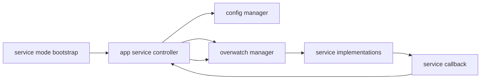
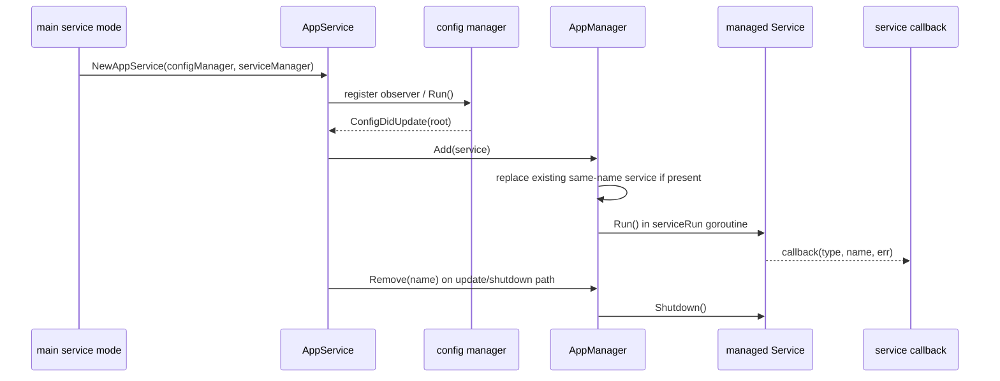
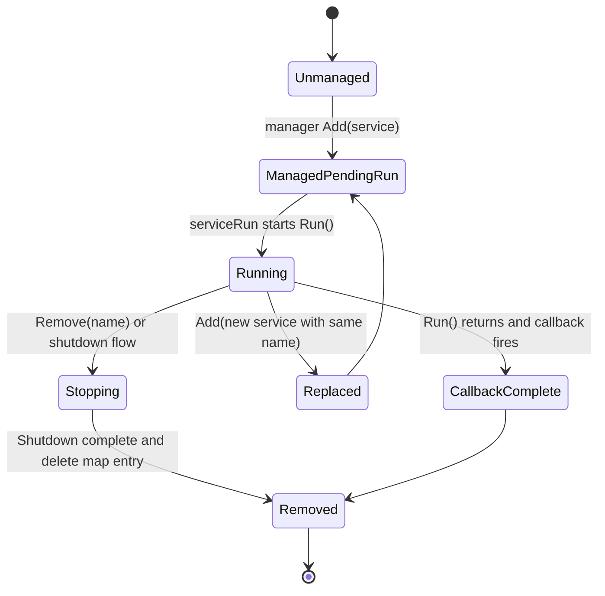
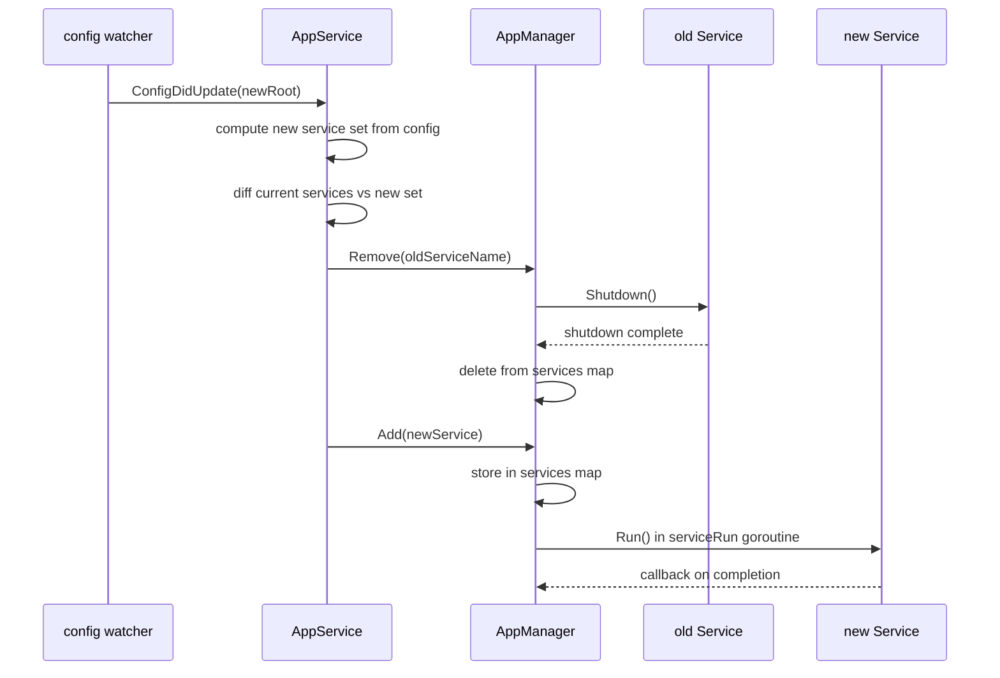

# Overwatch Behavior Catalog

- Baseline date: 20260321
- Baseline reference: [cloudflare/cloudflared/tree/2026.3.0](https://github.com/cloudflare/cloudflared/tree/2026.3.0)
- Primary evidence set: behavior atoms under [../atoms](../../atoms)
- Upstream recheck: overwatch control contracts revalidated against tag `2026.3.0` source anchors for [overwatch/manager.go](https://github.com/cloudflare/cloudflared/blob/2026.3.0/overwatch/manager.go), [atoms/overwatch/manager](../../atoms/overwatch/manager.md), [overwatch/app_manager.go](https://github.com/cloudflare/cloudflared/blob/2026.3.0/overwatch/app_manager.go), [atoms/overwatch/app_manager](../../atoms/overwatch/app_manager.md), [cmd/cloudflared/main.go](https://github.com/cloudflare/cloudflared/blob/2026.3.0/cmd/cloudflared/main.go), [atoms/cmd/cloudflared/main](../../atoms/cmd/cloudflared/main.md), and [cmd/cloudflared/app_service.go](https://github.com/cloudflare/cloudflared/blob/2026.3.0/cmd/cloudflared/app_service.go), [atoms/cmd/cloudflared/app_service](../../atoms/cmd/cloudflared/app_service.md).

## Scope

This catalog is the dedicated service-orchestration view centered on the `overwatch` module and its runtime callers.

For this catalog, overwatch behavior includes:

- core service contract interfaces (`Service`, `Manager`),
- default manager behavior for add/remove/run/service listing,
- callback-driven runloop completion signaling,
- config-driven service replacement through app-service integration,
- service-mode bootstrap paths that instantiate and drive overwatch manager flows,
- lifecycle/state boundaries for service registry mutation and controlled shutdown.

Out of scope:

- tunnel transport differences in [tunnels-transport](tunnels-transport.md),
- full CLI command taxonomy in [cli](cli.md),
- broader supervisor connection orchestration in [supervisor](supervisor.md).

## Overwatch Topology

## Service Lifecycle Sequence

## Core Contract Inventory

| Contract | Kind | Behavior |
| --- | --- | --- |
| `Service` | interface | Managed unit exposes `Name`, `Type`, `Hash`, `Shutdown`, and `Run` contracts. |
| `Manager` | interface | Registry surface supports `Add`, `Remove`, and `Services` operations. |
| `AppManager` | struct | Default manager implementation with map-backed service registry and callback wiring. |
| `ServiceCallback` | function type | Invoked on service run completion with service type/name and optional error. |

Primary evidence: [atoms/overwatch/manager](../../atoms/overwatch/manager.md), [atoms/overwatch/app_manager](../../atoms/overwatch/app_manager.md).

## Controller-Object Behavior Matrix

| Controller object | Owned state | Lifecycle contract |
| --- | --- | --- |
| `AppManager.services` | `map[string]Service` by service name | `Add` replaces existing service of same name, `Remove` shuts down then deletes, `Services` snapshots current managed values. |
| `AppManager.callback` | optional completion hook | `serviceRun` forwards terminal run result to callback when present. |
| `AppService` | config observer channel + shutdown channel + manager reference | receives config updates, computes service set changes, and applies `Add`/`Remove` against manager. |

Primary evidence: [atoms/overwatch/app_manager](../../atoms/overwatch/app_manager.md), [atoms/cmd/cloudflared/app_service](../../atoms/cmd/cloudflared/app_service.md).

## State Progression Model

## Integration Contracts

| Integration surface | Overwatch interaction | Representative atoms |
| --- | --- | --- |
| Service-mode bootstrap | Root service-mode path creates manager and app-service orchestration context. | [atoms/cmd/cloudflared/main](../../atoms/cmd/cloudflared/main.md), [atoms/cmd/cloudflared/app_service](../../atoms/cmd/cloudflared/app_service.md) |
| Config mutation path | Config updates trigger app-service handling that mutates managed service set via manager operations. | [atoms/cmd/cloudflared/app_service](../../atoms/cmd/cloudflared/app_service.md), [atoms/config/manager](../../atoms/config/manager.md) |
| Managed-service runtime | Each managed service runs with callback-backed completion notification and optional replacement semantics. | [atoms/overwatch/app_manager](../../atoms/overwatch/app_manager.md), [atoms/overwatch/manager](../../atoms/overwatch/manager.md) |

## Shared-State and Concurrency Overlap

| Overlap catalog | Shared concern | Evidence |
| --- | --- | --- |
| [shared-state](shared-state.md) | map-backed registry mutation + asynchronous runloop completion callback is shared-state coordination. | [atoms/overwatch/app_manager](../../atoms/overwatch/app_manager.md), [atoms/cmd/cloudflared/app_service](../../atoms/cmd/cloudflared/app_service.md) |
| [state-machines](state-machines.md) | service add/run/remove transitions and callback terminal states are explicit lifecycle machine edges. | [atoms/overwatch/app_manager](../../atoms/overwatch/app_manager.md) |
| [cli](cli.md) | service-mode entrypoint decides when overwatch-managed app lifecycle is activated. | [atoms/cmd/cloudflared/main](../../atoms/cmd/cloudflared/main.md) |

## Failure and Shutdown Semantics

| Pattern | Contracted behavior |
| --- | --- |
| Replace-on-add | adding a service with an existing name triggers prior service shutdown before replacement run. |
| Remove semantics | remove path performs shutdown for existing service and always deletes registry entry. |
| Callback error propagation | run completion error is surfaced through callback parameters, allowing caller-defined terminal policy. |
| Service-mode teardown | app-service shutdown path delegates to manager/service shutdown contracts, preserving controlled stop behavior. |

Primary evidence: [atoms/overwatch/app_manager](../../atoms/overwatch/app_manager.md), [atoms/cmd/cloudflared/app_service](../../atoms/cmd/cloudflared/app_service.md), [atoms/cmd/cloudflared/main](../../atoms/cmd/cloudflared/main.md).

## Full Coverage Links

### Core overwatch atom set (2)

- [overwatch/app_manager](../../atoms/overwatch/app_manager.md)
- [overwatch/manager](../../atoms/overwatch/manager.md)

### Integration overlap atom set (3)

- [cmd/cloudflared/app_service](../../atoms/cmd/cloudflared/app_service.md)
- [cmd/cloudflared/main](../../atoms/cmd/cloudflared/main.md)
- [config/manager](../../atoms/config/manager.md)

## Upstream-Verified Overwatch Interface Contracts

### Service Interface Surface

The `Service` interface in [overwatch/manager.go](https://github.com/cloudflare/cloudflared/blob/2026.3.0/overwatch/manager.go) defines the minimal contract for managed services:

| Method | Return | Semantics |
| --- | --- | --- |
| `Name()` | `string` | Unique service identifier |
| `Type()` | `string` | Service category (e.g., tunnel, dns-proxy) |
| `Hash()` | `string` | Configuration fingerprint for change detection |
| `Shutdown()` | — | Graceful stop signal |
| `Run()` | `error` | Blocking service execution; error on abnormal exit |

### Manager Interface Surface

The `Manager` interface is intentionally minimal (3 methods):

| Method | Semantics |
| --- | --- |
| `Add(Service)` | Register and start a service |
| `Remove(string)` | Stop and unregister by name |
| `Services()` | List currently managed services |

Quirk — **Hash-based change detection**: `AppManager` (the concrete implementation) uses `Service.Hash()` to determine whether an `Add()` call is a no-op (same config) or requires a restart cycle. This means services must produce stable, deterministic hashes from their configuration to avoid spurious restarts.

Quirk — **Minimal surface by design**: the entire overwatch/manager.go file is 17 lines with only interface declarations, no implementation logic. The concrete `AppManager` in [overwatch/app_manager.go](https://github.com/cloudflare/cloudflared/blob/2026.3.0/overwatch/app_manager.go) holds the actual goroutine management and callback-driven lifecycle.

## Config-Driven Service Replacement

When a config update arrives, it triggers a cascading replacement sequence in the overwatch manager.

## Rust Porting Considerations

### Interface-to-Trait Translation

| Go interface | Rust trait | Key difference |
| --- | --- | --- |
| `Service` (5 methods) | `trait Service: Send + Sync` | Must be object-safe for `dyn Service` storage; `Run` returns `Result<(), Error>` |
| `Manager` (3 methods) | `trait Manager: Send + Sync` | `Services()` returns owned `Vec` vs Go slice of interface values |
| `ServiceCallback` function type | `Box<dyn Fn(ServiceType, &str, Option<Error>) + Send>` | Or use `tokio::sync::mpsc` channel for completion notification |

### Goroutine-to-Task Mapping

The `serviceRun` goroutine spawned per managed service maps to a `tokio::spawn` task:

| Go pattern | Rust pattern |
| --- | --- |
| `go am.serviceRun(svc)` | `tokio::spawn(async move { svc.run().await })` |
| Callback invocation on run completion | `JoinHandle` result or channel send |
| Panic in service goroutine is unrecoverable | `JoinHandle` captures panic; supervisor decides policy |
| No explicit goroutine tracking | `JoinSet` or `HashMap<String, JoinHandle>` for tracked shutdown |

### Map Registry Synchronization

The `services map[string]Service` protected by implicit Go single-goroutine access maps to Rust's explicit synchronization:

| Go pattern | Rust pattern |
| --- | --- |
| Map mutation in single-goroutine context | `RwLock<HashMap<String, Box<dyn Service>>>` |
| `Add` replaces same-name entry after shutdown | Lock → shutdown old → remove → insert new → unlock |
| `Services()` returns snapshot | `read()` lock and clone service list |
| `Remove` shuts down then deletes | Lock → `remove()` entry → drop lock → `shutdown().await` |

## Notes

- `overwatch` is intentionally small by code footprint but high leverage by control impact because it governs live service replacement and shutdown boundaries.
- Overlap with [shared-state](shared-state.md) and [state-machines](state-machines.md) is expected and documented, not avoided.
- The core `Service`/`Manager` interface contracts are the stability anchor for future service-mode evolution.

## Coverage Audit

- Audit method: include all atoms under `atoms/overwatch/**`, then include direct integration callers that import/instantiate overwatch manager paths in `cmd/cloudflared` service mode and app-service orchestration.
- Current result: 2 core overwatch atoms found and linked; 3 integration overlap atoms linked for end-to-end lifecycle context; 0 missing from declared sets.
- Operational guardrail: if `Service`/`Manager` interfaces, app-service config update flow, or service-mode bootstrap logic changes, update this catalog in the same change.
