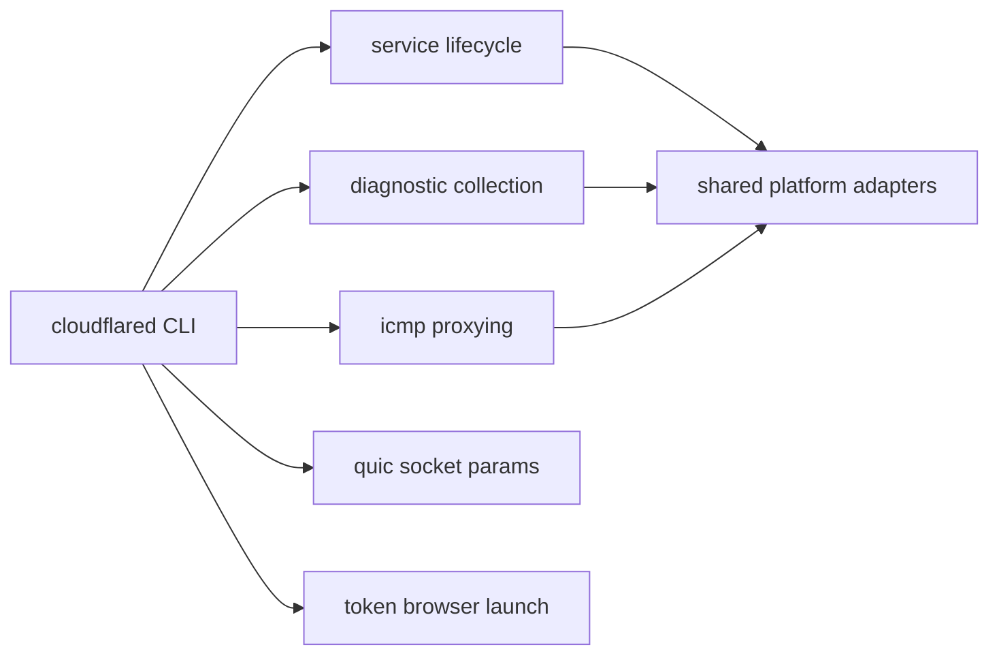
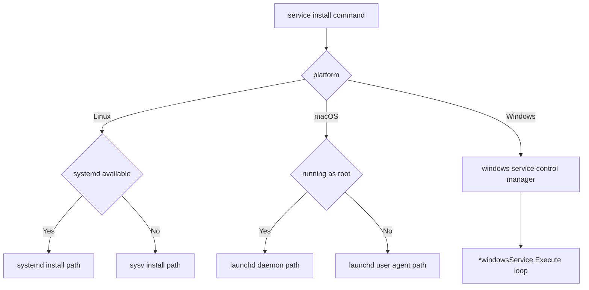
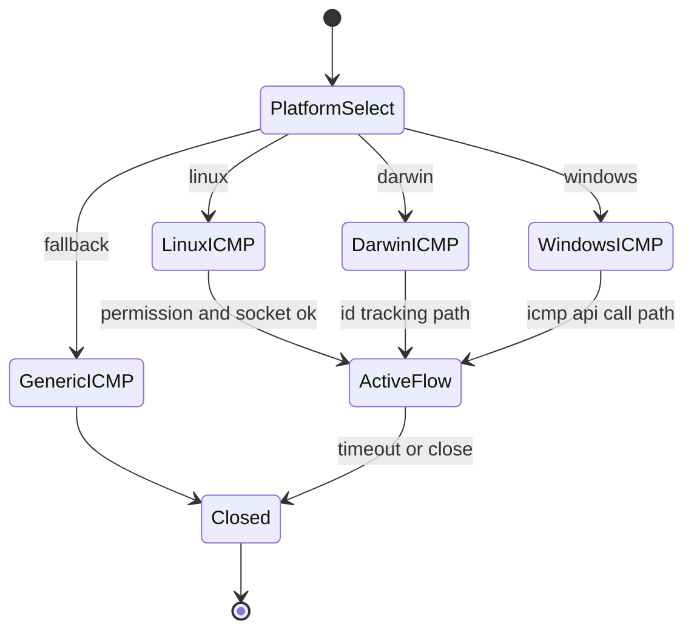
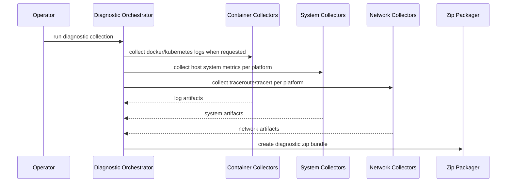

# Platforms Behavior Catalog

- Baseline date: 20260321
- Baseline reference: [cloudflare/cloudflared/tree/2026.3.0](https://github.com/cloudflare/cloudflared/tree/2026.3.0)
- Primary evidence set: behavior atoms under [../atoms](../../atoms)
- Upstream recheck: key platform contracts revalidated against tag `2026.3.0` source anchors for [cmd/cloudflared/linux_service.go](https://github.com/cloudflare/cloudflared/blob/2026.3.0/cmd/cloudflared/linux_service.go), [atoms/cmd/cloudflared/linux_service](../../atoms/cmd/cloudflared/linux_service.md), [cmd/cloudflared/windows_service.go](https://github.com/cloudflare/cloudflared/blob/2026.3.0/cmd/cloudflared/windows_service.go), [atoms/cmd/cloudflared/windows_service](../../atoms/cmd/cloudflared/windows_service.md), [cmd/cloudflared/macos_service.go](https://github.com/cloudflare/cloudflared/blob/2026.3.0/cmd/cloudflared/macos_service.go), [atoms/cmd/cloudflared/macos_service](../../atoms/cmd/cloudflared/macos_service.md), [ingress/icmp_linux.go](https://github.com/cloudflare/cloudflared/blob/2026.3.0/ingress/icmp_linux.go), [atoms/ingress/icmp_linux](../../atoms/ingress/icmp_linux.md), [ingress/icmp_windows.go](https://github.com/cloudflare/cloudflared/blob/2026.3.0/ingress/icmp_windows.go), [atoms/ingress/icmp_windows](../../atoms/ingress/icmp_windows.md), [diagnostic/system_collector_linux.go](https://github.com/cloudflare/cloudflared/blob/2026.3.0/diagnostic/system_collector_linux.go), [atoms/diagnostic/system_collector_linux](../../atoms/diagnostic/system_collector_linux.md), and [token/launch_browser_windows.go](https://github.com/cloudflare/cloudflared/blob/2026.3.0/token/launch_browser_windows.go), [atoms/token/launch_browser_windows](../../atoms/token/launch_browser_windows.md).

## Scope

This catalog documents platform-aware behavior in cloudflared runtime surfaces that diverge by OS, init system, container runtime, networking stack, and host utility availability.

For this catalog, platform behavior includes:

- service lifecycle management across Linux, macOS, and Windows,
- host/container diagnostics collection and command execution differences,
- ICMP handling and permission model divergence by OS,
- QUIC socket tuning split across Unix and Windows,
- token browser-launch dispatch across platform launchers,
- shared abstraction layers that normalize platform-specific branches.

Out of scope:

- tunnel lifecycle and protocol orchestration already detailed in [tunnels](tunnels.md),
- finite-state progression details already detailed in [state-machines](state-machines.md),
- observability-only inventories already detailed in [observabilities](observabilities.md),
- host boundary file-system/syscall/watcher-first detail now curated in [host-interactions](host-interactions.md),
- non-platform API contract inventory already detailed in [upstream-api-contracts](upstream-api-contracts.md).

## Platform Topology

## Service Lifecycle Flow

## ICMP Runtime Branching

## Diagnostics Collection Sequence

## Domain Map

| Domain | Description | Representative atoms |
| --- | --- | --- |
| Service platform adapters | Service install/uninstall and runtime control split by Linux init systems, macOS launchd context, and Windows SCM callbacks. | [cmd/cloudflared/common_service](../../atoms/cmd/cloudflared/common_service.md), [cmd/cloudflared/generic_service](../../atoms/cmd/cloudflared/generic_service.md), [cmd/cloudflared/linux_service](../../atoms/cmd/cloudflared/linux_service.md), [cmd/cloudflared/macos_service](../../atoms/cmd/cloudflared/macos_service.md), [cmd/cloudflared/windows_service](../../atoms/cmd/cloudflared/windows_service.md), [cmd/cloudflared/app_service](../../atoms/cmd/cloudflared/app_service.md), [cmd/cloudflared/app_forward_service](../../atoms/cmd/cloudflared/app_forward_service.md) |
| Container and host diagnostics | Docker/Kubernetes log collection, host log collection, and OS-specific system collection/parsing layers. | [diagnostic/log_collector_docker](../../atoms/diagnostic/log_collector_docker.md), [diagnostic/log_collector_kubernetes](../../atoms/diagnostic/log_collector_kubernetes.md), [diagnostic/log_collector_host](../../atoms/diagnostic/log_collector_host.md), [diagnostic/log_collector_utils](../../atoms/diagnostic/log_collector_utils.md), [diagnostic/system_collector](../../atoms/diagnostic/system_collector.md), [diagnostic/system_collector_linux](../../atoms/diagnostic/system_collector_linux.md), [diagnostic/system_collector_macos](../../atoms/diagnostic/system_collector_macos.md), [diagnostic/system_collector_windows](../../atoms/diagnostic/system_collector_windows.md), [diagnostic/system_collector_utils](../../atoms/diagnostic/system_collector_utils.md), [diagnostic/diagnostic_utils](../../atoms/diagnostic/diagnostic_utils.md) |
| Platform network diagnostics | Trace-route collection split for Unix and Windows output formats plus shared decode helpers. | [diagnostic/network/collector_unix](../../atoms/diagnostic/network/collector_unix.md), [diagnostic/network/collector_windows](../../atoms/diagnostic/network/collector_windows.md), [diagnostic/network/collector_utils](../../atoms/diagnostic/network/collector_utils.md) |
| ICMP platform runtime | ICMP forwarding split across Linux, Darwin, Windows, generic fallback, and POSIX-shared helpers. | [ingress/icmp_generic](../../atoms/ingress/icmp_generic.md), [ingress/icmp_posix](../../atoms/ingress/icmp_posix.md), [ingress/icmp_linux](../../atoms/ingress/icmp_linux.md), [ingress/icmp_darwin](../../atoms/ingress/icmp_darwin.md), [ingress/icmp_windows](../../atoms/ingress/icmp_windows.md), [ingress/icmp_metrics](../../atoms/ingress/icmp_metrics.md) |
| QUIC platform parameters | Platform-gated QUIC UDP parameter tuning by Unix and Windows implementations. | [quic/param_unix](../../atoms/quic/param_unix.md), [quic/param_windows](../../atoms/quic/param_windows.md) |
| Browser-launch dispatch | OAuth/login browser launch command dispatch split by Darwin, Unix, and Windows behavior. | [token/launch_browser_darwin](../../atoms/token/launch_browser_darwin.md), [token/launch_browser_unix](../../atoms/token/launch_browser_unix.md), [token/launch_browser_windows](../../atoms/token/launch_browser_windows.md) |

## Platform Conditional Matrix

| Surface | Linux | macOS | Windows | Fallback / shared behavior |
| --- | --- | --- | --- | --- |
| Service installation | systemd or sysv branches selected by runtime checks and install flags | launchd path split by root vs user contexts | Windows service manager registration plus recovery-option wiring | shared templates and common argument builders in service helper atoms |
| Service runtime control | daemon scripts and service control commands | launchd load/unload semantics | `Execute` loop handles SCM control requests and graceful stop | generic service abstractions keep command-level interfaces consistent |
| Host system diagnostics | procfs and Linux command parsing | sysctl and macOS tool output parsing | WMI/Windows command parsing | shared parse/util layers normalize output structures |
| Network diagnostics | traceroute format decoding | traceroute format decoding | tracert format decoding | shared collector utility decodes output stream line-by-line |
| ICMP tunneling | permission checks and raw socket flow loops | echo ID remapping with packet handlers | API-backed send/receive and response unmarshaling | generic and posix helpers provide compatibility layer |
| QUIC params | Unix defaults and socket options | inherited Unix branch | Windows-specific parameter branch | build-tag-gated files isolate target-specific tuning |
| Browser launch | unix launcher command path | `open` command path | Windows shell launch command path | shared token flow invokes platform-specific launcher implementation |

## Key Lifecycle Contracts

| Contract area | Platform-specific behavior |
| --- | --- |
| Linux service branch | Linux service install chooses systemd or sysv path and persists runtime args/config in branch-specific templates. |
| macOS launch scope | macOS service install chooses system-wide daemon vs per-user agent path based on effective privilege and home-directory resolution. |
| Windows service execution | Windows service loop consumes service-control change requests and coordinates graceful shutdown via control channels and status transitions. |
| Container diagnostics | Docker and Kubernetes collectors use different command and argument surfaces to gather container logs with consistent timeout/output piping behavior. |
| System diagnostics parsing | Linux/macOS/Windows collectors execute platform-native commands/files and normalize outputs through shared utility parsing functions. |
| ICMP forwarding split | Linux/Darwin/Windows ICMP implementations differ in socket/API model and response correlation while presenting a common ingress-facing behavior surface. |
| Build-tag isolation | Platform-specialized files isolate implementation differences via OS-specific compile targets rather than broad runtime branching in shared files. |
| Browser launch compatibility | Token flow dispatches launch commands per target platform while preserving the same high-level login/open-browser contract. |

Primary evidence: [cmd/cloudflared/linux_service](../../atoms/cmd/cloudflared/linux_service.md), [cmd/cloudflared/macos_service](../../atoms/cmd/cloudflared/macos_service.md), [cmd/cloudflared/windows_service](../../atoms/cmd/cloudflared/windows_service.md), [diagnostic/system_collector_linux](../../atoms/diagnostic/system_collector_linux.md), [diagnostic/system_collector_macos](../../atoms/diagnostic/system_collector_macos.md), [diagnostic/system_collector_windows](../../atoms/diagnostic/system_collector_windows.md), [diagnostic/network/collector_unix](../../atoms/diagnostic/network/collector_unix.md), [diagnostic/network/collector_windows](../../atoms/diagnostic/network/collector_windows.md), [ingress/icmp_linux](../../atoms/ingress/icmp_linux.md), [ingress/icmp_darwin](../../atoms/ingress/icmp_darwin.md), [ingress/icmp_windows](../../atoms/ingress/icmp_windows.md), [quic/param_unix](../../atoms/quic/param_unix.md), [quic/param_windows](../../atoms/quic/param_windows.md), [token/launch_browser_darwin](../../atoms/token/launch_browser_darwin.md), [token/launch_browser_unix](../../atoms/token/launch_browser_unix.md), [token/launch_browser_windows](../../atoms/token/launch_browser_windows.md).

## Full Coverage Links

- [cmd/cloudflared/app_forward_service](../../atoms/cmd/cloudflared/app_forward_service.md)
- [cmd/cloudflared/app_service](../../atoms/cmd/cloudflared/app_service.md)
- [cmd/cloudflared/common_service](../../atoms/cmd/cloudflared/common_service.md)
- [cmd/cloudflared/generic_service](../../atoms/cmd/cloudflared/generic_service.md)
- [cmd/cloudflared/linux_service](../../atoms/cmd/cloudflared/linux_service.md)
- [cmd/cloudflared/macos_service](../../atoms/cmd/cloudflared/macos_service.md)
- [cmd/cloudflared/windows_service](../../atoms/cmd/cloudflared/windows_service.md)
- [diagnostic/diagnostic_utils](../../atoms/diagnostic/diagnostic_utils.md)
- [diagnostic/log_collector_docker](../../atoms/diagnostic/log_collector_docker.md)
- [diagnostic/log_collector_host](../../atoms/diagnostic/log_collector_host.md)
- [diagnostic/log_collector_kubernetes](../../atoms/diagnostic/log_collector_kubernetes.md)
- [diagnostic/log_collector_utils](../../atoms/diagnostic/log_collector_utils.md)
- [diagnostic/network/collector_unix](../../atoms/diagnostic/network/collector_unix.md)
- [diagnostic/network/collector_utils](../../atoms/diagnostic/network/collector_utils.md)
- [diagnostic/network/collector_windows](../../atoms/diagnostic/network/collector_windows.md)
- [diagnostic/system_collector](../../atoms/diagnostic/system_collector.md)
- [diagnostic/system_collector_linux](../../atoms/diagnostic/system_collector_linux.md)
- [diagnostic/system_collector_macos](../../atoms/diagnostic/system_collector_macos.md)
- [diagnostic/system_collector_utils](../../atoms/diagnostic/system_collector_utils.md)
- [diagnostic/system_collector_windows](../../atoms/diagnostic/system_collector_windows.md)
- [ingress/icmp_darwin](../../atoms/ingress/icmp_darwin.md)
- [ingress/icmp_generic](../../atoms/ingress/icmp_generic.md)
- [ingress/icmp_linux](../../atoms/ingress/icmp_linux.md)
- [ingress/icmp_metrics](../../atoms/ingress/icmp_metrics.md)
- [ingress/icmp_posix](../../atoms/ingress/icmp_posix.md)
- [ingress/icmp_windows](../../atoms/ingress/icmp_windows.md)
- [quic/param_unix](../../atoms/quic/param_unix.md)
- [quic/param_windows](../../atoms/quic/param_windows.md)
- [token/launch_browser_darwin](../../atoms/token/launch_browser_darwin.md)
- [token/launch_browser_unix](../../atoms/token/launch_browser_unix.md)
- [token/launch_browser_windows](../../atoms/token/launch_browser_windows.md)

## Upstream-Verified Platform Quirks and Variance

### Linux Service Installation Details

The `isSystemd()` detection in [cmd/cloudflared/linux_service.go](https://github.com/cloudflare/cloudflared/blob/2026.3.0/cmd/cloudflared/linux_service.go) checks for the existence of `/run/systemd/system` directory.

| Install mode | Templates generated | Auto-update mechanism | Start sequence |
| --- | --- | --- | --- |
| systemd | cloudflared service, update service, update timer | `OnCalendar=daily` timer | `systemctl enable` → start timer → `daemon-reload` → `start` |
| sysv | `/etc/init.d/cloudflared` script | `--autoupdate-freq 24h0m0s` flag | Symlinks to `/etc/rc{2,3,4,5}.d/S50et` and `/etc/rc{0,1,6}.d/K02et` |

Quirk — **Config conflict detection**: if a config file already exists at the service config path (`/etc/cloudflared/config.yml`) and differs from the user-specified config, the installer rejects with an explicit conflict message rather than silently overwriting.

Quirk — **Token vs config mode**: `service install` accepts either a `--token` flag (which generates minimal args) or reads from a config file that must contain `tunnel:` and `credentials-file:` entries.

### Linux Diagnostics Data Sources

The Linux system collector in [diagnostic/system_collector_linux.go](https://github.com/cloudflare/cloudflared/blob/2026.3.0/diagnostic/system_collector_linux.go) collects four categories:

| Category | Source command or path | Parsed fields |
| --- | --- | --- |
| Memory | `cat /proc/meminfo` | `MemTotal`, `MemAvailable` (parsed as `KEY VALUE kB` format) |
| File descriptors | `sysctl -n fs.file-nr` | max and current FD counts |
| Disk volumes | Unix-shared collection | Volume mount and usage info |
| OS info | Unix-shared collection | System, name, version, release, architecture |

Quirk — **Partial collection resilience**: if any single collector fails, the remaining collectors still run. All errors are aggregated into a `SystemInformationGeneralError` with per-category error fields and raw output for debugging.

## Notes

- Platform behavior is intentionally represented as adapter boundaries and branch contracts instead of duplicating full tunnel flow details.
- ICMP behavior overlaps with [proxying](proxying.md) and [state-machines](state-machines.md); overlap is intentional because platform handling materially changes runtime behavior.
- Service and diagnostics behavior overlaps with [observabilities](observabilities.md) where telemetry/logging surfaces are involved; this catalog prioritizes platform divergence itself.

## Coverage Audit

- Audit method: collect platform-scoped atom docs across OS service adapters (`cmd/cloudflared/{common_service,generic_service,linux_service,macos_service,windows_service,app_service,app_forward_service}`), diagnostics collectors (`diagnostic/{log_collector_docker,log_collector_host,log_collector_kubernetes,log_collector_utils,system_collector,system_collector_linux,system_collector_macos,system_collector_windows,system_collector_utils,diagnostic_utils}`, `diagnostic/network/{collector_unix,collector_windows,collector_utils}`), ICMP surfaces (`ingress/{icmp_generic,icmp_posix,icmp_darwin,icmp_linux,icmp_windows,icmp_metrics}`), QUIC params (`quic/{param_unix,param_windows}`), and platform launchers (`token/{launch_browser_darwin,launch_browser_unix,launch_browser_windows}`), then diff against all atom links listed in this catalog.
- Current coverage result: 31 platform-scoped atom docs found, 31 linked in catalog, 0 missing.
- Delta (catalog links - platform-scoped atom docs): 0.
- Operational guardrail: if platform branches, build tags, or collector surfaces change, rerun this audit and update this file in the same change.
