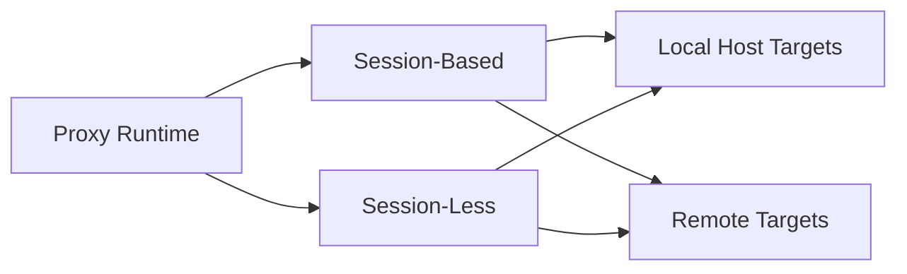
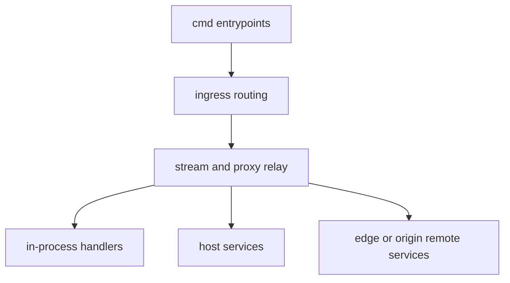
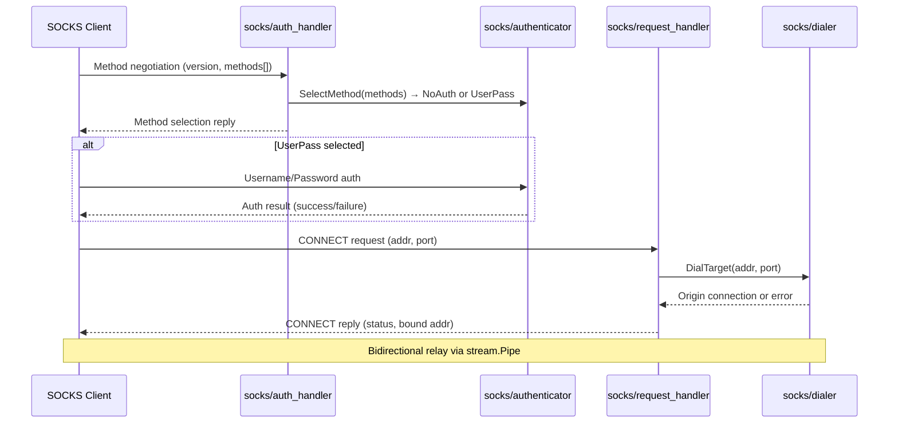

# Proxying Behavior Catalog

- Baseline date: 20260320
- Baseline reference: [cloudflare/cloudflared/tree/2026.3.0](https://github.com/cloudflare/cloudflared/tree/2026.3.0)
- Primary evidence set: behavior atoms under [../atoms](../../atoms)
- Index source: [../atom-index](../atom-index.md)

## Scope

This catalog captures complete proxying behavior represented in the baseline atom corpus.

Complete for this catalog means all non-vendor, non-test behavior atoms that implement or orchestrate:

- protocol bridging between tunnel-side and origin-side connections,
- behavior across OSI Layers 3 through 7 for cloudflared proxy paths,
- ingress rule matching and origin dispatch,
- stream, datagram, packet, and socket relay paths,
- proxy-adjacent command entrypoints and data-path RPC streams.

Tunnel-control RPC atoms (registration, configuration management, schema definitions) are scoped to [tunnels](tunnels.md); this catalog retains only the data-path session/request stream atoms from tunnelrpc.

Proxying scope modules tracked by this catalog:

- [../atoms/carrier](../../atoms/carrier)
- [../atoms/proxy](../../atoms/proxy)
- [../atoms/ingress](../../atoms/ingress)
- [../atoms/connection](../../atoms/connection) (transport-relevant subset; HA slot tracking and lifecycle events scoped to [tunnels](tunnels.md))
- [../atoms/quic](../../atoms/quic)
- [../atoms/websocket](../../atoms/websocket)
- [../atoms/socks](../../atoms/socks)
- [../atoms/stream](../../atoms/stream)
- [../atoms/packet](../../atoms/packet)
- [../atoms/datagramsession](../../atoms/datagramsession)
- [../atoms/tunnelrpc](../../atoms/tunnelrpc) (data-path subset: quic/*, pogs/session_manager, pogs/quic_metadata_protocol)
- [../atoms/cfio](../../atoms/cfio)
- [../atoms/hello](../../atoms/hello)

## Proxying Classes by Destination Boundary

| Class | Boundary | Description | Representative atoms |
|---|---|---|---|
| In-Process Proxying | Same process/runtime | Proxy and target handler live in the same running process and communicate through in-memory or internal stream abstractions. | [stream/stream](../../atoms/stream/stream.md), [stream/debug](../../atoms/stream/debug.md), [proxy/proxy](../../atoms/proxy/proxy.md) |
| Host-Service Proxying | Same host/OS, different process | Proxy forwards to another local process or OS service through local sockets/interfaces. | [socks/connection_handler](../../atoms/socks/connection_handler.md), [ingress/origin_dialer](../../atoms/ingress/origin_dialer.md), [cmd/cloudflared/proxydns/cmd](../../atoms/cmd/cloudflared/proxydns/cmd.md) |
| Remote-Service Proxying | Different host/network endpoint | Proxy forwards to edge or upstream services across network transport boundaries (HTTP2/QUIC/WebSocket/TunnelRPC). | [connection/http2](../../atoms/connection/http2.md), [connection/quic](../../atoms/connection/quic.md), [carrier/websocket](../../atoms/carrier/websocket.md), [tunnelrpc/quic/protocol](../../atoms/tunnelrpc/quic/protocol.md), [ingress/origin_proxy](../../atoms/ingress/origin_proxy.md) |
| Remote-Service Proxying | Different host/network endpoint | DNS origin path to Cloudflare virtual DNS (`2606:4700:0cf1:2000::1:53`): `DialTCP` is session-based, `DialUDP` is session-less, resolver index selection uses `crypto/rand` as non-security-sensitive linter-compliance behavior, and resolver address refresh runs every 5 minutes via `StartRefreshLoop`. | [ingress/origins/dns](../../atoms/ingress/origins/dns.md) |

## Session Orientation

| Class | Definition | Representative atoms |
|---|---|---|
| Session-Based Proxying | Proxying that explicitly allocates, tracks, or tears down session identifiers/state over time. | [datagramsession/session](../../atoms/datagramsession/session.md), [datagramsession/manager](../../atoms/datagramsession/manager.md), [connection/quic_datagram_v2](../../atoms/connection/quic_datagram_v2.md), [connection/quic_datagram_v3](../../atoms/connection/quic_datagram_v3.md), [quic/v3/session](../../atoms/quic/v3/session.md), [tunnelrpc/quic/session_client](../../atoms/tunnelrpc/quic/session_client.md), [tunnelrpc/quic/session_server](../../atoms/tunnelrpc/quic/session_server.md) |
| Session-Less Proxying | Proxying that operates per request/stream without an explicit long-lived session registry in the behavior atom contract. | [connection/http2](../../atoms/connection/http2.md), [ingress/origin_proxy](../../atoms/ingress/origin_proxy.md), [proxy/proxy](../../atoms/proxy/proxy.md), [stream/stream](../../atoms/stream/stream.md), [socks/connection_handler](../../atoms/socks/connection_handler.md), [carrier/websocket](../../atoms/carrier/websocket.md) |

## Crypto Involvement by Proxying Boundary

| Proxying boundary class | Crypto observed in linked proxy paths | Evidence atoms |
|---|---|---|
| In-Process Proxying | No explicit crypto imports in representative in-process relay atoms; crypto appears mainly at transport/auth boundaries rather than internal relay glue. | [stream/stream](../../atoms/stream/stream.md), [stream/debug](../../atoms/stream/debug.md), [proxy/proxy](../../atoms/proxy/proxy.md) |
| Host-Service Proxying | Limited direct crypto in local-host forwarding paths; `crypto/rand` appears in DNS-origin path handling. | [ingress/origins/dns](../../atoms/ingress/origins/dns.md), [socks/connection_handler](../../atoms/socks/connection_handler.md), [ingress/origin_dialer](../../atoms/ingress/origin_dialer.md) |
| Remote-Service Proxying | TLS-heavy transport and origin forwarding with handshake/hash/random primitives. | [connection/quic](../../atoms/connection/quic.md), [carrier/carrier](../../atoms/carrier/carrier.md), [ingress/origin_proxy](../../atoms/ingress/origin_proxy.md), [ingress/origin_service](../../atoms/ingress/origin_service.md), [hello/hello](../../atoms/hello/hello.md), [websocket/websocket](../../atoms/websocket/websocket.md) |

## Crypto Involvement by Session Orientation

| Session orientation | Crypto observed | Evidence atoms |
|---|---|---|
| Session-Based Proxying | Session constructs are mostly transport/session-state orchestration; crypto is primarily inherited from underlying remote transports (not from session manager contracts directly). | [datagramsession/session](../../atoms/datagramsession/session.md), [connection/quic_datagram_v2](../../atoms/connection/quic_datagram_v2.md), [connection/quic_datagram_v3](../../atoms/connection/quic_datagram_v3.md), [tunnelrpc/quic/session_client](../../atoms/tunnelrpc/quic/session_client.md), [tunnelrpc/quic/session_server](../../atoms/tunnelrpc/quic/session_server.md), [connection/quic](../../atoms/connection/quic.md) |
| Session-Less Proxying | Crypto concentrated in request/stream transport and handshake layers (`crypto/tls`, `crypto/sha1`, and selected `crypto/rand` paths). | [connection/http2](../../atoms/connection/http2.md), [carrier/websocket](../../atoms/carrier/websocket.md), [websocket/websocket](../../atoms/websocket/websocket.md), [ingress/origin_proxy](../../atoms/ingress/origin_proxy.md), [ingress/origin_service](../../atoms/ingress/origin_service.md), [ingress/origins/dns](../../atoms/ingress/origins/dns.md) |

## Coverage Summary

| Area | Module | Atom count | Coverage links |
|---|---|---:|---|
| Core proxy surface | carrier | 2 | [carrier/carrier](../../atoms/carrier/carrier.md), [carrier/websocket](../../atoms/carrier/websocket.md) |
| Core proxy surface | proxy | 3 | [proxy/proxy](../../atoms/proxy/proxy.md), [proxy/metrics](../../atoms/proxy/metrics.md), [proxy/logger](../../atoms/proxy/logger.md) |
| Ingress and origin dispatch | ingress | 19 | [ingress/ingress](../../atoms/ingress/ingress.md), [ingress/rule](../../atoms/ingress/rule.md), [ingress/origin_service](../../atoms/ingress/origin_service.md), [ingress/origin_proxy](../../atoms/ingress/origin_proxy.md), [ingress/origin_connection](../../atoms/ingress/origin_connection.md), [ingress/origin_dialer](../../atoms/ingress/origin_dialer.md), [ingress/packet_router](../../atoms/ingress/packet_router.md), [ingress/origin_icmp_proxy](../../atoms/ingress/origin_icmp_proxy.md), [ingress/config](../../atoms/ingress/config.md), [ingress/origins/dns](../../atoms/ingress/origins/dns.md), [ingress/origins/metrics](../../atoms/ingress/origins/metrics.md), [ingress/icmp_linux](../../atoms/ingress/icmp_linux.md), [ingress/icmp_posix](../../atoms/ingress/icmp_posix.md), [ingress/icmp_windows](../../atoms/ingress/icmp_windows.md), [ingress/icmp_darwin](../../atoms/ingress/icmp_darwin.md), [ingress/icmp_generic](../../atoms/ingress/icmp_generic.md), [ingress/icmp_metrics](../../atoms/ingress/icmp_metrics.md), [ingress/middleware/middleware](../../atoms/ingress/middleware/middleware.md), [ingress/middleware/jwtvalidator](../../atoms/ingress/middleware/jwtvalidator.md) |
| Edge transport protocols | connection | 12 | [connection/connection](../../atoms/connection/connection.md), [connection/http2](../../atoms/connection/http2.md), [connection/quic](../../atoms/connection/quic.md), [connection/quic_connection](../../atoms/connection/quic_connection.md), [connection/quic_datagram_v2](../../atoms/connection/quic_datagram_v2.md), [connection/quic_datagram_v3](../../atoms/connection/quic_datagram_v3.md), [connection/protocol](../../atoms/connection/protocol.md), [connection/control](../../atoms/connection/control.md), [connection/header](../../atoms/connection/header.md), [connection/errors](../../atoms/connection/errors.md), [connection/metrics](../../atoms/connection/metrics.md), [connection/observer](../../atoms/connection/observer.md) |
| QUIC internals for proxy relay | quic | 17 | [quic/datagram](../../atoms/quic/datagram.md), [quic/datagramv2](../../atoms/quic/datagramv2.md), [quic/safe_stream](../../atoms/quic/safe_stream.md), [quic/v3/session](../../atoms/quic/v3/session.md), [quic/v3/muxer](../../atoms/quic/v3/muxer.md), [quic/v3/request](../../atoms/quic/v3/request.md), [quic/v3/datagram](../../atoms/quic/v3/datagram.md), [quic/v3/datagram_errors](../../atoms/quic/v3/datagram_errors.md), [quic/v3/icmp](../../atoms/quic/v3/icmp.md), [quic/v3/manager](../../atoms/quic/v3/manager.md), [quic/v3/metrics](../../atoms/quic/v3/metrics.md), [quic/constants](../../atoms/quic/constants.md), [quic/conversion](../../atoms/quic/conversion.md), [quic/metrics](../../atoms/quic/metrics.md), [quic/param_unix](../../atoms/quic/param_unix.md), [quic/param_windows](../../atoms/quic/param_windows.md), [quic/tracing](../../atoms/quic/tracing.md) |
| WebSocket tunneling | websocket | 2 | [websocket/connection](../../atoms/websocket/connection.md), [websocket/websocket](../../atoms/websocket/websocket.md) |
| SOCKS proxy handling | socks | 6 | [socks/request_handler](../../atoms/socks/request_handler.md), [socks/connection_handler](../../atoms/socks/connection_handler.md), [socks/dialer](../../atoms/socks/dialer.md), [socks/request](../../atoms/socks/request.md), [socks/authenticator](../../atoms/socks/authenticator.md), [socks/auth_handler](../../atoms/socks/auth_handler.md) |
| Relay stream primitives | stream | 2 | [stream/stream](../../atoms/stream/stream.md), [stream/debug](../../atoms/stream/debug.md) |
| Packet forwarding primitives | packet | 5 | [packet/session](../../atoms/packet/session.md), [packet/funnel](../../atoms/packet/funnel.md), [packet/decoder](../../atoms/packet/decoder.md), [packet/encoder](../../atoms/packet/encoder.md), [packet/packet](../../atoms/packet/packet.md) |
| Datagram session orchestration | datagramsession | 4 | [datagramsession/session](../../atoms/datagramsession/session.md), [datagramsession/manager](../../atoms/datagramsession/manager.md), [datagramsession/event](../../atoms/datagramsession/event.md), [datagramsession/metrics](../../atoms/datagramsession/metrics.md) |
| Tunnel RPC data-path streams | tunnelrpc | 9 | [tunnelrpc/quic/protocol](../../atoms/tunnelrpc/quic/protocol.md), [tunnelrpc/quic/request_client_stream](../../atoms/tunnelrpc/quic/request_client_stream.md), [tunnelrpc/quic/request_server_stream](../../atoms/tunnelrpc/quic/request_server_stream.md), [tunnelrpc/quic/session_client](../../atoms/tunnelrpc/quic/session_client.md), [tunnelrpc/quic/session_server](../../atoms/tunnelrpc/quic/session_server.md), [tunnelrpc/quic/cloudflared_client](../../atoms/tunnelrpc/quic/cloudflared_client.md), [tunnelrpc/quic/cloudflared_server](../../atoms/tunnelrpc/quic/cloudflared_server.md), [tunnelrpc/pogs/session_manager](../../atoms/tunnelrpc/pogs/session_manager.md), [tunnelrpc/pogs/quic_metadata_protocol](../../atoms/tunnelrpc/pogs/quic_metadata_protocol.md) |
| Copy utility used by relays | cfio | 1 | [cfio/copy](../../atoms/cfio/copy.md) |
| Origin probe used in quick paths | hello | 1 | [hello/hello](../../atoms/hello/hello.md) |

## Command Entrypoints Driving Proxying

These atoms connect CLI paths to proxying runtime behavior.

- [cmd/cloudflared/tunnel/cmd](../../atoms/cmd/cloudflared/tunnel/cmd.md)
- [cmd/cloudflared/tunnel/configuration](../../atoms/cmd/cloudflared/tunnel/configuration.md)
- [cmd/cloudflared/tunnel/ingress_subcommands](../../atoms/cmd/cloudflared/tunnel/ingress_subcommands.md)
- [cmd/cloudflared/tunnel/quick_tunnel](../../atoms/cmd/cloudflared/tunnel/quick_tunnel.md)
- [cmd/cloudflared/proxydns/cmd](../../atoms/cmd/cloudflared/proxydns/cmd.md)
- [cmd/cloudflared/access/carrier](../../atoms/cmd/cloudflared/access/carrier.md)
- [cmd/cloudflared/app_forward_service](../../atoms/cmd/cloudflared/app_forward_service.md)

## Data-Path Layering View

Primary layering details are captured in [OSI Layer Coverage](#osi-layer-coverage); this section is intentionally condensed to avoid duplicating that table.

## OSI Layer Coverage

This is an OSI-inspired analysis aid for proxy behavior boundaries, not a claim that cloudflared implements a strict OSI protocol stack.

| OSI-inspired layer analogy | Proxying behavior in baseline | Primary module coverage | Representative atoms |
|---|---|---|---|
| Layer 7 Application | HTTP ingress rule evaluation, middleware, websocket/http2 semantics, management and control RPC request framing | [ingress](../../atoms/ingress), [connection](../../atoms/connection), [websocket](../../atoms/websocket), [tunnelrpc](../../atoms/tunnelrpc), [proxy](../../atoms/proxy) | [ingress/ingress](../../atoms/ingress/ingress.md), [ingress/rule](../../atoms/ingress/rule.md), [connection/http2](../../atoms/connection/http2.md), [websocket/websocket](../../atoms/websocket/websocket.md), [tunnelrpc/quic/request_server_stream](../../atoms/tunnelrpc/quic/request_server_stream.md) |
| Layer 6 Presentation | Payload and message translation/serialization boundaries for transport metadata and session framing | [connection](../../atoms/connection), [tunnelrpc](../../atoms/tunnelrpc) | [connection/protocol](../../atoms/connection/protocol.md), [tunnelrpc/pogs/quic_metadata_protocol](../../atoms/tunnelrpc/pogs/quic_metadata_protocol.md), [connection/header](../../atoms/connection/header.md) |
| Layer 5 Session | Tunnel session lifecycle, stream setup/teardown, bidirectional relay session control | [connection](../../atoms/connection), [quic](../../atoms/quic), [stream](../../atoms/stream), [datagramsession](../../atoms/datagramsession), [tunnelrpc](../../atoms/tunnelrpc) | [connection/connection](../../atoms/connection/connection.md), [quic/v3/session](../../atoms/quic/v3/session.md), [stream/stream](../../atoms/stream/stream.md), [datagramsession/session](../../atoms/datagramsession/session.md), [tunnelrpc/quic/session_server](../../atoms/tunnelrpc/quic/session_server.md) |
| Layer 4 Transport | TCP/UDP/QUIC transport behavior, SOCKS handling, stream reliability and tunnel transport multiplexing | [connection](../../atoms/connection), [quic](../../atoms/quic), [socks](../../atoms/socks), [carrier](../../atoms/carrier), [websocket](../../atoms/websocket) | [connection/quic](../../atoms/connection/quic.md), [connection/quic_datagram_v3](../../atoms/connection/quic_datagram_v3.md), [quic/datagram](../../atoms/quic/datagram.md), [socks/connection_handler](../../atoms/socks/connection_handler.md), [carrier/carrier](../../atoms/carrier/carrier.md) |
| Layer 3 Network | ICMP and packet-level routing/encoding/decoding and origin network forwarding decisions | [ingress](../../atoms/ingress), [packet](../../atoms/packet), [quic](../../atoms/quic) | [ingress/origin_icmp_proxy](../../atoms/ingress/origin_icmp_proxy.md), [ingress/packet_router](../../atoms/ingress/packet_router.md), [packet/decoder](../../atoms/packet/decoder.md), [packet/encoder](../../atoms/packet/encoder.md), [quic/v3/icmp](../../atoms/quic/v3/icmp.md) |

Layer 1 and Layer 2 are out of scope for this catalog because the baseline atom set models proxy software behavior above link and physical interfaces.

## Upstream-Verified Proxying Quirks and Variance

### Bidirectional Stream Pipe Behavior

Two distinct pipe modes exist in the stream package:

| Mode | Function | `maxWaitForSecondStream` | `CloseWrite` propagation | Use case |
|---|---|---|---|---|
| Simple | `Pipe(tunnelConn, originConn)` | `0` (no wait) | No (wrapped with `NopCloseWriterAdapter`) | HTTP2 proxy relay |
| Bidirectional | `PipeBidirectional(downstream, upstream, maxWait, log)` | Caller-specified | Yes (`CloseWrite()` called on dst when src EOF) | QUIC stream relay with half-close support |

Quirk — **Panic recovery**: each `unidirectionalStream` goroutine installs a `recover()` handler. If one stream direction has already completed (`isAnyDone()` returns true), panics are logged at debug level. Otherwise, the panic is reported to Sentry as a warning before being swallowed. This prevents transport-layer errors from crashing the process.

Quirk — **`debugCopy` const**: a compile-time `const debugCopy = false` exists in [stream/stream.go](https://github.com/cloudflare/cloudflared/blob/2026.3.0/stream/stream.go) that, when set to true, hex-dumps all copied bytes to stdout. This is a development-only toggle with no runtime flag exposure.

### Copy Function Selection

When `debugCopy` is false, `cfio.Copy` is used (a wrapper around `io.Copy`). The buffer size for debug mode is `32 * 1024` bytes.

## Notes

- Counts and file coverage are reconciled against [../atom-index](../atom-index.md).
- This catalog tracks behavior surfaces documented by existing atoms and avoids inferring undocumented runtime semantics.
- Ingress-specific deep behavior (rule evaluation, middleware details, and origin selection contracts) is elaborated in [ingress](ingress.md).

## Overlap Seam with Tunnels

The [tunnels](tunnels.md) and proxying catalogs share a structural seam: tunnel connections carry proxied traffic, so transport and session atoms appear in both domains. An overlap-reduction pass pruned atoms along the control-plane vs. data-path boundary:

| Boundary | Kept in tunnels | Kept in proxying | Rationale |
|---|---|---|---|
| Tunnel registration RPC | `tunnelrpc/registration_*`, `pogs/registration_server`, `pogs/configuration_manager`, `proto/*.capnp` | — | Registration and configuration management are tunnel lifecycle operations, not request forwarding |
| Connection lifecycle events | `connection/tunnelsforha`, `connection/event`, `connection/json` | — | HA slot tracking, lifecycle events, and control-stream JSON are tunnel management concerns |
| Data-path RPC streams | `tunnelrpc/quic/protocol`, `quic/session_*`, `quic/request_*`, `quic/cloudflared_*` | Same | Request/session stream framing is equally relevant to tunnel transport and proxy relay |
| Proxy implementation | — | `proxy/*`, `carrier/*`, `websocket/*`, `stream/*`, `packet/*`, `socks/*`, `hello/*` | Origin relay, packet forwarding, and protocol bridging are proxying concerns |
| Ingress detail | `ingress/ingress`, `ingress/rule`, `ingress/origin_proxy`, `ingress/origin_service`, `ingress/packet_router`, `ingress/config` | Full ingress set (19 atoms) | Tunnels retains rule matching and origin dispatch entry points; proxying retains the complete implementation surface |

Post-pruning Jaccard similarity: $J \approx 0.36$ (down from $J = 0.65$). The remaining overlap concentrates in transport atoms (`connection/*`, `quic/*`, `datagramsession/*`) that genuinely serve both domains.

## SOCKS5 Negotiation Protocol

The SOCKS proxy path implements a subset of [RFC 1928](https://datatracker.ietf.org/doc/html/rfc1928) for TCP CONNECT forwarding through cloudflared:

### SOCKS5 Implementation Constraints

| Constraint | Detail |
|---|---|
| Supported commands | CONNECT only; BIND and UDP ASSOCIATE are not implemented |
| Auth methods | NoAuth (0x00) and Username/Password (0x02); GSSAPI not supported |
| Address types | IPv4, IPv6, and domain name (FQDN) |
| Dialer behavior | `socks/dialer` resolves FQDN targets and dials TCP; timeout is inherited from the connection context |
| Error mapping | Connection refused → `0x05`, network unreachable → `0x03`, host unreachable → `0x04`; all other errors → `0x01` (general failure) |

## Proxy Error Response Mapping

When proxy request forwarding encounters errors, cloudflared maps internal error conditions to HTTP response codes returned to the edge:

| Error condition | HTTP status | Source |
|---|---|---|
| Origin connection refused | `502 Bad Gateway` | [proxy/proxy](../../atoms/proxy/proxy.md) |
| Origin connection timeout | `504 Gateway Timeout` | [proxy/proxy](../../atoms/proxy/proxy.md) |
| Ingress rule not matched (catch-all 404) | `404 Not Found` | [ingress/ingress](../../atoms/ingress/ingress.md) |
| WebSocket upgrade failure | `400 Bad Request` | [carrier/websocket](../../atoms/carrier/websocket.md) |
| Request body read error | `502 Bad Gateway` | [proxy/proxy](../../atoms/proxy/proxy.md) |
| Stream copy error (mid-transfer) | Connection reset (no HTTP status) | [stream/stream](../../atoms/stream/stream.md) |

### Proxy Metrics by Error Class

Error responses are tracked via Prometheus counters in [proxy/metrics](../../atoms/proxy/metrics.md) with labels distinguishing origin-side failures from transport-side failures. The `proxied_requests_total` counter increments on every proxy attempt; `proxy_errors_total` increments on failures with an `error_type` label.

## Coverage Audit

- Audit method: collect all atom docs from the proxying scope modules listed above, then diff against all atom links listed in this catalog.
- Current coverage result: 83 scoped atom docs found, 83 covered by catalog links, 0 missing. (14 tunnel-control-plane atoms pruned to [tunnels](tunnels.md) in overlap-reduction pass.)
- Delta (catalog links - scoped atom docs): 0.
- Additional links beyond the scoped minimum are used for command entrypoints.
- Operational guardrail: if any scoped module gains a new atom doc, rerun this audit and update the relevant sections in this file.
