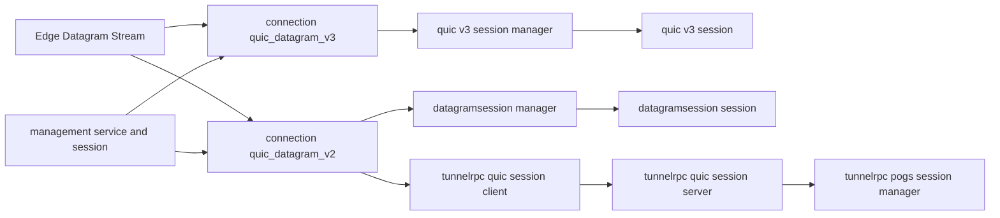
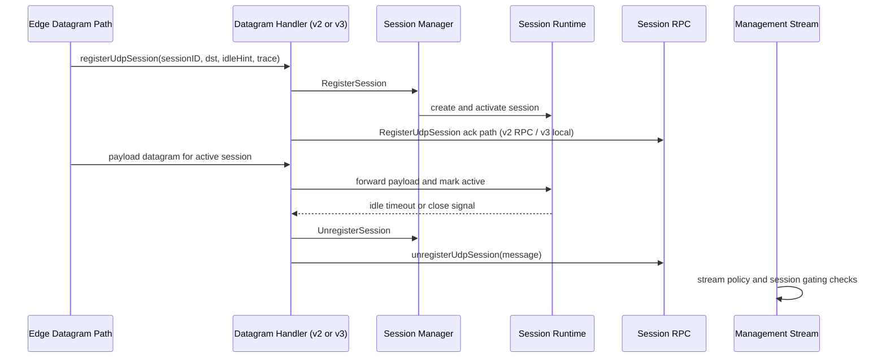
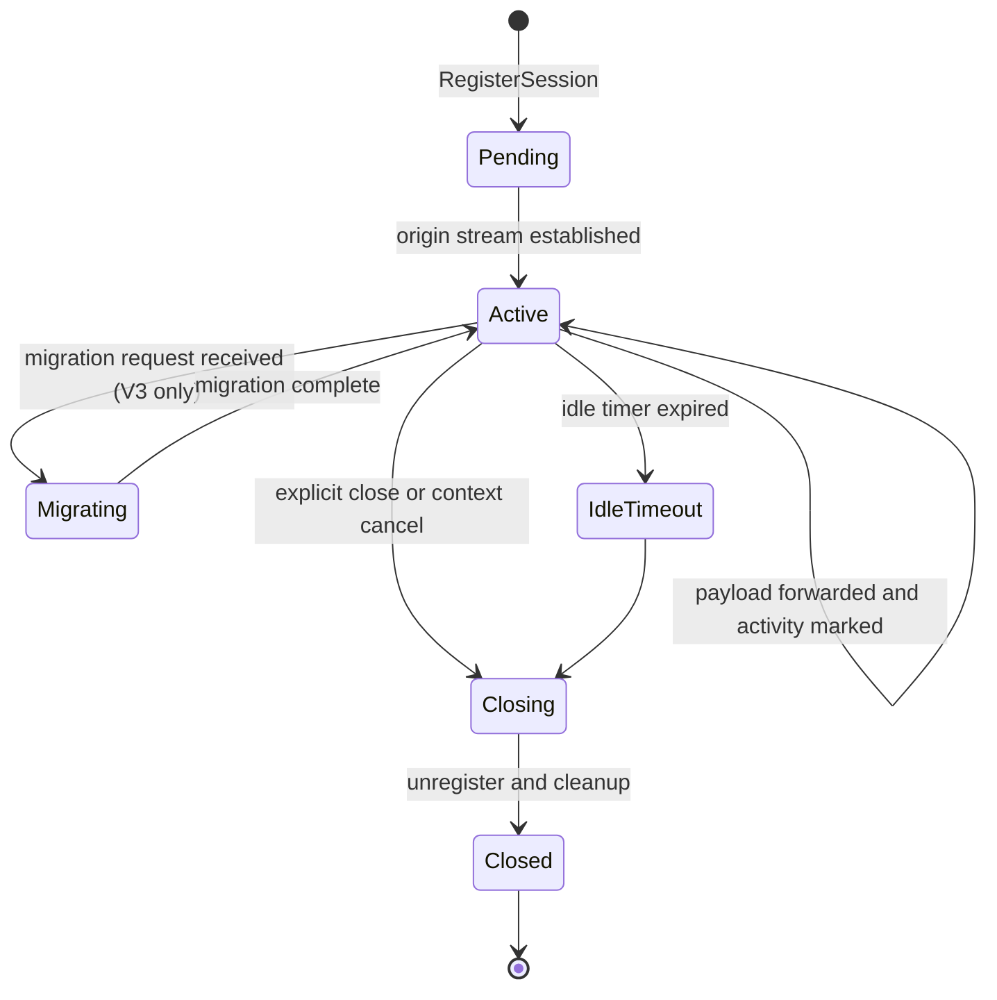

# Sessions Behavior Catalog

- Baseline date: 20260321
- Baseline reference: [cloudflare/cloudflared/tree/2026.3.0](https://github.com/cloudflare/cloudflared/tree/2026.3.0)
- Primary evidence set: behavior atoms under [../atoms](../../atoms)
- Upstream recheck: key session lifecycle contracts revalidated against tag `2026.3.0` source anchors for [datagramsession/session.go](https://github.com/cloudflare/cloudflared/blob/2026.3.0/datagramsession/session.go), [atoms/datagramsession/session](../../atoms/datagramsession/session.md), [quic/v3/session.go](https://github.com/cloudflare/cloudflared/blob/2026.3.0/quic/v3/session.go), [atoms/quic/v3/session](../../atoms/quic/v3/session.md), [connection/quic_datagram_v2.go](https://github.com/cloudflare/cloudflared/blob/2026.3.0/connection/quic_datagram_v2.go), [atoms/connection/quic_datagram_v2](../../atoms/connection/quic_datagram_v2.md), [connection/quic_datagram_v3.go](https://github.com/cloudflare/cloudflared/blob/2026.3.0/connection/quic_datagram_v3.go), [atoms/connection/quic_datagram_v3](../../atoms/connection/quic_datagram_v3.md), and [tunnelrpc/pogs/session_manager.go](https://github.com/cloudflare/cloudflared/blob/2026.3.0/tunnelrpc/pogs/session_manager.go), [atoms/tunnelrpc/pogs/session_manager](../../atoms/tunnelrpc/pogs/session_manager.md).

## Scope

This catalog documents session lifecycle and management behavior across transport, RPC, runtime orchestration, and management surfaces.

For this catalog, session behavior includes:

- UDP session registration and unregistration contracts,
- session creation, migration, idle timeout, and close semantics,
- datagram transport handlers and session dispatch paths,
- SessionManager RPC client/server and Cap'n Proto schema contracts,
- management-side session gating and stream lifecycle controls,
- session-level metrics and telemetry hooks.

Out of scope:

- generic tunnel lifecycle internals already detailed in [tunnels](tunnels.md),
- broad observability-only cataloging already detailed in [observabilities](observabilities.md),
- non-session API families already detailed in [upstream-api-contracts](upstream-api-contracts.md).

## Session Architecture Topology



## Session Lifecycle Sequence



## Domain Map

| Domain | Description | Representative atoms |
| --- | --- | --- |
| Datagram session runtime | Core session object lifecycle, activity tracking, and close behavior. | [datagramsession/session](../../atoms/datagramsession/session.md), [datagramsession/event](../../atoms/datagramsession/event.md), [packet/session](../../atoms/packet/session.md) |
| Session manager orchestration | Session registry, register/unregister flow, and fanout routing to active sessions. | [datagramsession/manager](../../atoms/datagramsession/manager.md), [quic/v3/manager](../../atoms/quic/v3/manager.md) |
| Datagram transport adapters | V2 and V3 handler contracts bridging edge datagrams to session managers. | [connection/quic_datagram_v2](../../atoms/connection/quic_datagram_v2.md), [connection/quic_datagram_v3](../../atoms/connection/quic_datagram_v3.md), [quic/v3/muxer](../../atoms/quic/v3/muxer.md) |
| RPC session control plane | Session registration RPC client/server contracts and POGS bindings. | [tunnelrpc/quic/session_client](../../atoms/tunnelrpc/quic/session_client.md), [tunnelrpc/quic/session_server](../../atoms/tunnelrpc/quic/session_server.md), [tunnelrpc/pogs/session_manager](../../atoms/tunnelrpc/pogs/session_manager.md) |
| Session schema contracts | Cap'n Proto schema surfaces for registration/session control interfaces. | [tunnelrpc/proto/tunnelrpc.capnp](../../atoms/tunnelrpc/proto/tunnelrpc.capnp) |
| Management-side session controls | Management websocket session state, filters, and access-token middleware guardrails. | [management/session](../../atoms/management/session.md), [management/service](../../atoms/management/service.md), [management/events](../../atoms/management/events.md), [management/middleware](../../atoms/management/middleware.md), [management/token](../../atoms/management/token.md) |
| Session telemetry | Session-level counters and flow/drop metrics for lifecycle observability. | [datagramsession/metrics](../../atoms/datagramsession/metrics.md), [quic/v3/metrics](../../atoms/quic/v3/metrics.md) |

## Lifecycle and State Contracts

| Stage | Contract |
| --- | --- |
| Registration | Datagram handlers accept session registration requests and invoke manager registration with destination and idle hints. |
| Activation | Managers materialize session instances and wire transport/origin streams for bidirectional forwarding. |
| Activity tracking | Session runtime marks activity on payload transfer and resets idle timers to avoid premature closure. |
| Migration and duplicate handling | Datagram muxing logic distinguishes already-registered and migration scenarios, with dedicated response semantics. |
| Unregistration | Local or remote closure triggers unregister flow with message context propagated through session-control interfaces. |
| Idle and shutdown | Session close conditions include context cancellation, idle timeout, transport EOF, and explicit close requests. |

Primary evidence: [datagramsession/session](../../atoms/datagramsession/session.md), [datagramsession/manager](../../atoms/datagramsession/manager.md), [quic/v3/session](../../atoms/quic/v3/session.md), [quic/v3/muxer](../../atoms/quic/v3/muxer.md), [connection/quic_datagram_v2](../../atoms/connection/quic_datagram_v2.md), [connection/quic_datagram_v3](../../atoms/connection/quic_datagram_v3.md).

## RPC and Schema Contracts

| Surface | Contracted behavior |
| --- | --- |
| QUIC session client | Exposes `RegisterUdpSession` and `UnregisterUdpSession` with timeout-bounded request semantics and trace context propagation. |
| QUIC session server | Serves SessionManager RPC streams and dispatches register/unregister calls to backing manager implementations. |
| POGS session manager | Marshals session registration fields (session ID, destination, idle hint, trace context) across Cap'n Proto boundaries. |
| Schema compatibility | Cap'n Proto tunnel RPC schema preserves SessionManager and registration surfaces as part of transport compatibility contracts. |

Primary evidence: [tunnelrpc/quic/session_client](../../atoms/tunnelrpc/quic/session_client.md), [tunnelrpc/quic/session_server](../../atoms/tunnelrpc/quic/session_server.md), [tunnelrpc/pogs/session_manager](../../atoms/tunnelrpc/pogs/session_manager.md), [tunnelrpc/proto/tunnelrpc.capnp](../../atoms/tunnelrpc/proto/tunnelrpc.capnp).

## Management Session Contracts

| Surface | Session-management behavior |
| --- | --- |
| Websocket session state | Management log-stream sessions maintain active state, bounded queues, and dynamic event filters. |
| Stream lifecycle control | Management service enforces stream-start gating and parses client filter events before emitting logs. |
| Event serialization | Management events layer normalizes client/server event codecs and websocket close/error classification. |
| Access control | Token parsing and middleware gate management endpoints and stream entry with explicit HTTP error mapping. |

Primary evidence: [management/session](../../atoms/management/session.md), [management/service](../../atoms/management/service.md), [management/events](../../atoms/management/events.md), [management/middleware](../../atoms/management/middleware.md), [management/token](../../atoms/management/token.md).

## Full Coverage Links

- [connection/quic_datagram_v2](../../atoms/connection/quic_datagram_v2.md)
- [connection/quic_datagram_v3](../../atoms/connection/quic_datagram_v3.md)
- [datagramsession/event](../../atoms/datagramsession/event.md)
- [datagramsession/manager](../../atoms/datagramsession/manager.md)
- [datagramsession/metrics](../../atoms/datagramsession/metrics.md)
- [datagramsession/session](../../atoms/datagramsession/session.md)
- [management/events](../../atoms/management/events.md)
- [management/middleware](../../atoms/management/middleware.md)
- [management/service](../../atoms/management/service.md)
- [management/session](../../atoms/management/session.md)
- [management/token](../../atoms/management/token.md)
- [packet/session](../../atoms/packet/session.md)
- [quic/v3/manager](../../atoms/quic/v3/manager.md)
- [quic/v3/metrics](../../atoms/quic/v3/metrics.md)
- [quic/v3/muxer](../../atoms/quic/v3/muxer.md)
- [quic/v3/session](../../atoms/quic/v3/session.md)
- [tunnelrpc/pogs/session_manager](../../atoms/tunnelrpc/pogs/session_manager.md)
- [tunnelrpc/proto/tunnelrpc.capnp](../../atoms/tunnelrpc/proto/tunnelrpc.capnp)
- [tunnelrpc/quic/session_client](../../atoms/tunnelrpc/quic/session_client.md)
- [tunnelrpc/quic/session_server](../../atoms/tunnelrpc/quic/session_server.md)

## Upstream-Verified Session Constants and Quirks

### Datagram Session Idle Timeout

| Constant | Value | Source |
| --- | --- | --- |
| `defaultCloseIdleAfter` | `210 seconds` (3 min 30 sec) | [datagramsession/session.go](https://github.com/cloudflare/cloudflared/blob/2026.3.0/datagramsession/session.go) |
| Idle check frequency | $\frac{\text{closeAfterIdle}}{8}$ | Same file |
| Read buffer size | `1500 bytes` (`maxPacketSize` const) | Same file |

If the caller passes `closeAfterIdle = 0` to `Session.Serve()`, the default 210-second timeout is applied.

### Non-blocking Activity Marking

The `markActive()` method uses a select-with-default pattern:

```go
select {
case s.activeAtChan <- time.Now():
default:
}
```

This means under heavy concurrent read/write, some activity marks may be silently dropped. The idle checker may therefore observe a slightly stale "last active" timestamp, but this is intentionally accepted for performance — the comment in source notes: "It is fine to lose some precision."

### Error Severity Quirk

The `ErrVithVariableSeverity` interface (note: typo in upstream source — "Vith" instead of "With") allows destination-to-transport errors to carry variable `zerolog.Level` severity. This means not all session I/O errors are logged at error level; some may be logged at debug or warn depending on the error implementation.

### Management Session Constants

| Constant | Value | Source |
| --- | --- | --- |
| Management WS idle timeout | `5 minutes` | [management/service.go](https://github.com/cloudflare/cloudflared/blob/2026.3.0/management/service.go) |
| Management WS heartbeat | `15 seconds` (ping ticker) | Same file |
| `StatusInvalidCommand` | `4001` | Same file |
| `StatusSessionLimitExceeded` | `4002` | Same file |
| `StatusIdleLimitExceeded` | `4003` | Same file |
| Active session limit | 1 (same actor can preempt existing session) | Same file |
| CORS allowed origins | `https://*.cloudflare.com` | Same file |
| CORS max age | `300` seconds | Same file |
| WebSocket accept origins | `*.cloudflare.com` | Same file |

## Session Protocol Version Comparison

### V2 vs V3 Behavioral Differences

| Aspect | V2 (datagramsession) | V3 (quic/v3) |
| --- | --- | --- |
| Registration path | RPC-based via tunnelrpc session client | Local manager registration without RPC round-trip |
| Session migration | Not supported | Supported via muxer migration branches |
| Payload framing | Datagram manager message routing | Direct QUIC datagram stream dispatch |
| Idle management | Session-level idle timeout with activity channel | Manager-level session sweep with configurable idle |
| Error propagation | Callback-based through session event types | Direct error return with variable severity interface |



## Companion Catalog — State Machines

This catalog shares 10 atoms with [state-machines](state-machines.md) ($J = 0.33$), the strongest pairwise overlap for sessions outside the tunnel core cluster.

### Shared Atom Inventory

| Shared atom | Sessions perspective | State-machines perspective |
| --- | --- | --- |
| [connection/quic_datagram_v2](../../atoms/connection/quic_datagram_v2.md) | V2 datagram transport adapter for session dispatch | V2 handler state transitions in registration and payload forwarding |
| [connection/quic_datagram_v3](../../atoms/connection/quic_datagram_v3.md) | V3 datagram transport adapter for session dispatch | V3 handler state transitions including migration branches |
| [datagramsession/event](../../atoms/datagramsession/event.md) | Session event types driving registration and close | Event-triggered state transitions in session lifecycle |
| [datagramsession/manager](../../atoms/datagramsession/manager.md) | Session registry and register/unregister orchestration | Manager state machine: pending → active → closing |
| [datagramsession/session](../../atoms/datagramsession/session.md) | Core session lifecycle, activity tracking, idle timeout | Session runtime state: active → idle → closing → closed |
| [management/service](../../atoms/management/service.md) | Management service session gating and stream lifecycle | Management session machine: start-gating → active → stopped |
| [management/session](../../atoms/management/session.md) | Management websocket session state and filters | Log-stream session state transitions and filter lifecycle |
| [quic/v3/manager](../../atoms/quic/v3/manager.md) | V3 session manager orchestration | Registration acceptance and duplicate/migration state branches |
| [quic/v3/muxer](../../atoms/quic/v3/muxer.md) | V3 stream muxer bridging edge to session managers | Muxer dispatch state: route → register → migrate → forward |
| [quic/v3/session](../../atoms/quic/v3/session.md) | V3 session runtime lifecycle | V3 session state: pending → active → migrating → closing |

### Overlap Interpretation

The overlap concentrates in the datagram session and QUIC v3 subsystems where session lifecycle and state-machine concerns are inherently coupled. Sessions documents *what* each session does at each lifecycle stage (registration contracts, activity tracking, idle timeouts, RPC bindings); state-machines documents *how* sessions transition between states (state diagrams, entry/exit triggers, failure/forced-exit paths). The two catalogs are complementary: sessions provides the contract reference, state-machines provides the transition reference. Atoms exclusive to state-machines (supervisor, protocol selector, backoff, stream completion) model broader runtime state behavior that is not session-specific. Atoms exclusive to sessions (RPC clients, metrics, management middleware/token/events, packet/session) model session-specific protocol and telemetry surfaces that state-machines intentionally omits.

## Notes

- This catalog is session-surface specific and intentionally excludes non-session tunnel internals already covered in [tunnels](tunnels.md).
- Management session streaming appears under both this catalog and [observabilities](observabilities.md); overlap is intentional because lifecycle gating is session behavior.

## Coverage Audit

- Audit method: collect session-scoped atoms under `datagramsession`, `packet/session`, `quic/v3/(manager|session|muxer|metrics)`, `connection/quic_datagram_v2`, `connection/quic_datagram_v3`, `tunnelrpc` session-manager surfaces, and management session stream controls, then diff against all atom links listed in this catalog.
- Current coverage result: 20 session-scoped atom docs found, 20 linked in catalog, 0 missing.
- Delta (catalog links - session-scoped atom docs): 0.
- Operational guardrail: if session lifecycle surfaces or scope rules change, rerun this audit and update this file in the same change.
