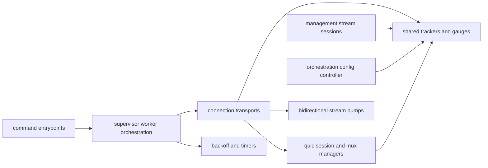
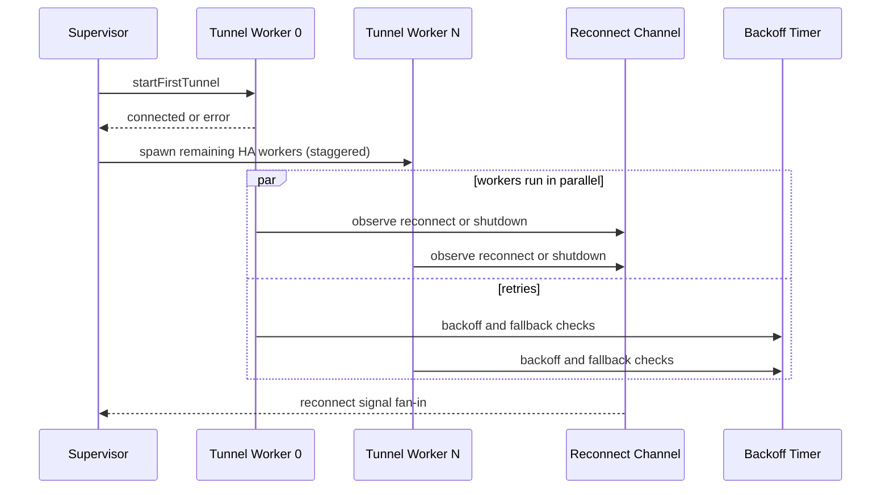
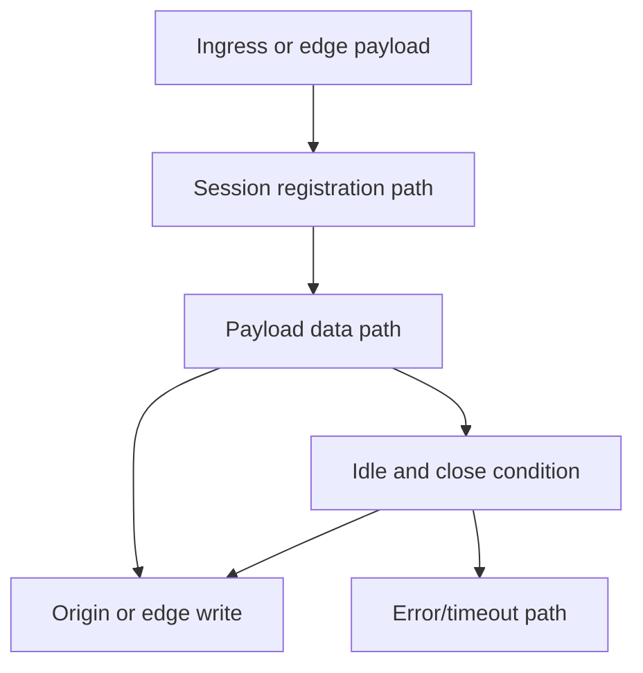

# Shared-State and Parallelism Behavior Catalog

- Baseline date: 20260321
- Baseline reference: [cloudflare/cloudflared/tree/2026.3.0](https://github.com/cloudflare/cloudflared/tree/2026.3.0)
- Primary evidence set: behavior atoms under [../atoms](../../atoms)
- Upstream recheck: concurrency and shared-state surfaces revalidated against tag `2026.3.0` source anchors for [supervisor/supervisor.go](https://github.com/cloudflare/cloudflared/blob/2026.3.0/supervisor/supervisor.go), [supervisor/tunnel.go](https://github.com/cloudflare/cloudflared/blob/2026.3.0/supervisor/tunnel.go), [quic/v3/muxer.go](https://github.com/cloudflare/cloudflared/blob/2026.3.0/quic/v3/muxer.go), [quic/v3/manager.go](https://github.com/cloudflare/cloudflared/blob/2026.3.0/quic/v3/manager.go), [stream/stream.go](https://github.com/cloudflare/cloudflared/blob/2026.3.0/stream/stream.go), [management/service.go](https://github.com/cloudflare/cloudflared/blob/2026.3.0/management/service.go), [management/session.go](https://github.com/cloudflare/cloudflared/blob/2026.3.0/management/session.go), [orchestration/orchestrator.go](https://github.com/cloudflare/cloudflared/blob/2026.3.0/orchestration/orchestrator.go), [tunnelstate/conntracker.go](https://github.com/cloudflare/cloudflared/blob/2026.3.0/tunnelstate/conntracker.go), [flow/limiter.go](https://github.com/cloudflare/cloudflared/blob/2026.3.0/flow/limiter.go), [retry/backoffhandler.go](https://github.com/cloudflare/cloudflared/blob/2026.3.0/retry/backoffhandler.go), and [websocket/connection.go](https://github.com/cloudflare/cloudflared/blob/2026.3.0/websocket/connection.go).

## Scope

This catalog is the dedicated concurrency and parallelism view of the baseline. It focuses on shared mutable state, synchronization primitives, channel-driven coordination, and goroutine lifecycle orchestration.

For this catalog, shared-state behavior includes:

- mutex-protected registries and maps,
- channel-mediated event and reconnect signaling,
- one-shot synchronization primitives and fuses,
- timer/backoff/retry loops controlling parallel workers,
- stream pump and bidirectional copy coordination,
- session manager registration/unregistration concurrency,
- observer-style fanout and active-connection tracking,
- concurrent config updates and runtime hot-swap coordination.

Out of scope:

- endpoint payload schemas and REST contracts in [upstream-api-contracts](upstream-api-contracts.md),
- non-concurrency functional semantics already organized in domain catalogs (for example [tunnels](tunnels.md), [ingress](ingress.md), [crypto](crypto.md)).

## Concurrency Topology

## Primitive Taxonomy

| Primitive family | Typical role | Representative atoms |
|---|---|---|
| Mutex and map guards | Protect shared maps/counters for active sessions, tunnel indexes, and dedup or limiter state. | [tunnelstate/conntracker](../../atoms/tunnelstate/conntracker.md), [quic/v3/manager](../../atoms/quic/v3/manager.md), [supervisor/tunnelsforha](../../atoms/supervisor/tunnelsforha.md), [flow/limiter](../../atoms/flow/limiter.md) |
| Channels and select loops | Coordinate reconnect, shutdown, event fan-in, and producer or consumer pipelines. | [supervisor/supervisor](../../atoms/supervisor/supervisor.md), [supervisor/tunnel](../../atoms/supervisor/tunnel.md), [management/service](../../atoms/management/service.md), [quic/v3/muxer](../../atoms/quic/v3/muxer.md) |
| One-shot synchronization | Latch first-success/terminal state transitions and wake waiters deterministically. | [supervisor/fuse](../../atoms/supervisor/fuse.md), [supervisor/tunnel](../../atoms/supervisor/tunnel.md) |
| Atomic state fields | Lock-free status bits and fast-path state checks in stream/session logic. | [stream/stream](../../atoms/stream/stream.md), [management/session](../../atoms/management/session.md), [orchestration/orchestrator](../../atoms/orchestration/orchestrator.md) |
| Timers and backoff | Bound retry cadence, idle timeout, heartbeat, and pacing for long-running workers. | [retry/backoffhandler](../../atoms/retry/backoffhandler.md), [datagramsession/session](../../atoms/datagramsession/session.md), [websocket/connection](../../atoms/websocket/connection.md), [features/selector](../../atoms/features/selector.md) |
| Errgroup and worker fanout | Couple worker lifecycle and cancellation semantics for parallel protocol handlers. | [supervisor/tunnel](../../atoms/supervisor/tunnel.md), [connection/quic](../../atoms/connection/quic.md), [connection/http2](../../atoms/connection/http2.md) |

## Shared-State Controller Inventory

| Controller object | Shared state under control | Concurrency contract |
|---|---|---|
| `Supervisor` | `tunnelErrors`, `tunnelsConnecting`, per-index fallback state | Manages multi-connection worker fanout with channel fan-in and selective retry scheduling. |
| `EdgeTunnelServer` | reconnect and shutdown channels, edge address state, tracker references | Runs protocol handlers concurrently, reconciles reconnect signals, and classifies recoverable failures. |
| `protocolFallback` | current protocol, retry counter, fallback flag | Wraps backoff progression and protocol transition safety between retries. |
| `booleanFuse` and `connectedFuse` | one-shot connection success state | Guarantees single-write latch semantics and deterministic wake-up of waiting goroutines. |
| `sessionManager` (`quic/v3`) | request-id keyed session map | Synchronizes register/get/unregister operations over shared session registry. |
| `datagramConn` (`quic/v3`) | read/write loops + session and ICMP queues | Serves datagrams in parallel loops while coordinating registration and payload handlers. |
| `session` (`management`) | active flag and buffered stream channel | Applies atomic active-state checks with select-based non-blocking insertion semantics. |
| `ConnTracker` | active connection index and protocol history map | Maintains observer-driven connection state safely for concurrent reads/writes. |
| `flowLimiter` | active flow count and dynamic limit | Enforces bounded concurrency with synchronized acquire/release operations. |
| `Orchestrator` | current proxy reference and versioned config snapshots | Coordinates update, swap, and deferred close behavior across runtime readers. |

## Parallel Worker Lifecycle

## Stream and Session Synchronization

| Surface | Synchronization semantics |
|---|---|
| `stream/PipeBidirectional` | Coordinates two uni-directional copy loops with shared status and second-leg timeout bound. |
| `datagramsession/Session.Serve` | Runs transport and destination copy loops with close-condition wait and idle timer gates. |
| `management/service` websocket loop | Splits event-read and log-stream loops while enforcing stream start/session-limit gates. |
| `websocket/Conn` pinger | Background ping loop and close sequencing coordinate heartbeat and connection liveness. |
| `tunnelrpc/SafeTransport` | Wraps temporary-read-error behavior to preserve transport loop continuity under transient conditions. |

## Concurrency Risk Matrix

| Risk pattern | Mitigation pattern in baseline |
|---|---|
| Lost reconnect signal during shutdown races | `select` over reconnect, graceful shutdown, and context done in listener loops. |
| Duplicate session registration races | Explicit already-registered / migration / rate-limited handling in v3 datagram session manager and mux paths. |
| Retry storms and synchronized reconnect spikes | backoff with max retry limits and grace periods (`retry/backoffhandler`). |
| Split-stream completion leaks | shared bidirectional status + bounded wait for second stream completion (`stream/stream`). |
| Shared map write/read races | mutex-guarded tracker, limiter, tunnel-id, and session manager registries. |
| Hot-swap resource teardown ordering | orchestrator waits before closing prior proxy and preserves version monotonicity checks. |

## Module Coverage Density

| Module | Concurrency-focused atom count |
|---|---:|
| cmd | 6 |
| connection | 7 |
| quic | 5 |
| supervisor | 5 |
| ingress | 5 |
| management | 3 |
| stream | 2 |
| all other covered modules | 1 each |

## Full Coverage Links

- [carrier/carrier](../../atoms/carrier/carrier.md)
- [cfio/copy](../../atoms/cfio/copy.md)
- [cmd/cloudflared/access/cmd](../../atoms/cmd/cloudflared/access/cmd.md)
- [cmd/cloudflared/tail/cmd](../../atoms/cmd/cloudflared/tail/cmd.md)
- [cmd/cloudflared/tunnel/cmd](../../atoms/cmd/cloudflared/tunnel/cmd.md)
- [cmd/cloudflared/updater/check](../../atoms/cmd/cloudflared/updater/check.md)
- [cmd/cloudflared/updater/update](../../atoms/cmd/cloudflared/updater/update.md)
- [cmd/cloudflared/windows_service](../../atoms/cmd/cloudflared/windows_service.md)
- [connection/http2](../../atoms/connection/http2.md)
- [connection/metrics](../../atoms/connection/metrics.md)
- [connection/protocol](../../atoms/connection/protocol.md)
- [connection/quic](../../atoms/connection/quic.md)
- [connection/quic_connection](../../atoms/connection/quic_connection.md)
- [connection/quic_datagram_v2](../../atoms/connection/quic_datagram_v2.md)
- [connection/tunnelsforha](../../atoms/connection/tunnelsforha.md)
- [datagramsession/session](../../atoms/datagramsession/session.md)
- [diagnostic/diagnostic](../../atoms/diagnostic/diagnostic.md)
- [edgediscovery/edgediscovery](../../atoms/edgediscovery/edgediscovery.md)
- [features/selector](../../atoms/features/selector.md)
- [flow/limiter](../../atoms/flow/limiter.md)
- [hello/hello](../../atoms/hello/hello.md)
- [ingress/icmp_darwin](../../atoms/ingress/icmp_darwin.md)
- [ingress/icmp_linux](../../atoms/ingress/icmp_linux.md)
- [ingress/icmp_posix](../../atoms/ingress/icmp_posix.md)
- [ingress/origin_dialer](../../atoms/ingress/origin_dialer.md)
- [ingress/origin_icmp_proxy](../../atoms/ingress/origin_icmp_proxy.md)
- [logger/create](../../atoms/logger/create.md)
- [management/logger](../../atoms/management/logger.md)
- [management/service](../../atoms/management/service.md)
- [management/session](../../atoms/management/session.md)
- [metrics/metrics](../../atoms/metrics/metrics.md)
- [orchestration/orchestrator](../../atoms/orchestration/orchestrator.md)
- [packet/funnel](../../atoms/packet/funnel.md)
- [quic/metrics](../../atoms/quic/metrics.md)
- [quic/safe_stream](../../atoms/quic/safe_stream.md)
- [quic/v3/manager](../../atoms/quic/v3/manager.md)
- [quic/v3/muxer](../../atoms/quic/v3/muxer.md)
- [quic/v3/session](../../atoms/quic/v3/session.md)
- [retry/backoffhandler](../../atoms/retry/backoffhandler.md)
- [signal/safe_signal](../../atoms/signal/safe_signal.md)
- [socks/request_handler](../../atoms/socks/request_handler.md)
- [stream/debug](../../atoms/stream/debug.md)
- [stream/stream](../../atoms/stream/stream.md)
- [supervisor/external_control](../../atoms/supervisor/external_control.md)
- [supervisor/fuse](../../atoms/supervisor/fuse.md)
- [supervisor/supervisor](../../atoms/supervisor/supervisor.md)
- [supervisor/tunnel](../../atoms/supervisor/tunnel.md)
- [supervisor/tunnelsforha](../../atoms/supervisor/tunnelsforha.md)
- [tlsconfig/certreloader](../../atoms/tlsconfig/certreloader.md)
- [token/token](../../atoms/token/token.md)
- [tracing/client](../../atoms/tracing/client.md)
- [tunnelrpc/utils](../../atoms/tunnelrpc/utils.md)
- [tunnelstate/conntracker](../../atoms/tunnelstate/conntracker.md)
- [websocket/connection](../../atoms/websocket/connection.md)

## Upstream-Verified Concurrency Quirks and Variance

### Signal Primitive

The `Signal` type in [signal/safe_signal.go](https://github.com/cloudflare/cloudflared/blob/2026.3.0/signal/safe_signal.go) is a one-shot event primitive (33 lines, stable since 2018):

| Method | Semantics |
|---|---|
| `New(ch chan struct{})` | Wraps an existing channel with `sync.Once` guard |
| `Notify()` | Closes the channel via `sync.Once.Do`; subsequent calls are no-ops |
| `Wait()` | Returns the underlying channel for `select` usage |

Quirk: the supervisor creates a new `Signal` per tunnel index via `newConnectedTunnelSignal(index)`, assigning different channels to track which connection index connected first. The `nextConnectedSignal` field is swapped each time, so only the most recently created signal is actively awaited.

### Non-blocking Activity Marks

The datagram session's `markActive()` uses a select-with-default pattern to avoid blocking under high concurrency. This means idle timeouts may fire slightly after the true last-activity timestamp, but the trade-off is intentional for throughput.

### Edge Address Pool Mutex

The `Edge` object in edgediscovery uses a bare `sync.Mutex` (not `RWMutex`) for all address allocation operations, even read-only ones like `AvailableAddrs()`. This simplifies correctness but means address queries contend with active allocations.

## Notes

- This catalog is intentionally concurrency-first: it emphasizes shared-state safety and parallel execution semantics over domain ownership.
- Overlap with [state-machines](state-machines.md), [sessions](sessions.md), and [supervisor](supervisor.md) is intentional because those catalogs inspect behavior domains rather than shared-state mechanics.

## Coverage Audit

- Audit method: select atom docs whose side-effect annotations include either `concurrency primitives` or `timers and scheduling`, then compare with links in this catalog.
- Current result: 54 concurrency-focused atom docs found, 54 linked in catalog, 0 missing.
- Module distribution: strongest concentration in `connection` (7), `cmd` (6), `quic` (5), `supervisor` (5), and `ingress` (5), with additional shared-state surfaces across 23 other modules.
- Operational guardrail: if any atom changes side-effect classification for concurrency or timers, rerun this audit and update this catalog in the same change.
