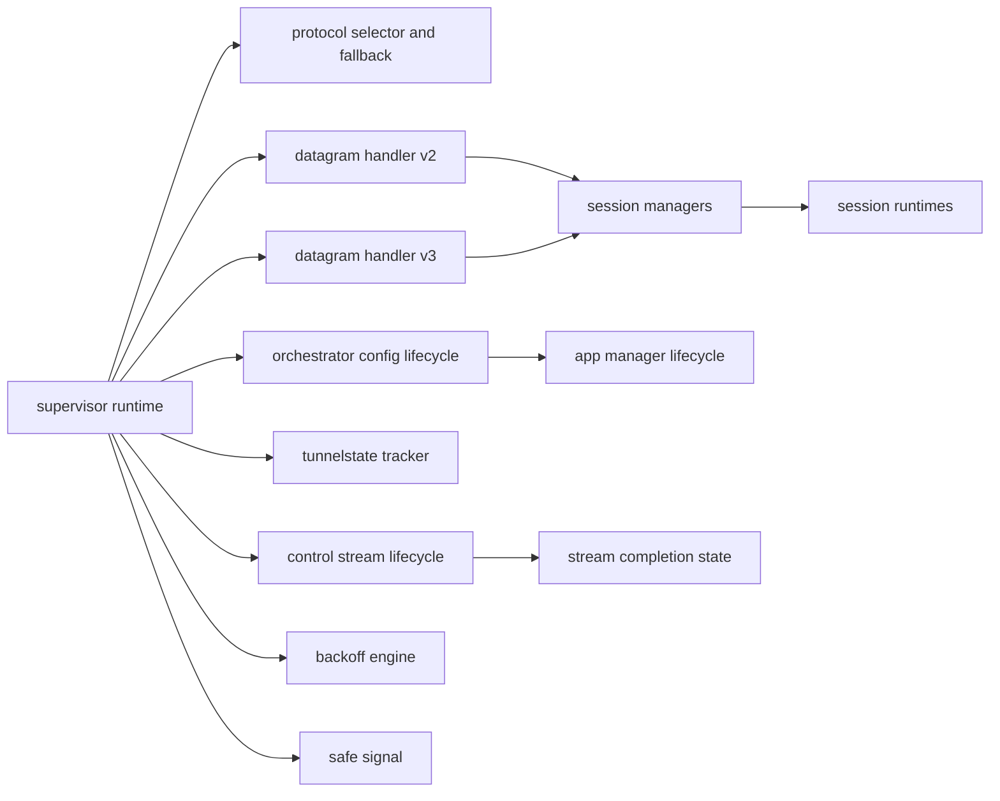
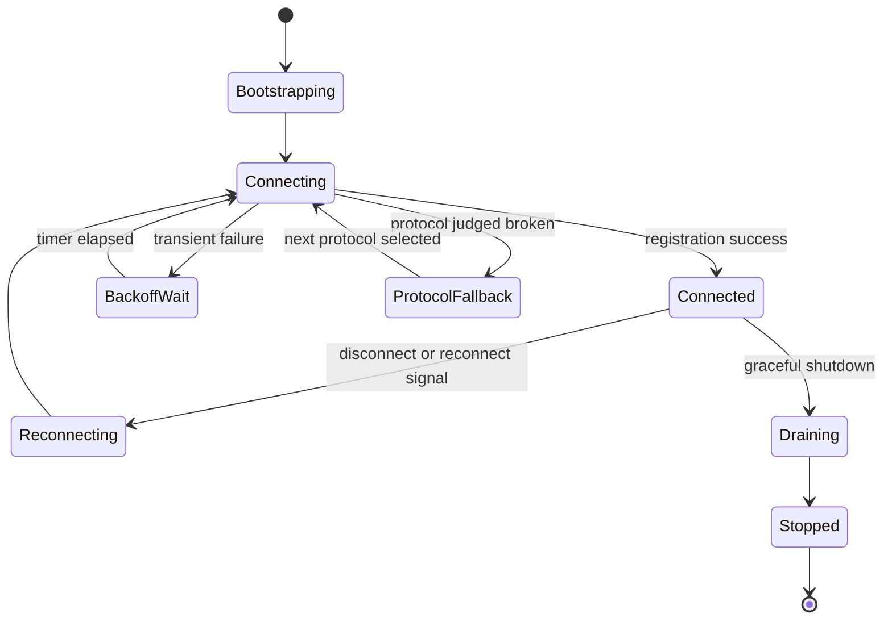
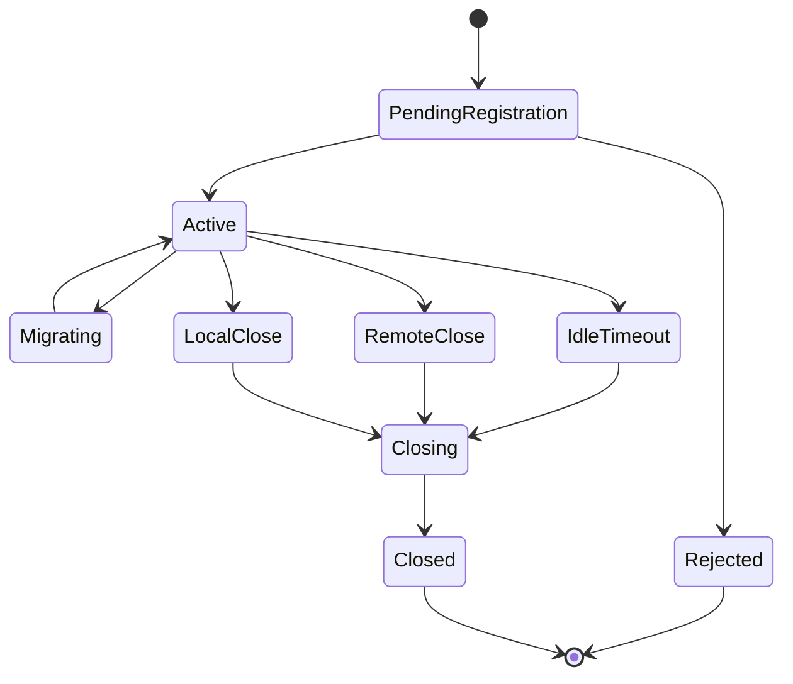
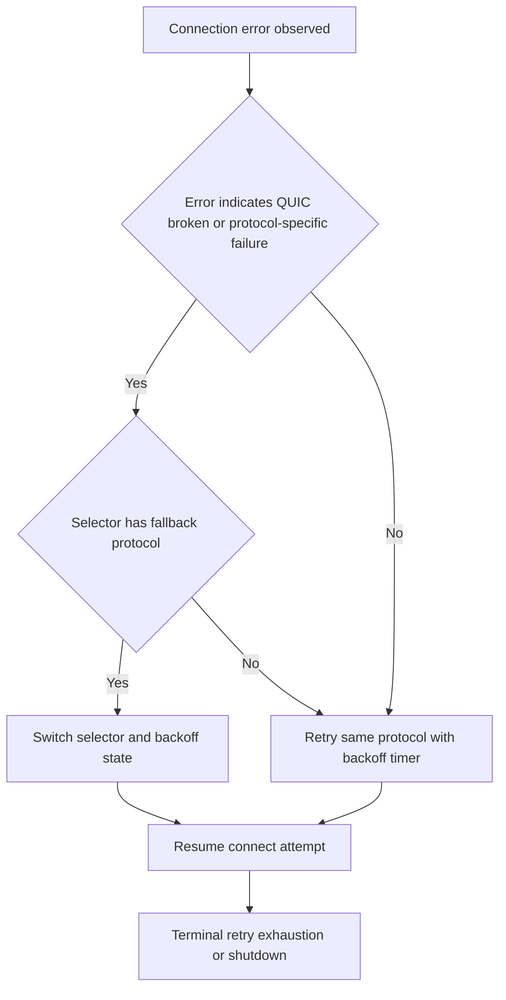
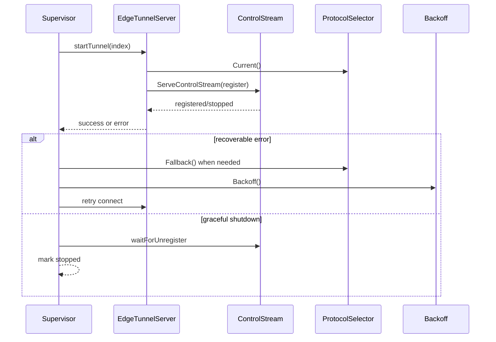
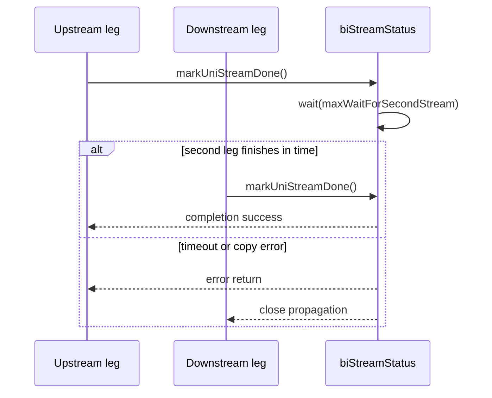

# State Machines Behavior Catalog

- Baseline date: 20260321
- Baseline reference: [cloudflare/cloudflared/tree/2026.3.0](https://github.com/cloudflare/cloudflared/tree/2026.3.0)
- Primary evidence set: behavior atoms under [../atoms](../../atoms)
- Upstream recheck: key state-machine contracts revalidated against tag `2026.3.0` source anchors for [supervisor/tunnel.go](https://github.com/cloudflare/cloudflared/blob/2026.3.0/supervisor/tunnel.go), [atoms/supervisor/tunnel](../../atoms/supervisor/tunnel.md), [supervisor/supervisor.go](https://github.com/cloudflare/cloudflared/blob/2026.3.0/supervisor/supervisor.go), [atoms/supervisor/supervisor](../../atoms/supervisor/supervisor.md), [connection/protocol.go](https://github.com/cloudflare/cloudflared/blob/2026.3.0/connection/protocol.go), [atoms/connection/protocol](../../atoms/connection/protocol.md), [quic/v3/muxer.go](https://github.com/cloudflare/cloudflared/blob/2026.3.0/quic/v3/muxer.go), [atoms/quic/v3/muxer](../../atoms/quic/v3/muxer.md), and [stream/stream.go](https://github.com/cloudflare/cloudflared/blob/2026.3.0/stream/stream.go), [atoms/stream/stream](../../atoms/stream/stream.md).

## Scope

This catalog documents finite-state and staged lifecycle behavior in tunnel runtime control loops, protocol selection, datagram/session dispatch, and orchestration coordinators.

For this catalog, state-machine behavior includes:

- supervisor connect-retry-fallback loops,
- protocol selector current/fallback state evolution,
- datagram/session registration-active-migration-close flows,
- tunnel connection index and active-connection tracking,
- orchestration and app-manager update/service lifecycle phases,
- backoff and signaling primitives that gate state progression,
- bidirectional stream completion state synchronization.

Out of scope:

- non-state API payload inventory already covered in [upstream-api-contracts](upstream-api-contracts.md),
- broad tunnel surface inventory already covered in [tunnels](tunnels.md),
- metrics-focused cataloging already covered in [metrics](metrics.md).

## State-Machine Topology

## Connection Runtime State Diagram

## Datagram Session State Diagram

## Protocol Fallback Decision Flow

## Supervisor and Control-Stream Sequence

## Stream Completion Timing Diagram

## Domain Map

| Domain | Description | Representative atoms |
| --- | --- | --- |
| Supervisor lifecycle machine | Core tunnel runtime state progression across startup, connect, reconnect, fallback, and shutdown. | [supervisor/supervisor](../../atoms/supervisor/supervisor.md), [supervisor/tunnel](../../atoms/supervisor/tunnel.md), [retry/backoffhandler](../../atoms/retry/backoffhandler.md), [signal/safe_signal](../../atoms/signal/safe_signal.md) |
| Protocol-selection machine | Dynamic protocol current/fallback state and remote/default switching logic. | [connection/protocol](../../atoms/connection/protocol.md) |
| Control-stream machine | Register, update, unregister, and stopped-state control stream lifecycle. | [connection/control](../../atoms/connection/control.md) |
| Datagram and session machine | Registration, migration, payload forwarding, idle detection, and unregister semantics. | [connection/quic_datagram_v2](../../atoms/connection/quic_datagram_v2.md), [connection/quic_datagram_v3](../../atoms/connection/quic_datagram_v3.md), [datagramsession/manager](../../atoms/datagramsession/manager.md), [datagramsession/session](../../atoms/datagramsession/session.md), [quic/v3/manager](../../atoms/quic/v3/manager.md), [quic/v3/muxer](../../atoms/quic/v3/muxer.md), [quic/v3/session](../../atoms/quic/v3/session.md) |
| Connection-state tracking | HA-indexed connection activity and protocol-observed connection history. | [tunnelstate/conntracker](../../atoms/tunnelstate/conntracker.md), [connection/tunnelsforha](../../atoms/connection/tunnelsforha.md) |
| Management session machine | Log-stream active/stopped/filtering lifecycle and stream start gating. | [management/session](../../atoms/management/session.md), [management/service](../../atoms/management/service.md) |
| Config/orchestration machine | Remote configuration versioning, override rules, and live proxy rollover sequencing. | [orchestration/orchestrator](../../atoms/orchestration/orchestrator.md) |
| Service registry machine | App add/remove/run lifecycle with callback-driven completion transitions. | [overwatch/app_manager](../../atoms/overwatch/app_manager.md) |
| Stream completion machine | Two-leg stream completion and timeout synchronization. | [stream/stream](../../atoms/stream/stream.md) |

## State Transition Contracts

| Surface | Contracted state behavior |
| --- | --- |
| Supervisor runtime | Tunnel workers advance through initialize, attempt-connect, recoverable-error, fallback, and shutdown states with reconnect channels and graceful-stop coordination. |
| Protocol selector | Selector state evolves from configured/default pools through fallback transitions and remote percentage-driven switching thresholds. |
| Control stream | Control path transitions through register, serve, wait-for-unregister, and stopped states, with context/shutdown termination. |
| Datagram session manager | Session registry tracks registration acceptance, duplicate/migration branches, active forwarding, and unregister cleanup. |
| Session runtime | Session loops transition across active I/O, idle timer resets, close-condition waiting, and terminal close states. |
| Backoff timer | Retries and grace windows advance according to timer/backoff progression and max-retry boundaries. |
| Stream synchronizer | Bidirectional stream status tracks one-leg complete, second-leg wait, timeout, and terminal completion. |

Primary evidence: [supervisor/supervisor](../../atoms/supervisor/supervisor.md), [supervisor/tunnel](../../atoms/supervisor/tunnel.md), [connection/protocol](../../atoms/connection/protocol.md), [connection/control](../../atoms/connection/control.md), [quic/v3/muxer](../../atoms/quic/v3/muxer.md), [quic/v3/session](../../atoms/quic/v3/session.md), [retry/backoffhandler](../../atoms/retry/backoffhandler.md), [stream/stream](../../atoms/stream/stream.md).

## Companion State/Event/Failure Matrix

| Machine | State | Entry trigger | Normal exit | Failure or forced exit |
| --- | --- | --- | --- | --- |
| Supervisor runtime | Bootstrapping | supervisor run and initialize begin | first tunnel worker started | initialization error aborts run |
| Supervisor runtime | Connecting | connect loop issues register/serve attempt | connection established and connected signal raised | recoverable transport error transitions to backoff/fallback |
| Supervisor runtime | ProtocolFallback | protocol judged broken by selector/fallback path | next protocol selected and connect retried | no viable fallback keeps retry loop on current constraints |
| Supervisor runtime | Draining | graceful shutdown signal received | unregister/wait paths complete and stop marked | context cancellation or unrecoverable edge error short-circuits |
| Protocol selector | CurrentProtocol | selector initialized from flag/default/remote pool | connection served on selected protocol | fallback invoked when protocol-specific break detected |
| Control stream | Registered | control stream client registration succeeds | update/unregister sequence completes and stop flag set | register timeout/context done terminates control stream |
| Datagram session manager | PendingRegistration | register request accepted for processing | session object created and published active | duplicate/rate-limited/invalid registration path returns failure |
| Datagram session runtime | Active | session serve loop starts with transport and origin endpoints | explicit unregister or idle timeout closes session | read/write errors and close conditions force terminal close |
| Datagram session runtime | Migrating | v3 muxer receives migration branch for known request/session | new eyeball path bound and session remains active | migration branch falls back to already-registered or failure response |
| Backoff engine | BackoffWait | recoverable failure increments retry timer state | timer expiry allows next connect attempt | max retry reached emits stop condition when not retry-forever |
| Connection tracker | ActiveIndexSet | tunnel event indicates connected index | active count and snapshots updated for observers | disconnect event removes index from active set |
| Orchestrator config lifecycle | ApplyingConfig | update-config request with versioned payload | ingress/proxy swap complete and version advanced | config parse/validation override errors reject update |
| App manager lifecycle | RunningService | service added and goroutine launched | callback observed and service removed/retained by manager policy | callback error path triggers removal and terminal callback state |
| Stream synchronizer | WaitingSecondLeg | one unidirectional leg completes first | second leg completes within wait budget | wait timeout/error returns failure and closes stream pair |

Primary evidence for matrix rows: [supervisor/supervisor](../../atoms/supervisor/supervisor.md), [supervisor/tunnel](../../atoms/supervisor/tunnel.md), [connection/protocol](../../atoms/connection/protocol.md), [connection/control](../../atoms/connection/control.md), [connection/quic_datagram_v2](../../atoms/connection/quic_datagram_v2.md), [quic/v3/muxer](../../atoms/quic/v3/muxer.md), [quic/v3/session](../../atoms/quic/v3/session.md), [retry/backoffhandler](../../atoms/retry/backoffhandler.md), [tunnelstate/conntracker](../../atoms/tunnelstate/conntracker.md), [orchestration/orchestrator](../../atoms/orchestration/orchestrator.md), [overwatch/app_manager](../../atoms/overwatch/app_manager.md), [stream/stream](../../atoms/stream/stream.md).

## Full Coverage Links

- [connection/control](../../atoms/connection/control.md)
- [connection/protocol](../../atoms/connection/protocol.md)
- [connection/quic_datagram_v2](../../atoms/connection/quic_datagram_v2.md)
- [connection/quic_datagram_v3](../../atoms/connection/quic_datagram_v3.md)
- [connection/tunnelsforha](../../atoms/connection/tunnelsforha.md)
- [datagramsession/event](../../atoms/datagramsession/event.md)
- [datagramsession/manager](../../atoms/datagramsession/manager.md)
- [datagramsession/session](../../atoms/datagramsession/session.md)
- [management/service](../../atoms/management/service.md)
- [management/session](../../atoms/management/session.md)
- [orchestration/orchestrator](../../atoms/orchestration/orchestrator.md)
- [overwatch/app_manager](../../atoms/overwatch/app_manager.md)
- [quic/v3/manager](../../atoms/quic/v3/manager.md)
- [quic/v3/muxer](../../atoms/quic/v3/muxer.md)
- [quic/v3/session](../../atoms/quic/v3/session.md)
- [retry/backoffhandler](../../atoms/retry/backoffhandler.md)
- [signal/safe_signal](../../atoms/signal/safe_signal.md)
- [stream/stream](../../atoms/stream/stream.md)
- [supervisor/supervisor](../../atoms/supervisor/supervisor.md)
- [supervisor/tunnel](../../atoms/supervisor/tunnel.md)
- [tunnelstate/conntracker](../../atoms/tunnelstate/conntracker.md)

## Upstream-Verified State-Machine Constants and Quirks

### Backoff Engine Specifics

The backoff handler ([retry/backoffhandler.go](https://github.com/cloudflare/cloudflared/blob/2026.3.0/retry/backoffhandler.go)) uses exponential backoff with jitter:

| Parameter | Value or formula |
| --- | --- |
| `DefaultBaseTime` | `1 second` |
| Max wait per retry | $\text{baseTime} \times 2^{\text{retries}+1}$ |
| Actual wait | Uniform random in $[0, \text{maxWait})$ |
| Grace period | $\text{baseTime} \times 2^{\text{retries}+2}$ (randomized) |
| Reset mechanism | If `resetDeadline` has passed, retries reset to 0 and backoff restarts from base |
| `retryForever` flag | Caps backoff exponent at `maxRetries` but never returns nil timer |
| Terminal signal | `BackoffTimer()` returns `nil` when `retries >= maxRetries` and `retryForever` is false |

Quirk — **Non-mutating peek**: `GetMaxBackoffDuration` follows the same logic as `Backoff` but does not mutate the receiver. The supervisor uses this to check whether retry is still allowed before enqueueing a reconnect attempt.

### Protocol Selector State Modes

Three implementations of `ProtocolSelector` interface exist, each with distinct state behavior:

| Implementation | When used | State transitions |
| --- | --- | --- |
| `staticProtocolSelector` | Explicit `--protocol quic` or `--protocol http2` | No state changes; `Fallback()` always returns `(0, false)` |
| `defaultProtocolSelector` | `--protocol auto` with `--token` | Starts QUIC; `Fallback()` returns `(HTTP2, true)` via the `Protocol.fallback()` method; HTTP2 has no further fallback |
| `remoteProtocolSelector` | `--protocol auto` without `--token` | `Current()` refreshes from remote percentage fetcher when `time.Now() >= refreshAfter`; uses FNV32a hash of account tag as threshold in `[0, 100)` |

### Stream Completion Recovery

The `unidirectionalStream` goroutine in [stream/stream.go](https://github.com/cloudflare/cloudflared/blob/2026.3.0/stream/stream.go) installs a deferred `recover()` that:

1. Checks `isAnyDone()` (atomic uint32 flag) to determine if the other direction already completed.
2. If yes — logs at debug level (expected: transport closed under one leg, other leg hit closed pipe).
3. If no — logs at warn level and reports to Sentry via `sentry.CurrentHub().Recover(err)` followed by `sentry.Flush(5s)`.

This prevents a panicking copy loop from crashing the entire cloudflared process.

## Notes

- This catalog is a state-machine-focused view; it prioritizes transition contracts over payload schema details.
- Some covered atoms also appear in [sessions](sessions.md) and [tunnels](tunnels.md); overlap is intentional because state behavior intersects both domains.

## Coverage Audit

- Audit method: collect state-machine-scoped atoms in supervisor lifecycle (`supervisor/{supervisor,tunnel}`), control/protocol and datagram handlers (`connection/{control,protocol,quic_datagram_v2,quic_datagram_v3,tunnelsforha}`), session runtimes (`datagramsession/{event,manager,session}`, `quic/v3/{manager,muxer,session}`), coordinators (`orchestration/orchestrator`, `overwatch/app_manager`), and progression primitives (`retry/backoffhandler`, `signal/safe_signal`, `stream/stream`, `tunnelstate/conntracker`), then diff against all atom links listed in this catalog.
- Current coverage result: 21 state-machine-scoped atom docs found, 21 linked in catalog, 0 missing.
- Delta (catalog links - state-machine-scoped atom docs): 0.
- Operational guardrail: if lifecycle/state surfaces or scope rules change, rerun this audit and update this file in the same change.
