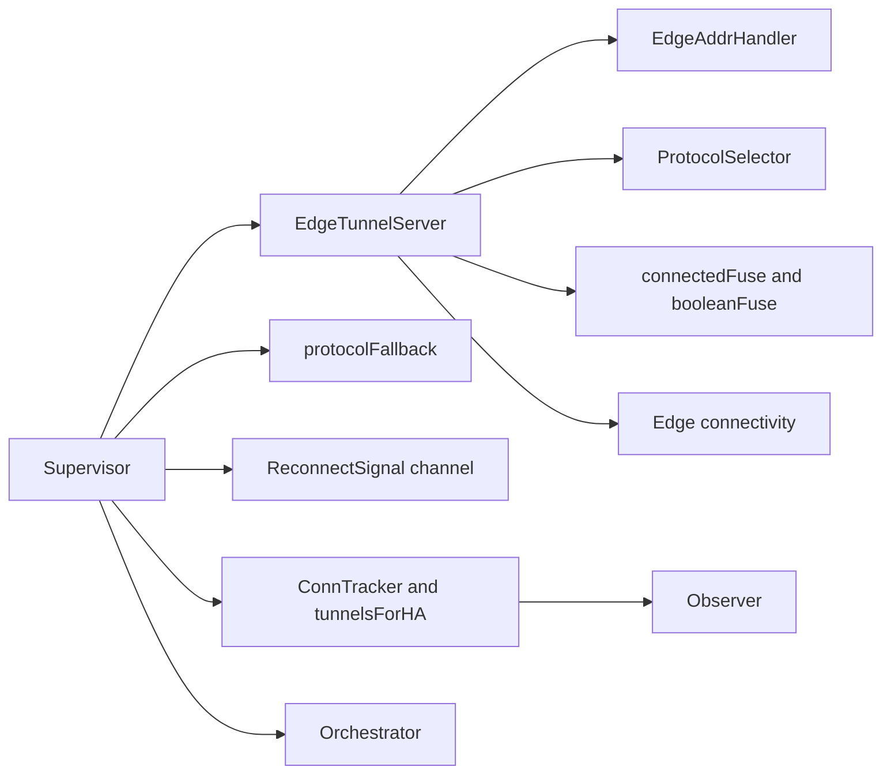
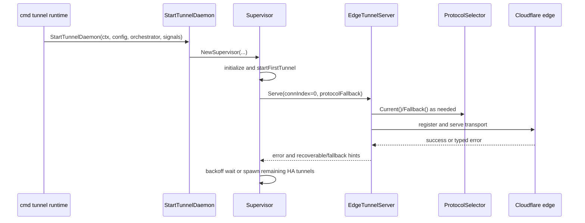
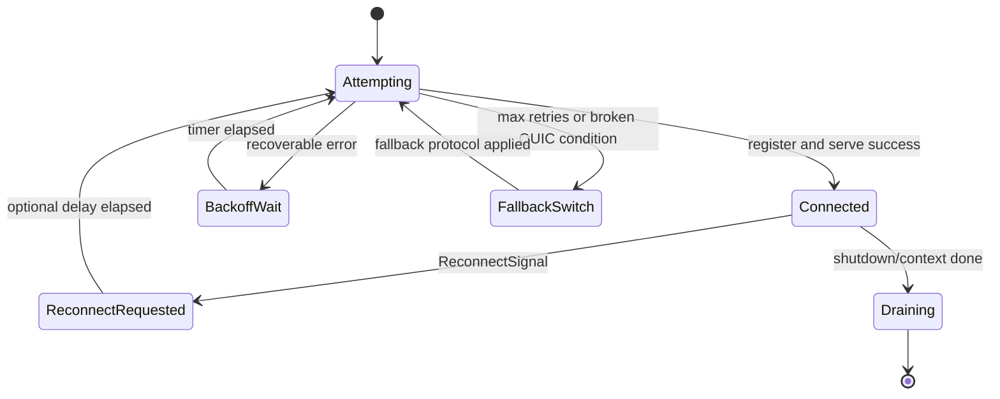
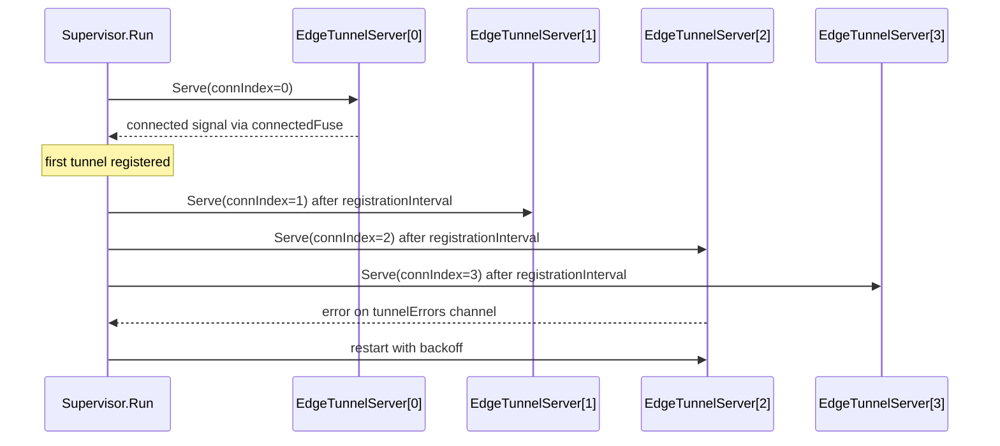

# Supervisor Behavior Catalog

- Baseline date: 20260321
- Baseline reference: [cloudflare/cloudflared/tree/2026.3.0](https://github.com/cloudflare/cloudflared/tree/2026.3.0)
- Primary evidence set: behavior atoms under [../atoms/supervisor](../../atoms/supervisor)
- Upstream recheck: supervisor control surfaces revalidated against tag `2026.3.0` source anchors for [supervisor/supervisor.go](https://github.com/cloudflare/cloudflared/blob/2026.3.0/supervisor/supervisor.go), [atoms/supervisor/supervisor](../../atoms/supervisor/supervisor.md), [supervisor/tunnel.go](https://github.com/cloudflare/cloudflared/blob/2026.3.0/supervisor/tunnel.go), [atoms/supervisor/tunnel](../../atoms/supervisor/tunnel.md), [supervisor/external_control.go](https://github.com/cloudflare/cloudflared/blob/2026.3.0/supervisor/external_control.go), [atoms/supervisor/external_control](../../atoms/supervisor/external_control.md), [supervisor/fuse.go](https://github.com/cloudflare/cloudflared/blob/2026.3.0/supervisor/fuse.go), [atoms/supervisor/fuse](../../atoms/supervisor/fuse.md), [supervisor/tunnelsforha.go](https://github.com/cloudflare/cloudflared/blob/2026.3.0/supervisor/tunnelsforha.go), [atoms/supervisor/tunnelsforha](../../atoms/supervisor/tunnelsforha.md), [supervisor/conn_aware_logger.go](https://github.com/cloudflare/cloudflared/blob/2026.3.0/supervisor/conn_aware_logger.go), [atoms/supervisor/conn_aware_logger](../../atoms/supervisor/conn_aware_logger.md), [supervisor/pqtunnels.go](https://github.com/cloudflare/cloudflared/blob/2026.3.0/supervisor/pqtunnels.go), [atoms/supervisor/pqtunnels](../../atoms/supervisor/pqtunnels.md), and [supervisor/metrics.go](https://github.com/cloudflare/cloudflared/blob/2026.3.0/supervisor/metrics.go), [atoms/supervisor/metrics](../../atoms/supervisor/metrics.md).

## Scope

This catalog is a dedicated deep dive on supervisor-owned control behavior: controller objects, connection orchestration loops, protocol fallback, reconnect control, and coordinated shutdown.

For this catalog, supervisor behavior includes:

- supervisor-level runtime coordination over multiple HA connections,
- edge tunnel serving loops and protocol-specific connection handlers,
- reconnect/backoff/fallback governance,
- control primitives (`ReconnectSignal`, fuse primitives, protocol fallback wrapper),
- HA tunnel-id tracking and supervisor metrics,
- connection-aware logging surfaces used by supervisor orchestration,
- post-quantum curve-preference policy selection in supervisor paths.

Out of scope:

- broader cross-module tunnel cataloging already detailed in [tunnels](tunnels.md),
- pure API contract inventory already detailed in [upstream-api-contracts](upstream-api-contracts.md),
- generalized state-machine synthesis already detailed in [state-machines](state-machines.md).

## Supervisor Topology

## Controlling Object Inventory

| Object | Kind | Responsibility | Primary evidence |
| --- | --- | --- | --- |
| `Supervisor` | struct | Owns multi-connection lifecycle, startup sequencing, retry scheduling, and next-connection coordination. | [atoms/supervisor/supervisor](../../atoms/supervisor/supervisor.md) |
| `TunnelConfig` | struct | Carries all control knobs for protocol, retries, edge addressing, transport limits, and service dependencies. | [atoms/supervisor/tunnel](../../atoms/supervisor/tunnel.md) |
| `EdgeTunnelServer` | struct | Runs serving loop per connection, drives transport mode, reconnect handling, and edge registration flow. | [atoms/supervisor/tunnel](../../atoms/supervisor/tunnel.md) |
| `TunnelServer` | interface | Supervisor abstraction boundary for serving a single connection index. | [atoms/supervisor/supervisor](../../atoms/supervisor/supervisor.md) |
| `EdgeAddrHandler` | interface | Governs when edge address rotation is required and when to classify connectivity failures. | [atoms/supervisor/tunnel](../../atoms/supervisor/tunnel.md) |
| `ipAddrFallback` | struct | Per-connection edge-IP retry bookkeeping and connectivity-error escalation. | [atoms/supervisor/tunnel](../../atoms/supervisor/tunnel.md) |
| `protocolFallback` | struct | Backoff wrapper that tracks current protocol and fallback mode transitions. | [atoms/supervisor/tunnel](../../atoms/supervisor/tunnel.md) |
| `ConnectivityError` | struct | Signals retry exhaustion state for fallback and reconnect decisions. | [atoms/supervisor/tunnel](../../atoms/supervisor/tunnel.md) |
| `ReconnectSignal` | struct | External control message that forces reconnect, with optional delay budget. | [atoms/supervisor/external_control](../../atoms/supervisor/external_control.md) |
| `booleanFuse` | struct | One-shot synchronization primitive for connection success/failure latching. | [atoms/supervisor/fuse](../../atoms/supervisor/fuse.md) |
| `connectedFuse` | struct | Couples connection success notification with backoff reset behavior. | [atoms/supervisor/tunnel](../../atoms/supervisor/tunnel.md) |
| `ConnAwareLogger` | struct | Chooses warn/error shape based on active-connection tracker state. | [atoms/supervisor/conn_aware_logger](../../atoms/supervisor/conn_aware_logger.md) |
| `tunnelsForHA` | struct | Maintains HA-connection-to-tunnel mapping and emits per-mapping metrics. | [atoms/supervisor/tunnelsforha](../../atoms/supervisor/tunnelsforha.md) |
| `haConnections` | gauge | Tracks active HA connections under tunnel metrics namespace/subsystem. | [atoms/supervisor/metrics](../../atoms/supervisor/metrics.md) |

## Lifecycle Sequence

## Supervisor Run-Loop Contracts

| Surface | Contract |
| --- | --- |
| Construction | `NewSupervisor` resolves static/dynamic edge addresses, allocates trackers/managers, and wires `EdgeTunnelServer`. |
| Initialization | `initialize` caps HA connections to available addresses and seeds per-connection `protocolFallback` states. |
| First tunnel gating | `startFirstTunnel` blocks rollout of additional HA connections until one successful registration signal is observed. |
| HA expansion | Additional connections are started with registration interval pacing and inherited connected protocol. |
| Error fan-in | `tunnelErrors` channel feeds per-index outcomes into retry/fallback decisions in `Run`. |
| Graceful shutdown | `gracefulShutdownC` and context cancellation terminate serving loops without forced crash behavior. |

Primary evidence: [atoms/supervisor/supervisor](../../atoms/supervisor/supervisor.md), [atoms/supervisor/tunnel](../../atoms/supervisor/tunnel.md).

## Protocol and Reconnect Governance

| Mechanism | Contracted behavior |
| --- | --- |
| `selectNextProtocol` | Switches to selector fallback when backoff is exhausted or QUIC-broken condition is detected and fallback exists. |
| QUIC-broken classifier | Treats idle-timeout/transport variants and selected network errors as fallback triggers. |
| `listenReconnect` | Waits on reconnect channel, graceful shutdown, or context completion; reconnect signal behaves as typed error path. |
| `ReconnectSignal.DelayBeforeReconnect` | Applies deferred reconnect pacing before retrying the connection loop. |
| `connectedFuse.Connected` | Marks successful connect and resets backoff state for that connection control path. |

Primary evidence: [atoms/supervisor/tunnel](../../atoms/supervisor/tunnel.md), [atoms/supervisor/external_control](../../atoms/supervisor/external_control.md), [atoms/supervisor/fuse](../../atoms/supervisor/fuse.md).

## Address Rotation and Connectivity Policy

| Error class | Address rotation | Connectivity classification |
| --- | --- | --- |
| `nil` | no | none |
| duplicate registration / QUIC idle timeout | yes | non-connectivity error |
| edge dial / edge QUIC dial | yes | `ConnectivityError(false)` until retry budget exhausted |
| exhausted dial retries | yes | `ConnectivityError(true)` enabling higher-level fallback behavior |
| default/unmatched errors | no | none |

Primary evidence: [atoms/supervisor/tunnel](../../atoms/supervisor/tunnel.md).

## Transport Control Contracts

| Transport surface | Control contract |
| --- | --- |
| `serveConnection` | Routes per selected protocol (`quic`/`http2`) and shapes connection options using local-origin address metadata. |
| `serveHTTP2` | Runs serving and reconnect listener in errgroup; reconnect path can force break for deterministic restart behavior. |
| `serveQUIC` | Applies curve preference policy, configures QUIC flow/idle/datagram windows, dials edge, and chooses datagram session manager variant. |
| `reportErrorToSentry` | Captures only specific FIPS + PQ strict crypto transport-error subset for QUIC dial failures. |

Primary evidence: [atoms/supervisor/tunnel](../../atoms/supervisor/tunnel.md), [atoms/supervisor/pqtunnels](../../atoms/supervisor/pqtunnels.md).

## PQ Curve Preference Policy

| PQ mode | FIPS disabled | FIPS enabled |
| --- | --- | --- |
| `PostQuantumStrict` | hybrid-only non-FIPS list (`X25519MLKEM768`) | strict FIPS list (`P256Kyber768Draft00`) |
| `PostQuantumPrefer` | PQ-first list plus caller curves with deduplication | PQ-first FIPS list with classical fallback (`CurveP256`) |
| default/unknown | error | error |

Primary evidence: [atoms/supervisor/pqtunnels](../../atoms/supervisor/pqtunnels.md).

## Observability and Tracking Contracts

| Surface | Contract |
| --- | --- |
| `haConnections` gauge | Incremented/decremented around `EdgeTunnelServer.Serve`, representing active HA tunnel connections. |
| `tunnelsForHA` | Maintains HA connection index to tunnel ID map and reconciles old/new label values in metrics. |
| `ConnAwareLogger` | Chooses error-level when zero active connections exist, warn-level otherwise. |
| observer registration | `ConnTracker` is registered as sink to connection observer through supervisor logger construction. |

Primary evidence: [atoms/supervisor/metrics](../../atoms/supervisor/metrics.md), [atoms/supervisor/tunnelsforha](../../atoms/supervisor/tunnelsforha.md), [atoms/supervisor/conn_aware_logger](../../atoms/supervisor/conn_aware_logger.md).

## Full Coverage Links

- [supervisor/conn_aware_logger](../../atoms/supervisor/conn_aware_logger.md)
- [supervisor/external_control](../../atoms/supervisor/external_control.md)
- [supervisor/fuse](../../atoms/supervisor/fuse.md)
- [supervisor/metrics](../../atoms/supervisor/metrics.md)
- [supervisor/pqtunnels](../../atoms/supervisor/pqtunnels.md)
- [supervisor/supervisor](../../atoms/supervisor/supervisor.md)
- [supervisor/tunnel](../../atoms/supervisor/tunnel.md)
- [supervisor/tunnelsforha](../../atoms/supervisor/tunnelsforha.md)

## Upstream-Verified Supervisor Constants and Quirks

### Retry and Timing Constants

| Constant | Value | Source |
| --- | --- | --- |
| `tunnelRetryDuration` | `10 seconds` | [supervisor/supervisor.go](https://github.com/cloudflare/cloudflared/blob/2026.3.0/supervisor/supervisor.go) |
| `registrationInterval` | `1 second` | [supervisor/supervisor.go](https://github.com/cloudflare/cloudflared/blob/2026.3.0/supervisor/supervisor.go) |

HA connections beyond index 0 are started sequentially with `registrationInterval` spacing after the first tunnel connects successfully.

### Error Classification for Retry vs Bail

The first-tunnel retry loop classifies errors into three buckets:

| Bucket | Error types | Behavior |
| --- | --- | --- |
| Always retry | `DupConnRegisterTunnelError`, `*quic.IdleTimeoutError`, `*quic.ApplicationError`, `edgediscovery.DialError`, `*connection.EdgeQuicDialError`, `*connection.ControlStreamError`, `*connection.StreamListenerError`, `*connection.DatagramManagerError` | Re-enter serve loop after backoff |
| Conditionally retry | `edgediscovery.ErrNoAddressesLeft` | Retry only when static edge addresses are configured; bail otherwise |
| Bail | All other error types | Return error, terminate tunnel index |

Quirk — **Unauthorized retry**: errors containing the string `"Unauthorized"` are always retried regardless of type classification. The rationale documented in source is that authorization failures may be transient due to edge propagation lag when new tunnels are created.

### HA Connection Startup Sequence

The first tunnel (index 0) connects and blocks the supervisor run loop. Only after successful registration signal does the supervisor fan out HA connections 1..N-1, each using the protocol that the first tunnel established. If `HAConnections` exceeds available edge addresses, it is clamped.

## Rust Porting Considerations

### Select-Loop to Tokio Select Mapping

The supervisor's `Run` method uses Go `select` over `tunnelErrors`, `reconnect`, and context cancellation channels. In Rust:

| Go pattern | Rust equivalent |
| --- | --- |
| `select { case err := <-tunnelErrors }` | `tokio::select! { err = tunnel_errors.recv() => }` |
| `ReconnectSignal` channel | `tokio::sync::mpsc` channel with typed signal |
| `gracefulShutdownC` | `tokio_util::sync::CancellationToken` or `tokio::sync::watch` |
| `time.After(delay)` in reconnect | `tokio::time::sleep(delay)` branch in select |
| Shared `protocolFallback` state across goroutines | `Arc<Mutex<ProtocolFallback>>` or dedicated actor |

### Error Type Hierarchy Translation

The supervisor classifies errors into always-retry, conditional-retry, and bail buckets via type-switch. In Rust, this maps to an enum-based error taxonomy:

| Go pattern | Rust pattern |
| --- | --- |
| `errors.As(err, &target)` type matching | `match err { SupervisorError::DupConn(..) => retry }` |
| String-contains "Unauthorized" check | `err.to_string().contains("Unauthorized")` or dedicated variant |
| `ConnectivityError{HasNoAddress: bool}` | `ConnectivityError { has_no_address: bool }` struct variant |

## Notes

- This catalog is intentionally dedicated to supervisor-owned control objects and loop semantics.
- Cross-module dependencies are referenced only where they materially shape supervisor control behavior.
- Overlap with [tunnels](tunnels.md) and [state-machines](state-machines.md) is intentional; this file is the controller-object-first view.

## Coverage Audit

- Audit method: collect all behavior atoms under [../atoms/supervisor](../../atoms/supervisor), diff against links in this catalog, and verify each controlling object and primitive has direct representation.
- Current result: 8 supervisor atom docs found, 8 linked in catalog, 0 missing.
- Control-object result: `Supervisor`, `TunnelConfig`, `EdgeTunnelServer`, `TunnelServer`, `EdgeAddrHandler`, `ipAddrFallback`, `protocolFallback`, `ConnectivityError`, `ReconnectSignal`, `booleanFuse`, `connectedFuse`, `ConnAwareLogger`, `tunnelsForHA`, and `haConnections` are explicitly covered.
- Operational guardrail: when controller objects or retry/fallback behavior changes in supervisor sources, rerun this audit and update this catalog in the same change.
