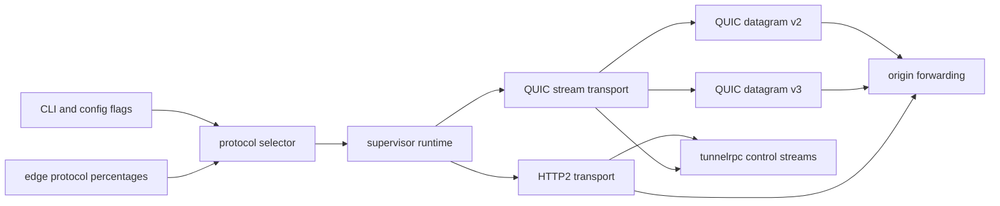
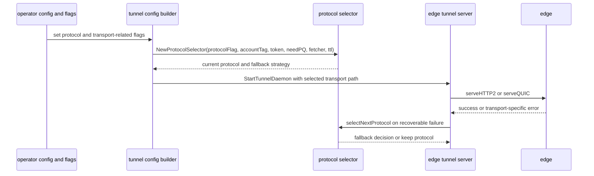

# Tunnels Transport Behavior Catalog

- Baseline date: 20260321
- Baseline reference: [cloudflare/cloudflared/tree/2026.3.0](https://github.com/cloudflare/cloudflared/tree/2026.3.0)
- Primary evidence set: behavior atoms under [../atoms](../../atoms)
- Upstream recheck: key transport-difference contracts revalidated against tag `2026.3.0` source anchors for [connection/protocol.go](https://github.com/cloudflare/cloudflared/blob/2026.3.0/connection/protocol.go), [atoms/connection/protocol](../../atoms/connection/protocol.md), [connection/http2.go](https://github.com/cloudflare/cloudflared/blob/2026.3.0/connection/http2.go), [atoms/connection/http2](../../atoms/connection/http2.md), [connection/quic.go](https://github.com/cloudflare/cloudflared/blob/2026.3.0/connection/quic.go), [atoms/connection/quic](../../atoms/connection/quic.md), [connection/quic_connection.go](https://github.com/cloudflare/cloudflared/blob/2026.3.0/connection/quic_connection.go), [atoms/connection/quic_connection](../../atoms/connection/quic_connection.md), [connection/quic_datagram_v2.go](https://github.com/cloudflare/cloudflared/blob/2026.3.0/connection/quic_datagram_v2.go), [atoms/connection/quic_datagram_v2](../../atoms/connection/quic_datagram_v2.md), [connection/quic_datagram_v3.go](https://github.com/cloudflare/cloudflared/blob/2026.3.0/connection/quic_datagram_v3.go), [atoms/connection/quic_datagram_v3](../../atoms/connection/quic_datagram_v3.md), [supervisor/tunnel.go](https://github.com/cloudflare/cloudflared/blob/2026.3.0/supervisor/tunnel.go), [atoms/supervisor/tunnel](../../atoms/supervisor/tunnel.md), [supervisor/pqtunnels.go](https://github.com/cloudflare/cloudflared/blob/2026.3.0/supervisor/pqtunnels.go), [atoms/supervisor/pqtunnels](../../atoms/supervisor/pqtunnels.md), [cmd/cloudflared/tunnel/cmd.go](https://github.com/cloudflare/cloudflared/blob/2026.3.0/cmd/cloudflared/tunnel/cmd.go), [atoms/cmd/cloudflared/tunnel/cmd](../../atoms/cmd/cloudflared/tunnel/cmd.md), and [cmd/cloudflared/tunnel/configuration.go](https://github.com/cloudflare/cloudflared/blob/2026.3.0/cmd/cloudflared/tunnel/configuration.go), [atoms/cmd/cloudflared/tunnel/configuration](../../atoms/cmd/cloudflared/tunnel/configuration.md).

## Scope

This catalog is the dedicated tunnel transport-differences view of baseline behavior.

For this catalog, transport behavior includes:

- transport family selection (HTTP2, QUIC stream, QUIC datagram variants),
- runtime fallback and retry transitions across transport/protocol states,
- control-stream and request-stream behavior tied to each transport,
- datagram session management differences between v2 and v3,
- CLI/config surfaces that shape transport behavior before runtime starts,
- post-quantum/FIPS transport constraints that influence curve and protocol paths.

Out of scope:

- tunnel CRUD and account API details in [tunnels](tunnels.md),
- full CLI command inventory in [cli](cli.md),
- broad proxying behavior across all boundaries in [proxying](proxying.md),
- Cap'n Proto RPC contract internals in [capnp-rpc](capnp-rpc.md).

## Transport Topology

## Selection and Fallback Sequence

## Transport Families

| Family | Primary behavior | Representative atoms |
|---|---|---|
| HTTP2 edge transport | Stream-based serving using HTTP2 request/response semantics, websocket/control upgrade handling, and config update path integration. | [connection/http2](../../atoms/connection/http2.md), [connection/control](../../atoms/connection/control.md), [connection/header](../../atoms/connection/header.md), [connection/json](../../atoms/connection/json.md) |
| QUIC stream transport | QUIC connection dial and stream accept loop with request dispatch and control stream handling. | [connection/quic](../../atoms/connection/quic.md), [connection/quic_connection](../../atoms/connection/quic_connection.md), [connection/control](../../atoms/connection/control.md), [quic/safe_stream](../../atoms/quic/safe_stream.md) |
| QUIC datagram v2 | Datagram sessions with per-session origin dial and explicit registration/unregistration through tunnelrpc session control. | [connection/quic_datagram_v2](../../atoms/connection/quic_datagram_v2.md), [datagramsession/session](../../atoms/datagramsession/session.md), [tunnelrpc/quic/session_client](../../atoms/tunnelrpc/quic/session_client.md) |
| QUIC datagram v3 | Session-manager/muxer model with request-ID-oriented registration, migration, and ICMP/datagram processing loops. | [connection/quic_datagram_v3](../../atoms/connection/quic_datagram_v3.md), [quic/v3/manager](../../atoms/quic/v3/manager.md), [quic/v3/muxer](../../atoms/quic/v3/muxer.md), [quic/v3/session](../../atoms/quic/v3/session.md) |
| RPC control stream plane | Registration/config/session method calls shared by transport handlers but with transport-specific lifecycle context. | [tunnelrpc/registration_client](../../atoms/tunnelrpc/registration_client.md), [tunnelrpc/quic/protocol](../../atoms/tunnelrpc/quic/protocol.md), [tunnelrpc/quic/request_server_stream](../../atoms/tunnelrpc/quic/request_server_stream.md), [tunnelrpc/quic/cloudflared_client](../../atoms/tunnelrpc/quic/cloudflared_client.md) |

## Transport Difference Matrix

| Aspect | HTTP2 path | QUIC stream path | QUIC datagram v2 | QUIC datagram v3 |
|---|---|---|---|---|
| Session model | Request/response stream with upgrade handling | Bidirectional QUIC streams + control stream | Datagram session object per registered UDP session | Request-ID session-manager/muxer model |
| Startup entrypoint | `serveHTTP2` and HTTP2 connection server | `serveQUIC` and `quicConnection.Serve` | `NewDatagramV2Connection` with session serve loops | `NewDatagramV3Connection` backed by v3 manager/muxer |
| Control-plane coupling | Control stream upgrade and configuration update route | QUIC control stream and request stream APIs | tunnelrpc session client manages register/unregister | v3 manager + datagram registration semantics |
| Failure/fallback strategy | Included in supervisor protocol fallback path | Included in supervisor protocol fallback path | Depends on QUIC stream transport health and RPC session responses | Depends on QUIC v3 manager/muxer and datagram lifecycle outcomes |
| Metadata framing | HTTP headers and response metadata wrappers | Connect request/response framing over request streams | Session trace/idle hints + datagram payload forwarding | RequestID/datagram envelopes + migration/rate-limited semantics |
| Concurrency profile | HTTP handler and stream coordination | Stream accept loop + per-stream handlers | Per-session goroutine loops and close conditions | Poll/process loops for datagrams and ICMP with shared session map |

Primary evidence: [supervisor/tunnel](../../atoms/supervisor/tunnel.md), [connection/http2](../../atoms/connection/http2.md), [connection/quic_connection](../../atoms/connection/quic_connection.md), [connection/quic_datagram_v2](../../atoms/connection/quic_datagram_v2.md), [connection/quic_datagram_v3](../../atoms/connection/quic_datagram_v3.md), [quic/v3/muxer](../../atoms/quic/v3/muxer.md).

## Protocol Selection and Policy Contracts

| Surface | Contracted behavior |
|---|---|
| Static selector | Honors explicit protocol choice from operator config/flags and uses deterministic fallback mapping rules. |
| Remote/default selector | Uses edge percentage fetch and switch threshold to choose current protocol dynamically. |
| PQ-aware path | `needPQ` modifies selector path and curve preference behavior toward PQ-capable transport profiles. |
| Runtime fallback | `selectNextProtocol` coordinates per-connection fallback decisions from observed transport errors. |
| Address refresh tie-in | Retry/fallback decisions can force edge-address refresh on connectivity conditions. |

Primary evidence: [connection/protocol](../../atoms/connection/protocol.md), [edgediscovery/protocol](../../atoms/edgediscovery/protocol.md), [supervisor/tunnel](../../atoms/supervisor/tunnel.md), [retry/backoffhandler](../../atoms/retry/backoffhandler.md).

## CLI and Config Overlap (Intentional)

| Overlap surface | Transport relevance | Representative atoms |
|---|---|---|
| Transport flag ingestion | CLI/config layer maps operator intent (`protocol`, resolver and bind options, ingress transport tuning) into runtime transport configuration. | [cmd/cloudflared/tunnel/cmd](../../atoms/cmd/cloudflared/tunnel/cmd.md), [cmd/cloudflared/tunnel/configuration](../../atoms/cmd/cloudflared/tunnel/configuration.md) |
| Tunnel startup orchestration | `StartServer` path creates supervisor and runtime transport handlers from merged config and token context. | [cmd/cloudflared/tunnel/cmd](../../atoms/cmd/cloudflared/tunnel/cmd.md), [supervisor/tunnel](../../atoms/supervisor/tunnel.md) |
| Quick-tunnel shaping | Quick mode biases runtime defaults (for example QUIC defaulting when unset) and constrains HA transport behavior. | [cmd/cloudflared/tunnel/quick_tunnel](../../atoms/cmd/cloudflared/tunnel/quick_tunnel.md), [tunnels](tunnels.md) |

## PQ and FIPS Transport Constraints

| Mode | Transport implication |
|---|---|
| Non-FIPS strict/prefer PQ | PQ-capable curve sets prefer hybrid paths that bias QUIC-compatible transport behavior. |
| FIPS strict/prefer PQ | Curve preference uses FIPS-constrained PQ/classical choices and still feeds transport negotiation policy. |
| Non-PQ/default | Selector and fallback can include HTTP2-first/default decisions depending on account and edge policy inputs. |

Primary evidence: [supervisor/pqtunnels](../../atoms/supervisor/pqtunnels.md), [connection/protocol](../../atoms/connection/protocol.md), [supervisor/tunnel](../../atoms/supervisor/tunnel.md).

## Full Coverage Links

### Core transport atom set (36)

- [cmd/cloudflared/tunnel/cmd](../../atoms/cmd/cloudflared/tunnel/cmd.md)
- [cmd/cloudflared/tunnel/configuration](../../atoms/cmd/cloudflared/tunnel/configuration.md)
- [cmd/cloudflared/tunnel/quick_tunnel](../../atoms/cmd/cloudflared/tunnel/quick_tunnel.md)
- [connection/control](../../atoms/connection/control.md)
- [connection/errors](../../atoms/connection/errors.md)
- [connection/header](../../atoms/connection/header.md)
- [connection/http2](../../atoms/connection/http2.md)
- [connection/json](../../atoms/connection/json.md)
- [connection/protocol](../../atoms/connection/protocol.md)
- [connection/quic](../../atoms/connection/quic.md)
- [connection/quic_connection](../../atoms/connection/quic_connection.md)
- [connection/quic_datagram_v2](../../atoms/connection/quic_datagram_v2.md)
- [connection/quic_datagram_v3](../../atoms/connection/quic_datagram_v3.md)
- [datagramsession/session](../../atoms/datagramsession/session.md)
- [edgediscovery/protocol](../../atoms/edgediscovery/protocol.md)
- [quic/constants](../../atoms/quic/constants.md)
- [quic/conversion](../../atoms/quic/conversion.md)
- [quic/datagram](../../atoms/quic/datagram.md)
- [quic/datagramv2](../../atoms/quic/datagramv2.md)
- [quic/safe_stream](../../atoms/quic/safe_stream.md)
- [quic/tracing](../../atoms/quic/tracing.md)
- [quic/v3/datagram](../../atoms/quic/v3/datagram.md)
- [quic/v3/datagram_errors](../../atoms/quic/v3/datagram_errors.md)
- [quic/v3/icmp](../../atoms/quic/v3/icmp.md)
- [quic/v3/manager](../../atoms/quic/v3/manager.md)
- [quic/v3/metrics](../../atoms/quic/v3/metrics.md)
- [quic/v3/muxer](../../atoms/quic/v3/muxer.md)
- [quic/v3/request](../../atoms/quic/v3/request.md)
- [quic/v3/session](../../atoms/quic/v3/session.md)
- [retry/backoffhandler](../../atoms/retry/backoffhandler.md)
- [supervisor/pqtunnels](../../atoms/supervisor/pqtunnels.md)
- [supervisor/tunnel](../../atoms/supervisor/tunnel.md)
- [tunnelrpc/quic/cloudflared_client](../../atoms/tunnelrpc/quic/cloudflared_client.md)
- [tunnelrpc/quic/protocol](../../atoms/tunnelrpc/quic/protocol.md)
- [tunnelrpc/quic/request_server_stream](../../atoms/tunnelrpc/quic/request_server_stream.md)
- [tunnelrpc/quic/session_client](../../atoms/tunnelrpc/quic/session_client.md)

## Upstream-Verified Transport Constants and Quirks

| Constant or parameter | Value | Source | Significance |
|---|---|---|---|
| `edgeH2TLSServerName` | `h2.cftunnel.com` | [connection/protocol.go](https://github.com/cloudflare/cloudflared/blob/2026.3.0/connection/protocol.go) | HTTP2 edge TLS SNI |
| `edgeQUICServerName` | `quic.cftunnel.com` | [connection/protocol.go](https://github.com/cloudflare/cloudflared/blob/2026.3.0/connection/protocol.go) | QUIC edge TLS SNI |
| QUIC ALPN next-protos | `["argotunnel"]` | [connection/protocol.go](https://github.com/cloudflare/cloudflared/blob/2026.3.0/connection/protocol.go) | Required ALPN for QUIC handshake |
| `ProtocolList` (precedence) | `[QUIC, HTTP2]` | [connection/protocol.go](https://github.com/cloudflare/cloudflared/blob/2026.3.0/connection/protocol.go) | Remote selector evaluates QUIC first |
| `ResolveTTL` | `1 hour` | [connection/protocol.go](https://github.com/cloudflare/cloudflared/blob/2026.3.0/connection/protocol.go) | Edge SRV/TXT record refresh cadence |
| `tunnelRetryDuration` | `10 seconds` | [supervisor/supervisor.go](https://github.com/cloudflare/cloudflared/blob/2026.3.0/supervisor/supervisor.go) | Wait before retrying a failed tunnel |
| `registrationInterval` | `1 second` | [supervisor/supervisor.go](https://github.com/cloudflare/cloudflared/blob/2026.3.0/supervisor/supervisor.go) | Inter-HA-connection registration spacing |

### Protocol Selector Modes

Three distinct protocol selector implementations exist at runtime:

| Mode | Trigger | Behavior | Fallback |
|---|---|---|---|
| Static | Explicit `--protocol quic` or `--protocol http2` | Fixed protocol, no fallback | None |
| Default | `--protocol auto` with `--token` provided | Starts QUIC, runtime fallback to HTTP2 | QUIC → HTTP2 |
| Remote | `--protocol auto` without `--token` | Percentage-based selection with FNV32a hash of account tag as switch threshold; refreshes at `ResolveTTL` cadence | Pool order: QUIC first, HTTP2 second |

Quirk: the FNV hash threshold means different accounts will switch protocols at different remote-percentage levels, providing a gradual rollout mechanism without client coordination.

### h2mux Deprecation

If `--protocol h2mux` is specified, the selector emits a deprecation warning and silently falls back to HTTP2. The h2mux TLS server name `cftunnel.com` is retained in source as an unused constant.

## Notes

- This catalog intentionally overlaps with [tunnels](tunnels.md) and [cli](cli.md), but isolates one concern: how transport families differ in behavior and failure handling.
- The focus is transport decision and runtime differences, not command taxonomy or API endpoint inventory.
- Cap'n Proto method surfaces are referenced only where they explain transport behavior boundaries.

## Coverage Audit

- Audit method: collect transport-focused atoms across `connection` transport handlers, `quic` internals, `supervisor` transport selection/fallback, and CLI tunnel configuration/startup surfaces, then diff against the links in this catalog.
- Current result: 36 selected transport atoms found, 36 linked in this catalog, 0 missing.
- Operational guardrail: if transport selector/fallback code, QUIC v3 manager/muxer/session behavior, or tunnel CLI transport flags change, update this catalog in the same change.
