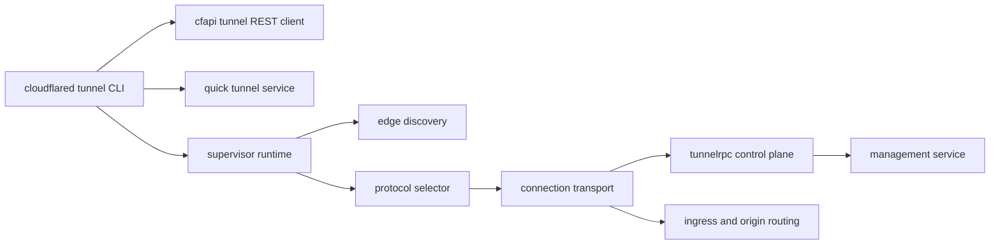
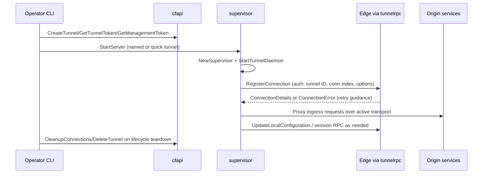

# Tunnels Behavior Catalog

- Baseline date: 20260321
- Baseline reference: [cloudflare/cloudflared/tree/2026.3.0](https://github.com/cloudflare/cloudflared/tree/2026.3.0)
- Primary evidence set: behavior atoms under [../atoms](../../atoms)
- Upstream recheck: key tunnel contracts revalidated against tag `2026.3.0` source anchors for [supervisor/pqtunnels.go](https://github.com/cloudflare/cloudflared/blob/2026.3.0/supervisor/pqtunnels.go), [atoms/supervisor/pqtunnels](../../atoms/supervisor/pqtunnels.md), [cmd/cloudflared/tunnel/quick_tunnel.go](https://github.com/cloudflare/cloudflared/blob/2026.3.0/cmd/cloudflared/tunnel/quick_tunnel.go), [atoms/cmd/cloudflared/tunnel/quick_tunnel](../../atoms/cmd/cloudflared/tunnel/quick_tunnel.md), [cfapi/tunnel.go](https://github.com/cloudflare/cloudflared/blob/2026.3.0/cfapi/tunnel.go), [atoms/cfapi/tunnel](../../atoms/cfapi/tunnel.md), and [tunnelrpc/proto/tunnelrpc.capnp](https://github.com/cloudflare/cloudflared/blob/2026.3.0/tunnelrpc/proto/tunnelrpc.capnp), [atoms/tunnelrpc/proto/tunnelrpc](../../atoms/tunnelrpc/proto/tunnelrpc).

## Scope

This catalog documents tunnel behavior as a dedicated surface across control plane, data plane, lifecycle orchestration, and protocol contracts.

For this catalog, tunnel behavior includes:

- tunnel creation, tokening, and cleanup contracts,
- runtime tunnel startup and reconnection orchestration,
- HA connection indexing and tunnel ID tracking,
- edge transport protocol selection and fallback,
- tunnel control protocol and RPC schema surfaces,
- quick tunnel provisioning and startup shaping,
- ingress and origin routing behavior executed through tunnel sessions,
- post-quantum tunnel crypto mode impacts on negotiation.

Out of scope:

- broad observability-only internals cataloged in [observabilities](observabilities.md),
- purely cryptographic inventory details already cataloged in [crypto](crypto.md),
- non-tunnel API families already cataloged in [upstream-api-contracts](upstream-api-contracts.md),
- proxy-implementation details (origin dialing, ICMP platform variants, packet encoding, proxy middleware, relay primitives) cataloged in [proxying](proxying.md).

## Tunnel Architecture Topology

## Tunnel Lifecycle Sequence

## Domain Map

| Domain | Description | Representative atoms |
|---|---|---|
| Control-plane API | Tunnel CRUD, token acquisition, active-client and cleanup APIs. | [cfapi/tunnel](../../atoms/cfapi/tunnel.md), [cfapi/tunnel_filter](../../atoms/cfapi/tunnel_filter.md), [cmd/cloudflared/management/cmd](../../atoms/cmd/cloudflared/management/cmd.md) |
| Runtime supervision | Multi-connection startup, reconnect loops, protocol fallback, and graceful stop. | [supervisor/supervisor](../../atoms/supervisor/supervisor.md), [supervisor/tunnel](../../atoms/supervisor/tunnel.md), [retry/backoffhandler](../../atoms/retry/backoffhandler.md) |
| HA and identity | HA index coordination and tunnel ID observability. | [connection/tunnelsforha](../../atoms/connection/tunnelsforha.md), [supervisor/tunnelsforha](../../atoms/supervisor/tunnelsforha.md) |
| Transport and streams | HTTP2/QUIC and datagram/session transports carrying tunnel traffic. | [connection/http2](../../atoms/connection/http2.md), [connection/quic](../../atoms/connection/quic.md), [quic/v3/session](../../atoms/quic/v3/session.md), [datagramsession/session](../../atoms/datagramsession/session.md) |
| RPC protocol | Registration/session/configuration RPC contracts and Cap'n Proto schema. | [tunnelrpc/registration_client](../../atoms/tunnelrpc/registration_client.md), [tunnelrpc/quic/protocol](../../atoms/tunnelrpc/quic/protocol.md), [tunnelrpc/proto/tunnelrpc.capnp](../../atoms/tunnelrpc/proto/tunnelrpc.capnp) |
| Ingress over tunnel | Rule matching and origin dispatch as tunnel entry points; detailed proxy implementation in [proxying](proxying.md). | [ingress/ingress](../../atoms/ingress/ingress.md), [ingress/rule](../../atoms/ingress/rule.md), [ingress/origin_proxy](../../atoms/ingress/origin_proxy.md) |
| Quick tunnel mode | Anonymous quick provisioning and constrained runtime shaping. | [cmd/cloudflared/tunnel/quick_tunnel](../../atoms/cmd/cloudflared/tunnel/quick_tunnel.md) |

## Control-Plane Tunnel API Contracts

| Operation | Method | Endpoint | Request semantics | Response semantics |
|---|---|---|---|---|
| Create tunnel | `POST` | `/accounts/{account_tag}/cfd_tunnel` | body includes `name` and `tunnel_secret`; name cannot be UUID string | returns `TunnelWithToken`; `409` indicates tunnel-name conflict |
| Get tunnel | `GET` | `/accounts/{account_tag}/cfd_tunnel/{tunnel_id}` | UUID path parameter | returns `Tunnel` |
| Get tunnel token | `GET` | `/accounts/{account_tag}/cfd_tunnel/{tunnel_id}/token` | UUID path parameter | returns token string in envelope `result` |
| Get management token | `POST` | `/accounts/{account_tag}/cfd_tunnel/{tunnel_id}/management/{resource}` | `resource` constrained to `logs`, `admin`, or `host_details` | returns resource-scoped token |
| List tunnels | `GET` | `/accounts/{account_tag}/cfd_tunnel` | query keys via `TunnelFilter` + pagination | paginated tunnel list aggregated by client |
| List active clients | `GET` | `/accounts/{account_tag}/cfd_tunnel/{tunnel_id}/connections` | UUID path parameter | returns active client list with feature/version/arch/connection details |
| Cleanup connections | `DELETE` | `/accounts/{account_tag}/cfd_tunnel/{tunnel_id}/connections` | optional query `client_id` | status-only success/failure mapping |
| Delete tunnel | `DELETE` | `/accounts/{account_tag}/cfd_tunnel/{tunnel_id}` | optional query `cascade=true` | status-only success/failure mapping |

Primary evidence: [cfapi/tunnel](../../atoms/cfapi/tunnel.md), [cfapi/tunnel_filter](../../atoms/cfapi/tunnel_filter.md), [upstream-api-contracts](upstream-api-contracts.md).

## Runtime Lifecycle Contracts

| Stage | Contract |
|---|---|
| Bootstrap | `StartServer` composes config, initializes supervisors, and starts tunnel runtime with signal-handled shutdown coordination. |
| Supervisor init | `NewSupervisor` and `Run` orchestrate concurrent tunnel workers, connection state, and reconnect channels. |
| Daemon loop | `StartTunnelDaemon` and `EdgeTunnelServer.Serve` run connection attempts with protocol fallback and edge-address refresh logic. |
| Retry and fallback | Backoff/retry and protocol fallback paths are integrated (`selectNextProtocol`, reconnect signaling, address refresh on connectivity errors). |
| Teardown | Graceful shutdown is coordinated through context cancellation, reconnect listener termination, and cleanup channels. |

Primary evidence: [cmd/cloudflared/tunnel/cmd](../../atoms/cmd/cloudflared/tunnel/cmd.md), [supervisor/supervisor](../../atoms/supervisor/supervisor.md), [supervisor/tunnel](../../atoms/supervisor/tunnel.md), [retry/backoffhandler](../../atoms/retry/backoffhandler.md).

## Transport and Protocol Selection Contracts

| Surface | Contracted behavior |
|---|---|
| Protocol selector | `NewProtocolSelector(protocolFlag, accountTag, tunnelTokenProvided, needPQ, ...)` resolves static/default/remote protocol selection paths. |
| PQ forcing path | When `needPQ` is true, selection path forces QUIC-oriented behavior instead of HTTP2 fallback-first behavior. |
| QUIC and HTTP2 serving | Runtime has explicit `serveQUIC` and `serveHTTP2` handlers with shared control-stream wiring and error classification. |
| Session datagrams | Datagram/session components define registration, forwarding, and idle/lifecycle semantics over tunnel transport. |

Primary evidence: [connection/protocol](../../atoms/connection/protocol.md), [connection/quic](../../atoms/connection/quic.md), [connection/http2](../../atoms/connection/http2.md), [connection/quic_datagram_v2](../../atoms/connection/quic_datagram_v2.md), [connection/quic_datagram_v3](../../atoms/connection/quic_datagram_v3.md), [quic/v3/session](../../atoms/quic/v3/session.md), [datagramsession/session](../../atoms/datagramsession/session.md).

## Tunnel RPC Schema and Stream Contracts

| RPC surface | Contracted behavior |
|---|---|
| Registration RPC | `registerConnection(auth, tunnelId, connIndex, options)` establishes per-connection edge binding and returns either connection details or structured connection error (with retry signals). |
| Configuration RPC | `updateLocalConfiguration(config)` provides remote config update channel to active tunnel runtime. |
| Session RPC | `registerUdpSession` and `unregisterUdpSession` manage UDP session lifecycle over control streams. |
| Schema evolution | `tunnelrpc.capnp` retains deprecated legacy registration/authentication structures for protocol compatibility while exposing current `RegistrationServer`, `SessionManager`, and `ConfigurationManager` contracts. |
| Connection metadata | `ConnectionOptions` includes client identity, origin local IP, replace-existing behavior, compression quality, and previous-attempt counters. |

Primary evidence: [tunnelrpc/registration_client](../../atoms/tunnelrpc/registration_client.md), [tunnelrpc/registration_server](../../atoms/tunnelrpc/registration_server.md), [tunnelrpc/quic/protocol](../../atoms/tunnelrpc/quic/protocol.md), [tunnelrpc/quic/session_client](../../atoms/tunnelrpc/quic/session_client.md), [tunnelrpc/quic/session_server](../../atoms/tunnelrpc/quic/session_server.md), [tunnelrpc/proto/tunnelrpc.capnp](../../atoms/tunnelrpc/proto/tunnelrpc.capnp).

## HA and Post-Quantum Contracts

| Surface | Contracted behavior |
|---|---|
| HA identity tracking | Tunnel IDs keyed by HA connection index are tracked with synchronization and metrics hooks for runtime observability. |
| PQ curve preference | `curvePreference(pqMode, fipsEnabled, currentCurve)` maps strict/prefer modes to explicit hybrid PQ curve lists with FIPS-aware behavior. |
| Non-FIPS PQ mode | Non-FIPS strict/prefer uses `X25519MLKEM768` (`CurveID 0x11ec`). |
| FIPS PQ mode | FIPS strict uses `P256Kyber768Draft00` (`CurveID 0xfe32`); FIPS prefer keeps PQ-first ordering with classical fallback (`P256`). |

Primary evidence: [supervisor/tunnelsforha](../../atoms/supervisor/tunnelsforha.md), [connection/tunnelsforha](../../atoms/connection/tunnelsforha.md), [supervisor/pqtunnels](../../atoms/supervisor/pqtunnels.md), [crypto](crypto.md).

## Quick Tunnel Contracts

| Contract area | Details |
|---|---|
| Provisioning request | `POST {quick-service}/tunnel` with `Content-Type: application/json` and explicit `User-Agent`. |
| Response schema | Expects JSON envelope with `success`, `result`, `errors`; `result` includes `id`, `name`, `hostname`, `account_tag`, `secret`. |
| Runtime shaping | Parsed quick tunnel credentials are converted into `connection.Credentials`, protocol defaults to `quic` when unset, and HA connections are forced to `1`. |
| User-facing constraints | Quick tunnel path presents non-production disclaimer and account-less service caveats before startup. |

Primary evidence: [cmd/cloudflared/tunnel/quick_tunnel](../../atoms/cmd/cloudflared/tunnel/quick_tunnel.md), [upstream-api-contracts](upstream-api-contracts.md).

## Ingress and Origin Routing Over Tunnel

| Surface | Tunnel-related contract |
|---|---|
| Rule resolution | Ingress rules define how incoming edge traffic is mapped to local origin services and protocols. |
| Origin dispatch | Origin proxy module forwards requests over active tunnel transport; detailed origin service contracts in [proxying](proxying.md). |

Primary evidence: [ingress/ingress](../../atoms/ingress/ingress.md), [ingress/rule](../../atoms/ingress/rule.md), [ingress/origin_proxy](../../atoms/ingress/origin_proxy.md). Packet forwarding, ICMP platform handling, and middleware details are documented in [proxying](proxying.md).

## Upstream-Verified Tunnel Lifecycle Constants and Quirks

_Cross-referenced against [cmd/cloudflared/tunnel/cmd.go](https://github.com/cloudflare/cloudflared/blob/2026.3.0/cmd/cloudflared/tunnel/cmd.go) at tag `2026.3.0`._

### Tunnel Runtime Default Constants

| Constant | Value | Source |
|---|---|---|
| HA connections | `4` | [cmd/cloudflared/tunnel/cmd.go](https://github.com/cloudflare/cloudflared/blob/2026.3.0/cmd/cloudflared/tunnel/cmd.go) |
| Retries | `5` | [cmd/cloudflared/tunnel/cmd.go](https://github.com/cloudflare/cloudflared/blob/2026.3.0/cmd/cloudflared/tunnel/cmd.go) |
| Max edge addr retries | `8` | [cmd/cloudflared/tunnel/cmd.go](https://github.com/cloudflare/cloudflared/blob/2026.3.0/cmd/cloudflared/tunnel/cmd.go) |
| RPC timeout | 5 s | [cmd/cloudflared/tunnel/cmd.go](https://github.com/cloudflare/cloudflared/blob/2026.3.0/cmd/cloudflared/tunnel/cmd.go) |
| Dial edge timeout | 15 s | [cmd/cloudflared/tunnel/cmd.go](https://github.com/cloudflare/cloudflared/blob/2026.3.0/cmd/cloudflared/tunnel/cmd.go) |
| Grace period | 30 s | [cmd/cloudflared/tunnel/cmd.go](https://github.com/cloudflare/cloudflared/blob/2026.3.0/cmd/cloudflared/tunnel/cmd.go) |
| Heartbeat interval | 5 s | [cmd/cloudflared/tunnel/cmd.go](https://github.com/cloudflare/cloudflared/blob/2026.3.0/cmd/cloudflared/tunnel/cmd.go) |
| Heartbeat count | `5` | [cmd/cloudflared/tunnel/cmd.go](https://github.com/cloudflare/cloudflared/blob/2026.3.0/cmd/cloudflared/tunnel/cmd.go) |
| Compression quality | `0` (off) | [cmd/cloudflared/tunnel/cmd.go](https://github.com/cloudflare/cloudflared/blob/2026.3.0/cmd/cloudflared/tunnel/cmd.go) |
| QUIC conn-level flow control | 30 MB | [cmd/cloudflared/tunnel/cmd.go](https://github.com/cloudflare/cloudflared/blob/2026.3.0/cmd/cloudflared/tunnel/cmd.go) |
| QUIC stream-level flow control | 6 MB | [cmd/cloudflared/tunnel/cmd.go](https://github.com/cloudflare/cloudflared/blob/2026.3.0/cmd/cloudflared/tunnel/cmd.go) |
| Reconnect token | `true` (enabled by default) | [cmd/cloudflared/tunnel/cmd.go](https://github.com/cloudflare/cloudflared/blob/2026.3.0/cmd/cloudflared/tunnel/cmd.go) |

### Tunnel Lifecycle Behavioral Quirks

- **Quirk — Tunnel name cannot be UUID.** The `CreateTunnel` API rejects tunnel names that parse as valid UUID strings, preventing confusion between name and ID.

- **Quirk — Quick tunnel forces HA=1.** When a quick tunnel URL is present, HA connections are forced to `1` regardless of the `--ha-connections` flag.

- **Quirk — Route provisioning is best-effort.** In `runAdhocNamedTunnel`, route provisioning failures are logged with `routeFailMsg` but do not abort tunnel startup. The tunnel runs even if DNS/LB route creation fails.

- **Quirk — Edge address for service IP.** `StartServer` resolves the edge address via `edgediscovery.ResolveEdge` and uses `GetAddrForRPC()` to determine the service IP for management diagnostic binding, falling back to the `--service-op-ip` flag value.

- **Quirk — Autoupdater runs in parallel.** The autoupdater goroutine starts alongside the tunnel daemon and runs independently until context cancellation.

- **Quirk — Internal management rule injection.** `ingress.NewManagementRule(mgmt)` is injected as an `InternalRules` entry in the orchestrator, making the management endpoint available as a negative-index rule match.

## Notes

- This catalog is intentionally tunnel-centric and uses evidence-linked claims only.
- Lower-level proxy and observability details are not duplicated when already captured by [proxying](proxying.md) and [observabilities](observabilities.md).
- API-specific request/response payload details are expanded in [upstream-api-contracts](upstream-api-contracts.md).

## Full Coverage Links

- [cfapi/tunnel_filter](../../atoms/cfapi/tunnel_filter.md)
- [cfapi/tunnel](../../atoms/cfapi/tunnel.md)
- [cmd/cloudflared/management/cmd](../../atoms/cmd/cloudflared/management/cmd.md)
- [cmd/cloudflared/tunnel/cmd](../../atoms/cmd/cloudflared/tunnel/cmd.md)
- [cmd/cloudflared/tunnel/configuration](../../atoms/cmd/cloudflared/tunnel/configuration.md)
- [cmd/cloudflared/tunnel/credential_finder](../../atoms/cmd/cloudflared/tunnel/credential_finder.md)
- [cmd/cloudflared/tunnel/filesystem](../../atoms/cmd/cloudflared/tunnel/filesystem.md)
- [cmd/cloudflared/tunnel/info](../../atoms/cmd/cloudflared/tunnel/info.md)
- [cmd/cloudflared/tunnel/ingress_subcommands](../../atoms/cmd/cloudflared/tunnel/ingress_subcommands.md)
- [cmd/cloudflared/tunnel/login](../../atoms/cmd/cloudflared/tunnel/login.md)
- [cmd/cloudflared/tunnel/quick_tunnel](../../atoms/cmd/cloudflared/tunnel/quick_tunnel.md)
- [cmd/cloudflared/tunnel/signal](../../atoms/cmd/cloudflared/tunnel/signal.md)
- [cmd/cloudflared/tunnel/subcommand_context](../../atoms/cmd/cloudflared/tunnel/subcommand_context.md)
- [cmd/cloudflared/tunnel/subcommand_context_teamnet](../../atoms/cmd/cloudflared/tunnel/subcommand_context_teamnet.md)
- [cmd/cloudflared/tunnel/subcommand_context_vnets](../../atoms/cmd/cloudflared/tunnel/subcommand_context_vnets.md)
- [cmd/cloudflared/tunnel/subcommands](../../atoms/cmd/cloudflared/tunnel/subcommands.md)
- [cmd/cloudflared/tunnel/tag](../../atoms/cmd/cloudflared/tunnel/tag.md)
- [cmd/cloudflared/tunnel/teamnet_subcommands](../../atoms/cmd/cloudflared/tunnel/teamnet_subcommands.md)
- [cmd/cloudflared/tunnel/vnets_subcommands](../../atoms/cmd/cloudflared/tunnel/vnets_subcommands.md)
- [connection/control](../../atoms/connection/control.md)
- [connection/errors](../../atoms/connection/errors.md)
- [connection/event](../../atoms/connection/event.md)
- [connection/header](../../atoms/connection/header.md)
- [connection/http2](../../atoms/connection/http2.md)
- [connection/json](../../atoms/connection/json.md)
- [connection/metrics](../../atoms/connection/metrics.md)
- [connection/observer](../../atoms/connection/observer.md)
- [connection/protocol](../../atoms/connection/protocol.md)
- [connection/quic_connection](../../atoms/connection/quic_connection.md)
- [connection/quic_datagram_v2](../../atoms/connection/quic_datagram_v2.md)
- [connection/quic_datagram_v3](../../atoms/connection/quic_datagram_v3.md)
- [connection/quic](../../atoms/connection/quic.md)
- [connection/tunnelsforha](../../atoms/connection/tunnelsforha.md)
- [datagramsession/event](../../atoms/datagramsession/event.md)
- [datagramsession/manager](../../atoms/datagramsession/manager.md)
- [datagramsession/metrics](../../atoms/datagramsession/metrics.md)
- [datagramsession/session](../../atoms/datagramsession/session.md)
- [edgediscovery/allregions/address](../../atoms/edgediscovery/allregions/address.md)
- [edgediscovery/allregions/discovery](../../atoms/edgediscovery/allregions/discovery.md)
- [edgediscovery/allregions/region](../../atoms/edgediscovery/allregions/region.md)
- [edgediscovery/allregions/regions](../../atoms/edgediscovery/allregions/regions.md)
- [edgediscovery/allregions/usedby](../../atoms/edgediscovery/allregions/usedby.md)
- [edgediscovery/dial](../../atoms/edgediscovery/dial.md)
- [edgediscovery/edgediscovery](../../atoms/edgediscovery/edgediscovery.md)
- [edgediscovery/protocol](../../atoms/edgediscovery/protocol.md)
- [ingress/config](../../atoms/ingress/config.md)
- [ingress/ingress](../../atoms/ingress/ingress.md)
- [ingress/origin_proxy](../../atoms/ingress/origin_proxy.md)
- [ingress/origin_service](../../atoms/ingress/origin_service.md)
- [ingress/packet_router](../../atoms/ingress/packet_router.md)
- [ingress/rule](../../atoms/ingress/rule.md)
- [management/events](../../atoms/management/events.md)
- [management/logger](../../atoms/management/logger.md)
- [management/middleware](../../atoms/management/middleware.md)
- [management/service](../../atoms/management/service.md)
- [management/session](../../atoms/management/session.md)
- [management/token](../../atoms/management/token.md)
- [orchestration/config](../../atoms/orchestration/config.md)
- [orchestration/metrics](../../atoms/orchestration/metrics.md)
- [orchestration/orchestrator](../../atoms/orchestration/orchestrator.md)
- [quic/constants](../../atoms/quic/constants.md)
- [quic/conversion](../../atoms/quic/conversion.md)
- [quic/datagram](../../atoms/quic/datagram.md)
- [quic/datagramv2](../../atoms/quic/datagramv2.md)
- [quic/metrics](../../atoms/quic/metrics.md)
- [quic/param_unix](../../atoms/quic/param_unix.md)
- [quic/param_windows](../../atoms/quic/param_windows.md)
- [quic/safe_stream](../../atoms/quic/safe_stream.md)
- [quic/tracing](../../atoms/quic/tracing.md)
- [quic/v3/datagram_errors](../../atoms/quic/v3/datagram_errors.md)
- [quic/v3/datagram](../../atoms/quic/v3/datagram.md)
- [quic/v3/icmp](../../atoms/quic/v3/icmp.md)
- [quic/v3/manager](../../atoms/quic/v3/manager.md)
- [quic/v3/metrics](../../atoms/quic/v3/metrics.md)
- [quic/v3/muxer](../../atoms/quic/v3/muxer.md)
- [quic/v3/request](../../atoms/quic/v3/request.md)
- [quic/v3/session](../../atoms/quic/v3/session.md)
- [retry/backoffhandler](../../atoms/retry/backoffhandler.md)
- [supervisor/pqtunnels](../../atoms/supervisor/pqtunnels.md)
- [supervisor/tunnel](../../atoms/supervisor/tunnel.md)
- [supervisor/tunnelsforha](../../atoms/supervisor/tunnelsforha.md)
- [tunnelrpc/metrics/metrics](../../atoms/tunnelrpc/metrics/metrics.md)
- [tunnelrpc/pogs/cloudflared_server](../../atoms/tunnelrpc/pogs/cloudflared_server.md)
- [tunnelrpc/pogs/configuration_manager](../../atoms/tunnelrpc/pogs/configuration_manager.md)
- [tunnelrpc/pogs/errors](../../atoms/tunnelrpc/pogs/errors.md)
- [tunnelrpc/pogs/quic_metadata_protocol](../../atoms/tunnelrpc/pogs/quic_metadata_protocol.md)
- [tunnelrpc/pogs/registration_server](../../atoms/tunnelrpc/pogs/registration_server.md)
- [tunnelrpc/pogs/session_manager](../../atoms/tunnelrpc/pogs/session_manager.md)
- [tunnelrpc/pogs/tag](../../atoms/tunnelrpc/pogs/tag.md)
- [tunnelrpc/proto/quic_metadata_protocol.capnp](../../atoms/tunnelrpc/proto/quic_metadata_protocol.capnp)
- [tunnelrpc/proto/tunnelrpc.capnp](../../atoms/tunnelrpc/proto/tunnelrpc.capnp)
- [tunnelrpc/quic/cloudflared_client](../../atoms/tunnelrpc/quic/cloudflared_client.md)
- [tunnelrpc/quic/cloudflared_server](../../atoms/tunnelrpc/quic/cloudflared_server.md)
- [tunnelrpc/quic/protocol](../../atoms/tunnelrpc/quic/protocol.md)
- [tunnelrpc/quic/request_client_stream](../../atoms/tunnelrpc/quic/request_client_stream.md)
- [tunnelrpc/quic/request_server_stream](../../atoms/tunnelrpc/quic/request_server_stream.md)
- [tunnelrpc/quic/session_client](../../atoms/tunnelrpc/quic/session_client.md)
- [tunnelrpc/quic/session_server](../../atoms/tunnelrpc/quic/session_server.md)
- [tunnelrpc/registration_client](../../atoms/tunnelrpc/registration_client.md)
- [tunnelrpc/registration_server](../../atoms/tunnelrpc/registration_server.md)
- [tunnelrpc/utils](../../atoms/tunnelrpc/utils.md)

## Coverage Audit

- Audit method: collect tunnel-scoped atom docs under tunnel runtime, tunnel CLI, tunnel RPC, tunnel control/transport, ingress-over-tunnel, and edge-discovery paths, then diff against all atom links listed in this catalog.
- Current coverage result: 101 tunnel-scoped atom docs found, 101 linked in catalog, 0 missing. (26 proxy-implementation atoms pruned to [proxying](proxying.md) in overlap-reduction pass.)
- Delta (catalog links - tunnel-scoped atom docs): 0.
- Operational guardrail: if tunnel-relevant atoms are added or scope rules change, rerun this audit and update this file in the same change.
