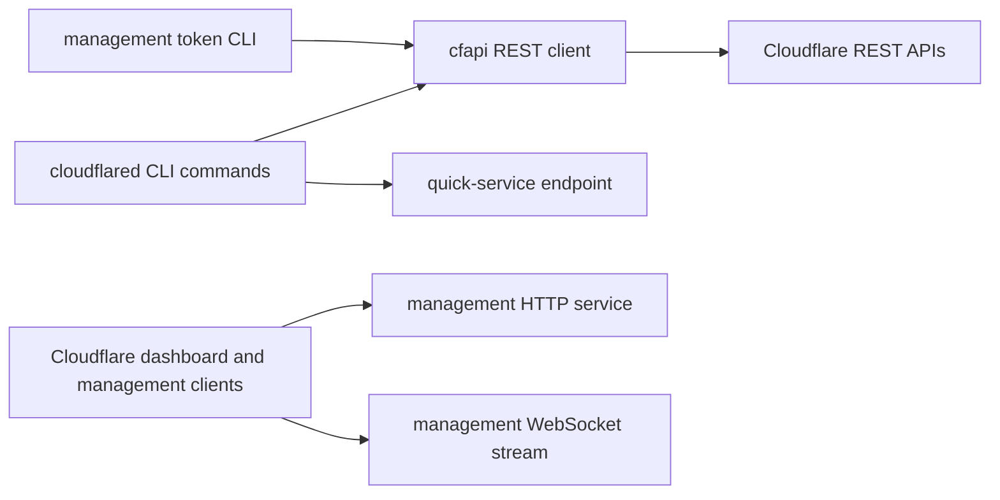
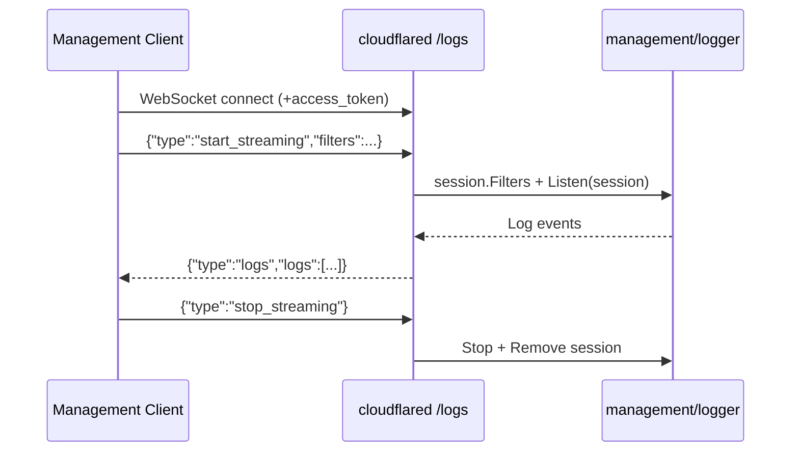

# Upstream API Contracts Catalog

- Baseline date: 20260321
- Baseline reference: [cloudflare/cloudflared/tree/2026.3.0](https://github.com/cloudflare/cloudflared/tree/2026.3.0)
- Primary evidence set: behavior atoms under [../atoms](../../atoms)
- Upstream source validation: explicit contract details cross-checked against `2026.3.0` source anchors linked from atom docs

## Scope

This catalog describes upstream-facing API contracts used or served by cloudflared in the baseline corpus.

For this catalog, upstream API contracts include:

- outbound REST contracts to Cloudflare APIs (tunnels, routes, virtual networks, hostname routing, management token issuance),
- outbound quick-tunnel provisioning contract,
- inbound management HTTP and WebSocket contracts served by cloudflared for Cloudflare dashboard/management clients,
- CLI-to-API shaping contracts where CLI flags map into concrete API parameters.

Companion edge-runtime interaction detail:

- discovery, protocol negotiation, registration/control streams, and tunnelrpc edge session flows are cataloged in [edge-interactions](edge-interactions.md).

Out of scope:

- lower-level transport implementation details already cataloged in [proxying](proxying.md),
- generic observability internals already cataloged in [observabilities](observabilities.md),
- cryptographic algorithm cataloging already covered in [crypto](crypto.md).

## Contract Topology



## Companion Catalog Alignment

- [edge-interactions](edge-interactions.md) is the behavior-first deep dive for discovery and stream lifecycle interactions with edge.
- This file stays API-contract focused (request/response semantics, endpoint shapes, and CLI API adapters).

## Global Contract Conventions

### REST Envelope and Headers

The `cfapi` client applies these shared contracts:

| Surface | Contract |
| --- | --- |
| Auth header | `Authorization: Bearer <token>` |
| Versioned accept | `Accept: application/json;version=1` |
| Content type | `Content-Type: application/json` when a request body is present |
| User agent | `User-Agent` is set from build/runtime user-agent value |
| Response envelope | JSON wrapper: `success`, `errors`, `messages`, `result`, `result_info` |
| Pagination envelope | `result_info`: `count`, `page`, `per_page`, `total_count` |

Primary evidence: [cfapi/base_client](../../atoms/cfapi/base_client.md).

### Shared HTTP Status-to-Error Mapping

| Status class | Mapped behavior |
| --- | --- |
| `200 OK` | success path |
| `400 Bad Request` | mapped to `ErrBadRequest` |
| `401 Unauthorized` and `403 Forbidden` | mapped to `ErrUnauthorized` |
| `404 Not Found` | mapped to `ErrNotFound` |
| other non-OK | generic operation/status error with status text |

Primary evidence: [cfapi/base_client](../../atoms/cfapi/base_client.md).

## Outbound Cloudflare REST Contracts

### Tunnels and Management Tokens

| Operation | Method | Endpoint template | Request contract | Success payload contract | Failure contract |
| --- | --- | --- | --- | --- | --- |
| Create tunnel | `POST` | `/accounts/{account_tag}/cfd_tunnel` | body `{name, tunnel_secret}`; `name` must be non-empty and not a UUID string | `TunnelWithToken` (`id`, `name`, timestamps, `connections`, `token`) | `409` maps to name conflict; otherwise shared status mapping |
| Get tunnel | `GET` | `/accounts/{account_tag}/cfd_tunnel/{tunnel_id}` | path `tunnel_id` UUID | `Tunnel` | shared status mapping |
| Get tunnel token | `GET` | `/accounts/{account_tag}/cfd_tunnel/{tunnel_id}/token` | path `tunnel_id` UUID | token string in envelope `result` | shared status mapping |
| Get management token | `POST` | `/accounts/{account_tag}/cfd_tunnel/{tunnel_id}/management/{resource}` | `resource` in `{logs, admin, host_details}` | token string in envelope `result` | shared status mapping |
| Delete tunnel | `DELETE` | `/accounts/{account_tag}/cfd_tunnel/{tunnel_id}` | optional query `cascade=true` | status-only success via shared mapper | shared status mapping |
| List tunnels | `GET` | `/accounts/{account_tag}/cfd_tunnel` | query from `TunnelFilter` plus pagination page injection | paginated `[]Tunnel` aggregated across pages | non-OK page fetch is operation error |
| List active clients | `GET` | `/accounts/{account_tag}/cfd_tunnel/{tunnel_id}/connections` | path `tunnel_id` UUID | `[]ActiveClient` with per-client version/arch/feature/connection data | shared status mapping |
| Cleanup connections | `DELETE` | `/accounts/{account_tag}/cfd_tunnel/{tunnel_id}/connections` | query via `CleanupParams` (`client_id` optional) | status-only success via shared mapper | shared status mapping |

Primary evidence: [cfapi/tunnel](../../atoms/cfapi/tunnel.md), [cfapi/tunnel_filter](../../atoms/cfapi/tunnel_filter.md), [cfapi/base_client](../../atoms/cfapi/base_client.md), [cmd/cloudflared/management/cmd](../../atoms/cmd/cloudflared/management/cmd.md).

### Hostname Routing (Zone-Level)

| Operation | Method | Endpoint template | Request contract | Success payload contract |
| --- | --- | --- | --- | --- |
| Route tunnel via DNS record | `PUT` | `/zones/{zone_tag}/tunnels/{tunnel_id}/routes` | route body `type=dns`, `user_hostname`, `overwrite_existing` | `DNSRouteResult` change summary (`new`, `updated`, `unchanged`) |
| Route tunnel via LB/pool | `PUT` | `/zones/{zone_tag}/tunnels/{tunnel_id}/routes` | route body `type=lb`, `lb_name`, `lb_pool` | `LBRouteResult` load balancer and pool change tuple |

Primary evidence: [cfapi/hostname](../../atoms/cfapi/hostname.md), [cfapi/base_client](../../atoms/cfapi/base_client.md).

### Teamnet IP Routes

| Operation | Method | Endpoint template | Request contract | Success payload contract |
| --- | --- | --- | --- | --- |
| List routes | `GET` | `/accounts/{account_tag}/teamnet/routes` | query from `IpRouteFilter`; client auto-paginates | paginated `[]DetailedRoute` |
| Add route | `POST` | `/accounts/{account_tag}/teamnet/routes` | body `{network, tunnel_id, comment, virtual_network_id?}` with CIDR serialized as string | `Route` |
| Delete route | `DELETE` | `/accounts/{account_tag}/teamnet/routes/{route_id}` | path `route_id` UUID | parsed deleted `Route` |
| Resolve route by IP | `GET` | `/accounts/{account_tag}/teamnet/routes/ip/{ip}` | optional query `virtual_network_id` | `DetailedRoute` |

Primary evidence: [cfapi/ip_route](../../atoms/cfapi/ip_route.md), [cfapi/ip_route_filter](../../atoms/cfapi/ip_route_filter.md), [cmd/cloudflared/tunnel/teamnet_subcommands](../../atoms/cmd/cloudflared/tunnel/teamnet_subcommands.md), [cmd/cloudflared/tunnel/subcommand_context_teamnet](../../atoms/cmd/cloudflared/tunnel/subcommand_context_teamnet.md).

### Teamnet Virtual Networks

| Operation | Method | Endpoint template | Request contract | Success payload contract |
| --- | --- | --- | --- | --- |
| Create virtual network | `POST` | `/accounts/{account_tag}/teamnet/virtual_networks` | body `{name, comment, is_default_network}` | `VirtualNetwork` |
| List virtual networks | `GET` | `/accounts/{account_tag}/teamnet/virtual_networks` | query from `VnetFilter` | `[]VirtualNetwork` |
| Delete virtual network | `DELETE` | `/accounts/{account_tag}/teamnet/virtual_networks/{vnet_id}` | optional query `force=true \| false` | parsed deleted `VirtualNetwork` |
| Update virtual network | `PATCH` | `/accounts/{account_tag}/teamnet/virtual_networks/{vnet_id}` | partial body `{name?, comment?, is_default_network?}` | parsed updated `VirtualNetwork` |

Primary evidence: [cfapi/virtual_network](../../atoms/cfapi/virtual_network.md), [cfapi/virtual_network_filter](../../atoms/cfapi/virtual_network_filter.md), [cmd/cloudflared/tunnel/vnets_subcommands](../../atoms/cmd/cloudflared/tunnel/vnets_subcommands.md), [cmd/cloudflared/tunnel/subcommand_context_vnets](../../atoms/cmd/cloudflared/tunnel/subcommand_context_vnets.md).

## Query Filter Contracts

### Tunnel Filter Query Keys

| Key | Semantics |
| --- | --- |
| `name` | exact name filter |
| `name_prefix` | prefix filter |
| `exclude_prefix` | exclusion prefix filter |
| `is_deleted` | include/exclude deleted tunnel records |
| `existed_at` | RFC3339 time filter |
| `uuid` | specific tunnel UUID |
| `per_page` | pagination size |
| `page` | pagination page |

Primary evidence: [cfapi/tunnel_filter](../../atoms/cfapi/tunnel_filter.md).

### IP Route Filter Query Keys

| Key | Semantics |
| --- | --- |
| `tun_types=cfd_tunnel` | enforced route type scope |
| `comment` | exact comment filter |
| `is_deleted` | deleted/non-deleted switch |
| `network_subset` | CIDR subset filter |
| `network_superset` | CIDR superset filter |
| `existed_at` | RFC3339 time filter |
| `tunnel_id` | owning tunnel UUID |
| `virtual_network_id` | virtual network UUID |
| `per_page` | pagination size |
| `page` | pagination page |

Primary evidence: [cfapi/ip_route_filter](../../atoms/cfapi/ip_route_filter.md), [cmd/cloudflared/tunnel/teamnet_subcommands](../../atoms/cmd/cloudflared/tunnel/teamnet_subcommands.md).

### Virtual Network Filter Query Keys

| Key | Semantics |
| --- | --- |
| `id` | virtual network UUID |
| `name` | exact name |
| `is_default` | default-network selector |
| `is_deleted` | deleted/non-deleted switch |
| `per_page` | pagination size |

Primary evidence: [cfapi/virtual_network_filter](../../atoms/cfapi/virtual_network_filter.md), [cmd/cloudflared/tunnel/vnets_subcommands](../../atoms/cmd/cloudflared/tunnel/vnets_subcommands.md).

## Inbound Management API Contracts (Served by cloudflared)

### HTTP Endpoint Surface

| Endpoint | Method(s) | Contract |
| --- | --- | --- |
| `/ping` | `GET`, `HEAD` | health response (`200`) |
| `/host_details` | `GET` | JSON payload: `connector_id`, optional `ip`, optional `hostname`; CORS-enabled |
| `/logs` | `GET` (WebSocket upgrade) | management log streaming channel |
| `/metrics` | `GET` (when diag enabled) | Prometheus scrape endpoint |
| `/debug/pprof/{heap \| goroutine}` | `GET` (when diag enabled) | profile handlers |

Shared middleware contract:

- every request requires query parameter `access_token`,
- missing/invalid token returns `400` JSON body `{success:false, errors:[{code:1001, message:"missing access_token query parameter"}]}`,
- parsed claims are injected into request context.

Primary evidence: [management/service](../../atoms/management/service.md), [management/middleware](../../atoms/management/middleware.md), [management/token](../../atoms/management/token.md).

### WebSocket Event Protocol (`/logs`)



#### Client Event Contract

| Event type | Payload |
| --- | --- |
| `start_streaming` | optional `filters` object |
| `stop_streaming` | no additional fields required |

#### Server Event Contract

| Event type | Payload |
| --- | --- |
| `logs` | `logs: []Log` |

#### Log Object Contract

| Field | Type | Notes |
| --- | --- | --- |
| `time` | string | event timestamp |
| `level` | enum string | one of `debug`, `info`, `warn`, `error` |
| `message` | string | human-readable message |
| `event` | enum string | one of `cloudflared`, `http`, `tcp`, `udp` |
| `fields` | object | remaining structured fields |

#### Streaming Filter Contract

| Filter field | Type | Behavior |
| --- | --- | --- |
| `events` | `[]LogEventType` | keep only matching event families |
| `level` | `LogLevel` | drop entries below requested level |
| `sampling` | float64 | clamped to `[0,1]`; probabilistic sampling when between 0 and 1 |

#### Connection Lifecycle and Limits

| Behavior | Contract |
| --- | --- |
| First command requirement | first valid command must be `start_streaming` |
| Concurrent session limit | one active actor/session at a time; same actor can preempt prior session |
| Idle timeout | idle WebSocket closed after 5 minutes if not actively streaming |
| Heartbeat | ping ticker every 15 seconds |
| Close status: invalid command | `4001` |
| Close status: session limit exceeded | `4002` |
| Close status: idle timeout | `4003` |

Primary evidence: [management/service](../../atoms/management/service.md), [management/events](../../atoms/management/events.md), [management/logger](../../atoms/management/logger.md), [management/session](../../atoms/management/session.md).

## Quick Tunnel Provisioning Contract

| Operation | Method | Endpoint template | Request contract | Response contract |
| --- | --- | --- | --- | --- |
| Create quick tunnel | `POST` | `{quick-service}/tunnel` | no body (`nil`), sets `Content-Type: application/json` and `User-Agent` | JSON object with `success`, `result`, `errors`; `result` contains `id`, `name`, `hostname`, `account_tag`, `secret` |

Behavioral post-processing contract:

- `result.id` must parse as UUID,
- resulting credentials are mapped into tunnel runtime start,
- default protocol is forced to `quic` when unset,
- HA connections are forced to `1`.

Primary evidence: [cmd/cloudflared/tunnel/quick_tunnel](../../atoms/cmd/cloudflared/tunnel/quick_tunnel.md).

## CLI-to-API Adapter Contracts

| CLI surface | Adapter contract |
| --- | --- |
| `cloudflared management token --resource ...` | validates resource in `{logs, admin, host_details}`, requests management JWT via cfapi, prints JSON `{token: ...}` |
| teamnet route commands | parse and validate CIDR/UUID flags, convert into `IpRouteFilter` or route request bodies |
| vnet commands | parse ID/name/default/deleted/max-fetch filters and convert into `VnetFilter` query parameters |

Primary evidence: [cmd/cloudflared/management/cmd](../../atoms/cmd/cloudflared/management/cmd.md), [cmd/cloudflared/tunnel/teamnet_subcommands](../../atoms/cmd/cloudflared/tunnel/teamnet_subcommands.md), [cmd/cloudflared/tunnel/vnets_subcommands](../../atoms/cmd/cloudflared/tunnel/vnets_subcommands.md), [cmd/cloudflared/tunnel/subcommand_context_teamnet](../../atoms/cmd/cloudflared/tunnel/subcommand_context_teamnet.md), [cmd/cloudflared/tunnel/subcommand_context_vnets](../../atoms/cmd/cloudflared/tunnel/subcommand_context_vnets.md).

## Full Coverage Links

- [cfapi/base_client](../../atoms/cfapi/base_client.md)
- [cfapi/client](../../atoms/cfapi/client.md)
- [cfapi/hostname](../../atoms/cfapi/hostname.md)
- [cfapi/ip_route](../../atoms/cfapi/ip_route.md)
- [cfapi/ip_route_filter](../../atoms/cfapi/ip_route_filter.md)
- [cfapi/tunnel](../../atoms/cfapi/tunnel.md)
- [cfapi/tunnel_filter](../../atoms/cfapi/tunnel_filter.md)
- [cfapi/virtual_network](../../atoms/cfapi/virtual_network.md)
- [cfapi/virtual_network_filter](../../atoms/cfapi/virtual_network_filter.md)
- [management/events](../../atoms/management/events.md)
- [management/logger](../../atoms/management/logger.md)
- [management/middleware](../../atoms/management/middleware.md)
- [management/service](../../atoms/management/service.md)
- [management/session](../../atoms/management/session.md)
- [management/token](../../atoms/management/token.md)
- [cmd/cloudflared/management/cmd](../../atoms/cmd/cloudflared/management/cmd.md)
- [cmd/cloudflared/tunnel/quick_tunnel](../../atoms/cmd/cloudflared/tunnel/quick_tunnel.md)
- [cmd/cloudflared/tunnel/subcommand_context_teamnet](../../atoms/cmd/cloudflared/tunnel/subcommand_context_teamnet.md)
- [cmd/cloudflared/tunnel/subcommand_context_vnets](../../atoms/cmd/cloudflared/tunnel/subcommand_context_vnets.md)
- [cmd/cloudflared/tunnel/teamnet_subcommands](../../atoms/cmd/cloudflared/tunnel/teamnet_subcommands.md)
- [cmd/cloudflared/tunnel/vnets_subcommands](../../atoms/cmd/cloudflared/tunnel/vnets_subcommands.md)

## Upstream-Verified API Client Quirks and Variance

### HTTP Transport Constants

| Constant | Value | Source |
| --- | --- | --- |
| `defaultTimeout` | `15 seconds` | [cfapi/base_client.go](https://github.com/cloudflare/cloudflared/blob/2026.3.0/cfapi/base_client.go) |
| TLS handshake timeout | `15 seconds` (same `defaultTimeout`) | Same file |
| Response header timeout | `15 seconds` (same `defaultTimeout`) | Same file |
| HTTP/2 transport | Enabled via `http2.ConfigureTransport` | Same file |

### Pagination Auto-Aggregation

The generic `fetchListPage[T]` function auto-paginates using this termination condition:

```text
stop when envelope.Pagination.Count < envelope.Pagination.PerPage
      OR len(fullResponse) >= envelope.Pagination.TotalCount
```

Pages are fetched starting at page 1 and incrementing. Each non-OK page response is a terminal error.

### Error Aggregation Quirk

When the response envelope contains multiple errors, they are concatenated with `"; "` separator into a single `fmt.Errorf("API errors: %s", ...)` message. Single errors return the `apiError` directly. The `apiError` type has `Code int` and `Message string` fields.

### Management Host Details Format

| Condition | `hostname` field value |
| --- | --- |
| `--label` flag set | `"custom:{label}"` |
| No label, hostname resolvable | `os.Hostname()` result (not FQDN) |
| No label, hostname error | `"unknown"` |

The `IP` field in the response is optional and derived from a 1-second TCP dial to the management service IP.

## Notes

- Contract details are intentionally stated at request/response schema and protocol-semantic level, not implementation-level pseudocode.
- Where atom summaries were coarse, details were validated against the source anchors at `cloudflare/cloudflared@2026.3.0`.

## Coverage Audit

- Audit method: collect all upstream-contract atoms under [../atoms/cfapi](../../atoms/cfapi), [../atoms/management](../../atoms/management), and API-driving CLI atoms listed in this file, then diff against all atom links in this catalog.
- Current coverage result: 21 upstream-contract atom docs found, 21 linked in catalog, 0 missing.
- Delta (catalog links - upstream-contract atom docs): 0.
- Operational guardrail: if an upstream-facing API atom is added or updated, rerun this audit and update this file in the same change.
