# S2.6 — Architecture

| | |
| --- | --- |
| Baseline | cloudflare/cloudflared @ tag `2026.3.0` |
| Phase | 01-RR / S2 - SUBSTRATE |
| S2.6 status | Closed |
| Consumes | [scope](scope.md), [dependency-decisions](dependency-decisions.md), [adr/](adr/README.md), [invariants](invariants.md), [risks](risks.md) |
| Produces | Crate boundary map, dependency graph, worker group ownership model, ADR-011 resolution. Inputs to S2.7 parity harness and S2.8 stages plan |

This document fixes the crate boundary decisions for cfdrs. Every S3
implementation session targets exactly one crate. Every crate maps to
one behavioral domain or one substrate concern. No orphaned atoms. No
circular dependencies.

**Exit gate for S2.6:** Every Must-tier atom from [scope](scope.md) is
assigned to exactly one crate. The dependency graph is acyclic. ADR-011
is resolved and closed. Every ADR with S2.6 consequences is satisfied.

---

## Design Principles

**One crate = one behavioral loop = one S3 session.** A crate boundary
is correct when one cook can hold the entire behavioral concern in their
head for one session. If two distinct behavioral loops must be simulated
simultaneously, the crate is too large. If the crate has no coherent
behavioral identity, it is too small.

**Behavioral domains are distinct from generic substrate.** Generic
substrate (error taxonomy, retry state machines, OS wrappers) belongs
in `common/`. Behavioral domains (tunnel connection lifecycle, session
migration, config authority negotiation) belong in their respective
groups. A crate that knows about Cloudflare concepts does not belong in
`common/`.

**Dependency direction is an invariant, not a guideline.**
`tunnel/` never imports `host/`. `host/` never imports `tunnel/`.
`common/` crates form a DAG with no cycles. `config/` imports
`tunnel-core` for shared interfaces — one-way. If a proposed crate
boundary requires violating direction, the boundary is wrong.

**`publish = false` at workspace level.** The only published artifact
is the `app/` binary (`cf-tunnel-client` if published to crates.io).
All other crates are internal.

---

## Groups

Six top-level groups organize the 26 crates. Groups are directories
in the workspace — they are not crates themselves.

| Group | Purpose | Crate count |
| --- | --- | --- |
| `common/` | Generic reusable substrate — no cloudflared knowledge | 8 |
| `config/` | Configuration authority negotiation domain | 2 |
| `tunnel/` | Edge-facing behavioral domains | 9 |
| `host/` | Host OS integration behavior | 2 |
| `operator/` | CLI surface and credential flows | 4 |
| `app/` | Assembly, binary, test boundary | 1 |

**Total: 26 crates.**

### Group-level dependency direction

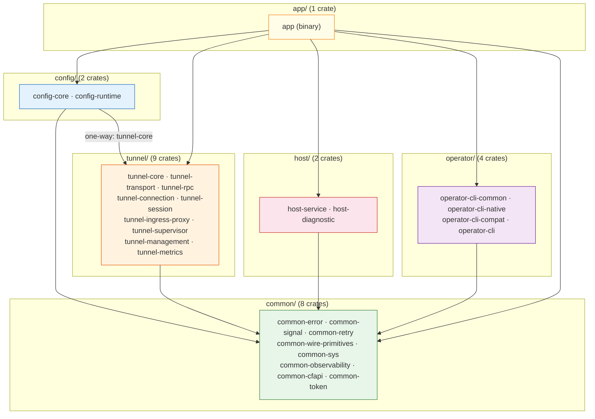

### Full crate dependency graph

```mermaid
graph TD
    %% common/ group
    CE[common-error]
    CS[common-signal]
    CR[common-retry]
    CWP[common-wire-primitives]
    CSYS[common-sys]
    CO[common-observability]
    CCFAPI[common-cfapi]
    CT[common-token]

    %% common/ internal deps
    CS --> CE
    CR --> CE
    CR --> CS

    %% config/ group
    CC[config-core]
    CRT[config-runtime]

    CC --> CWP
    CRT --> CC
    CRT --> TC
    CRT --> CS
    CRT --> CO

    %% tunnel/ group
    TC[tunnel-core]
    TT[tunnel-transport]
    TRPC[tunnel-rpc]
    TCONN[tunnel-connection]
    TS[tunnel-session]
    TIP[tunnel-ingress-proxy]
    TSUP[tunnel-supervisor]
    TM[tunnel-management]
    TMET[tunnel-metrics]

    %% tunnel/ deps on common/
    TT --> TC
    TT --> CSYS
    TT --> CWP
    TT --> CO

    TRPC --> TC

    TCONN --> TC
    TCONN --> TT
    TCONN --> TRPC
    TCONN --> CR
    TCONN --> CS
    TCONN --> CO

    TS --> TC
    TS --> CWP
    TS --> CS
    TS --> CO

    TIP --> TC
    TIP --> TS
    TIP --> CWP
    TIP --> CO

    TSUP --> TC
    TSUP --> TCONN
    TSUP --> CR
    TSUP --> CS
    TSUP --> CO

    TM --> TC
    TM --> CWP
    TM --> CO

    TMET --> CO

    %% host/ group
    HS[host-service]
    HD[host-diagnostic]

    HS --> CSYS
    HD --> CSYS
    HD --> CO

    %% operator/ group
    OCC[operator-cli-common]
    OCN[operator-cli-native]
    OCCOMPAT[operator-cli-compat]
    OC[operator-cli]

    OCN --> OCC
    OCCOMPAT --> OCC
    OC --> OCN
    OC --> OCCOMPAT

    %% app/
    APP2[app]
    APP2 --> OC
    APP2 --> CRT
    APP2 --> TSUP
    APP2 --> TM
    APP2 --> TMET
    APP2 --> TIP
    APP2 --> HS
    APP2 --> HD

    %% Styling
    style CE fill:#e8f5e9,stroke:#2e7d32
    style CS fill:#e8f5e9,stroke:#2e7d32
    style CR fill:#e8f5e9,stroke:#2e7d32
    style CWP fill:#e8f5e9,stroke:#2e7d32
    style CSYS fill:#e8f5e9,stroke:#2e7d32
    style CO fill:#e8f5e9,stroke:#2e7d32
    style CCFAPI fill:#e8f5e9,stroke:#2e7d32
    style CT fill:#e8f5e9,stroke:#2e7d32
    style CC fill:#e3f2fd,stroke:#1565c0
    style CRT fill:#e3f2fd,stroke:#1565c0
    style TC fill:#fff3e0,stroke:#e65100
    style TT fill:#fff3e0,stroke:#e65100
    style TRPC fill:#fff3e0,stroke:#e65100
    style TCONN fill:#fff3e0,stroke:#e65100
    style TS fill:#fff3e0,stroke:#e65100
    style TIP fill:#fff3e0,stroke:#e65100
    style TSUP fill:#fff3e0,stroke:#e65100
    style TM fill:#fff3e0,stroke:#e65100
    style TMET fill:#fff3e0,stroke:#e65100
    style HS fill:#fce4ec,stroke:#c62828
    style HD fill:#fce4ec,stroke:#c62828
    style OCC fill:#f3e5f5,stroke:#6a1b9a
    style OCN fill:#f3e5f5,stroke:#6a1b9a
    style OCCOMPAT fill:#f3e5f5,stroke:#6a1b9a
    style OC fill:#f3e5f5,stroke:#6a1b9a
    style APP2 fill:#fffde7,stroke:#f57f17
```

---

## `common/` Group

Generic substrate. These crates have no cloudflared-specific knowledge.
`common-cfapi` and `common-token` are named with the `common-` prefix
as a workspace convention — they are cloudflared-specific standalones
with no natural group home, not true generics.

### Dependency chain within `common/`

```text
common-error
  ↑
common-signal
  ↑
common-retry     (imports common-error + common-signal)

common-wire-primitives  (no internal deps)
common-sys              (no internal deps)
common-observability    (no internal deps)
common-cfapi            (no internal deps)
common-token            (no internal deps)
```

### Crate definitions

#### `common-error`

**Behavioral identity:** Shared error taxonomy and recoverability
contract.

**Contents:** God crate for all error types. Owns the top-level
`Error` enum and every domain error type. All domain types are pure
value types — primitives and enums only, no behavioral crate imports.
Behavioral crates construct these types; they never define their own.

```rust
pub enum Error {
    Unrecoverable(UnrecoverableKind),
    Recoverable(RecoverableKind),
}

pub enum UnrecoverableKind {
    Registration(RegistrationError),
    Auth(AuthError),
    Config(ConfigError),
    Platform(PlatformError),
    Protocol(ProtocolError),
}

pub enum RecoverableKind {
    Transport(TransportError),
    Rpc(RpcError),
    Session(SessionError),
    Backoff(BackoffError),
    EdgeDiscovery(EdgeDiscoveryError),
}
```

Domain error types (`RegistrationError`, `TransportError`, etc.) contain
only primitives and other `common-error` types — never behavioral crate
types. Behavioral crates construct them via `From` impls. `is_recoverable()`
is a convenience match on the top-level variant.

**Discipline:** If a domain error type needs to import from a behavioral
crate, the type is misplaced — move the data extraction to the behavioral
crate's `From` impl and pass primitives into `common-error`.

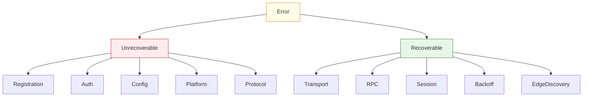

**ADR linkage:**
[ADR-012](adr/012-error-taxonomy-and-recoverability-policy.md)

**S1 evidence:**
[catalogs/cross-cutting/error-propagation](../s1/catalogs/cross-cutting/error-propagation/README.md)

---

#### `common-signal`

**Behavioral identity:** Cancellation and shutdown protocol contract.

**Contents:** `CancellationToken` wrapper, `ShutdownPhase` enum
(Graceful, Hard), `ShutdownSignal` type, `GracefulShutdownC` one-shot
channel type.

**ADR linkage:**
[ADR-019](adr/019-cancellation-timeout-propagation-contract.md),
[ADR-015](adr/015-graceful-shutdown-contract.md)

**S1 evidence:**
[atoms/signal/safe_signal](../s1/atoms/signal/safe_signal.md),
[catalogs/cross-cutting/init-teardown](../s1/catalogs/cross-cutting/init-teardown/README.md)

---

#### `common-retry`

**Behavioral identity:** Generic retry state machine — backoff, jitter,
recoverability typestate.

**Contents:** `BackoffHandler` (exponential delay, configurable max),
`Jitter` (randomization, thundering herd prevention),
`Recoverable<E>` typestate wrapper, `RetryPolicy` trait. Preserves
Go baseline's custom jitter and reset logic (~200 lines). BUILD vs BUY
decision deferred to S3 spike.

**Imports:** `common-error`, `common-signal`.

**ADR linkage:**
[ADR-005](adr/005-retry-backoff-library-vs-custom.md)

**S1 evidence:**
[atoms/retry/backoffhandler](../s1/atoms/retry/backoffhandler.md)

---

#### `common-wire-primitives`

**Behavioral identity:** Shared wire-level vocabulary — types every
layer must agree on.

**Contents:** `RequestID` (128-bit), `CfTraceID`, `CustomDuration`
(JSON → integer seconds, YAML → Go duration string), `ConnectionIndex`
(u8), protocol event enums, header constant strings, metadata
key-value pairs. WebSocket upgrade helpers (`IsWebSocketUpgrade`,
`generateAcceptKey` — RFC 6455 stateless protocol utilities from
`websocket/websocket` atom).

**ADR linkage:**
[ADR-013](adr/013-customduration-dual-format-contract.md)

**S1 evidence:**
[atoms/connection/header](../s1/atoms/connection/header.md),
[atoms/quic/constants](../s1/atoms/quic/constants.md),
[atoms/connection/event](../s1/atoms/connection/event.md),
[atoms/websocket/websocket](../s1/atoms/websocket/websocket.md)

---

#### `common-sys`

**Behavioral identity:** Safe public API over unsafe OS primitives.
The only crate in `common/` containing unsafe code. All unsafe
isolated here per ARCH-2.

**Module breakdown:**

| Module | Contents | Unsafe |
| --- | --- | --- |
| `network` | `socket2::Socket` raw socket, UDP buffer tuning, DF bit, ping-group detection | Yes |
| `signal` | nix signal registration (SIGINT, SIGTERM, SIGUSR1) | Yes |
| `file` | File descriptor locking for credential and token files | Yes |

**ADR linkage:**
[ADR-008](adr/008-icmp-raw-socket.md)

**S1 evidence:**
[atoms/ingress/icmp_linux](../s1/atoms/ingress/icmp_linux.md),
[catalogs/cross-cutting/platform-substrates](../s1/catalogs/cross-cutting/platform-substrates.md)

---

#### `common-observability`

**Behavioral identity:** Thin metrics facade — isolates behavioral
crates from the Prometheus backend.

**Contents:** `MetricsRegistrar` trait (wraps `prometheus::Registry`),
helper macros for counter/gauge/histogram construction with
`cloudflared` namespace and subsystem labels. No HTTP server. No
Prometheus adapter.

**ADR linkage:**
[ADR-003](adr/003-metrics-facade-vs-direct-prometheus.md)

**S1 evidence:**
[catalogs/domain/metrics](../s1/catalogs/domain/metrics.md)

---

#### `common-cfapi`

**Behavioral identity:** Cloudflare REST API client.

**Contents:** `RESTClient`, `fetchExhaustively` pagination, HTTP
transport constants (15s timeout, HTTP/2 enabled), error aggregation
quirk (`"; "` separator), `apiError{Code, Message}`, FedRAMP endpoint
awareness.

**S1 evidence:**
[atoms/cfapi/base_client](../s1/atoms/cfapi/base_client.md),
[atoms/cfapi/client](../s1/atoms/cfapi/client.md)

---

#### `common-token`

**Behavioral identity:** Access token lifecycle, credential file
operations, SSH key generation, browser launch.

**Contents:** Token acquisition with file-lock retry backoff,
org-to-app token exchange, browser launch (`xdg-open` on Linux),
NaCl sealed box encryption, SSH key generation, token path resolution.
User credential loading (`credentials` atom — account ID, zone ID,
API token, cfapi.Client factory, FedRAMP endpoint detection). Origin
certificate codec and discovery (`origin_cert` atom — PEM/JSON
serialization, cert file lookup, x509 parsing for mTLS origin auth).

**S1 evidence:**
[atoms/token/token](../s1/atoms/token/token.md),
[atoms/token/transfer](../s1/atoms/token/transfer.md),
[atoms/sshgen/sshgen](../s1/atoms/sshgen/sshgen.md),
[atoms/credentials/credentials](../s1/atoms/credentials/credentials.md),
[atoms/credentials/origin_cert](../s1/atoms/credentials/origin_cert.md)

---

## `config/` Group

Configuration authority negotiation domain. Config is a continuous
behavioral loop that negotiates between local (file/CLI/flags) and
remote (edge RPC push) authority, with field-level precedence rules
that persist for the process lifetime.

### Dependency chain

```text
config-core
  ↑
config-runtime    (imports config-core + tunnel-core)
```

### Crate definitions

#### `config-core`

**Behavioral identity:** Static config materialization.

**Contents:** Config file discovery (platform search path,
`~/.cloudflared` → `/etc/cloudflared` → `$CFDPATH`), two-pass YAML
decode (lenient + strict `KnownFields` warning pass), `Configuration`
struct, `NamedTunnel` struct, `OriginRequestConfig` struct, `Forwarder`
struct, 4-layer config merge precedence, ingress config transforms,
warp-routing model. Imports `CustomDuration` from
`common-wire-primitives`.

**S1 evidence:**
[atoms/config/configuration](../s1/atoms/config/configuration.md),
[atoms/config/model](../s1/atoms/config/model.md),
[atoms/ingress/config](../s1/atoms/ingress/config.md)

---

#### `config-runtime`

**Behavioral identity:** Continuous authority negotiation. Owns the
orchestrator. Reacts to all config change events. Maintains the running
proxy under change from any source.

**Contents:** `Orchestrator` (versioned config swap, start-before-stop
proxy hot-swap, `overrideRemoteWarpRoutingWithLocalValues` — local
flags maintain authority over specific warp-routing fields even after
remote push), `ConfigManager` implementation (satisfies
`tunnel-core::ConfigManager` trait), file watcher event loop
(inotify → `ConfigDidUpdate`), feature flag selector (DNS TXT periodic
refresh, FNV hash percentile rollout, hourly cadence), `GetConfigJSON`
and `GetVersionedConfigJSON` for edge config sync. `FeatureSelector`
and `FeatureFlags` types from `features` atoms live here — feature
flag type definitions and DNS TXT polling refresh loop.

Serializes all config mutations through a single task — no concurrent
config writes.

**S3 notes:**

- [ractor](https://crates.io/crates/ractor) actor framework used
  directly for orchestrator supervision tree — no standalone actor
  crate.
- Async TinyLFU cache
  ([dependency-decisions](dependency-decisions.md) L1.8) used for
  feature flag DNS response caching.

**Imports:** `config-core`, `tunnel-core` (for `ConfigManager` and
`OriginProxy` traits), `common-signal`, `common-observability`.

**ADR linkage:**
[ADR-014](adr/014-startup-dag-contract.md)

**S1 evidence:**
[atoms/orchestration/orchestrator](../s1/atoms/orchestration/orchestrator.md),
[atoms/config/manager](../s1/atoms/config/manager.md),
[atoms/features/selector](../s1/atoms/features/selector.md),
[atoms/features/features](../s1/atoms/features/features.md),
[atoms/watcher/file](../s1/atoms/watcher/file.md)

#### Configuration authority negotiation flow

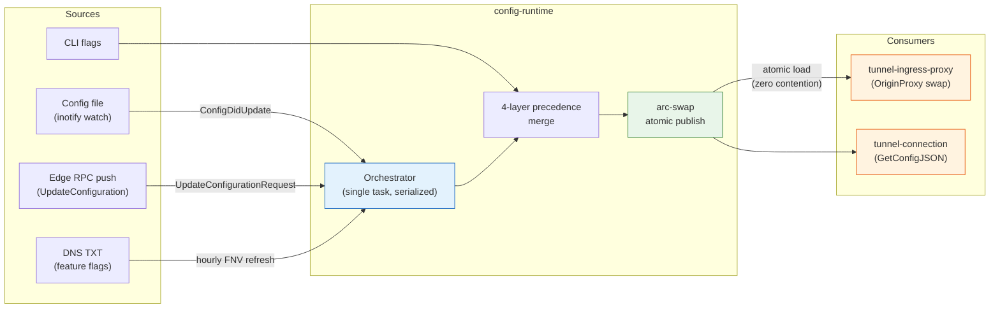

---

## `tunnel/` Group

Edge-facing behavioral domains. Nine crates, each mapping to one
distinct behavioral loop.

### Dependency graph within `tunnel/`

```text
tunnel-core
  ↑
  ├── tunnel-transport
  ├── tunnel-rpc
  ├── tunnel-session
  ├── tunnel-ingress-proxy (also imports tunnel-session)
  ├── tunnel-management
  └── tunnel-metrics  (imported by app/ only)

tunnel-transport ──→ tunnel-connection ──→ tunnel-supervisor
tunnel-rpc       ──→ tunnel-connection

config-runtime imports tunnel-core (one-way, via ConfigManager)
```

### Crate definitions

#### `tunnel-core`

**Behavioral identity:** Shared interface hub — pure traits and type
aliases. No logic. No state.

**Contents:** `OriginProxy` trait (implemented by
`tunnel-ingress-proxy`, swapped atomically by `config-runtime`),
`ConfigManager` trait (implemented by `config-runtime`, called by
`tunnel-connection` control stream), `TunnelStream` trait (QUIC
stream + future HTTP/2), `DatagramConn` trait, `TunnelProperties`
struct (tunnel UUID, account tag, credentials), worker boundary types:
`TunnelWorkerHandle` (`!Send`), `ProxyWorkerHandle` (`!Send`),
`SessionAssignment`, `WorkerIndex`.

**ADR linkage:**
[ADR-011](adr/011-worker-group-architecture.md) (worker group types),
[ADR-001](adr/001-quic-transport.md) (transport abstraction seam)

---

#### `tunnel-transport`

**Behavioral identity:** Pure carrier — establishes and maintains
reliable byte channels to the edge. No tunnel identity, no RPC, no
proxy behavior.

**Internal modules:**

| Module | Contents |
| --- | --- |
| `quic` | tokio-quiche connection, zero-copy sends, gcongestion, socket tuning |
| `http2` | HTTP/2 transport — deferred implementation, trait stub only |
| `edge` | Edge address discovery (DNS SRV + cfapi fallback), address pool, HAConnections clamping |
| `tls` | BoringSSL config, PQ curve priority (`X25519MLKEM768:X25519Kyber768Draft00:X25519`), ALPN, cert reloader |
| `workers` | Worker group thread construction via tokio runtime builder `on_thread_start` hook. Transport worker group (4 threads) + Proxy worker group (remaining cores). Atomic counter assignment. |

**Worker group ownership:** Transport worker group hosts QUIC connection
serve loops. Proxy worker group hosts session serve loops and proxy
dispatch. `min_by_key` on atomic counter at assignment time. No
migration. `quiche::Connection` is `!Send` — pinned to birth thread
forever.

**MPMC channel ownership:** `tunnel-transport` owns the
`crossbeam-channel` dependency. `SessionAssignment` messages cross from
transport worker group to proxy worker group via bounded MPMC. tokio
channels used internally within tasks only.

**S3 note:** Async TinyLFU cache
([dependency-decisions](dependency-decisions.md) L1.8) used for edge
address pool caching.

**Imports:** `tunnel-core`, `common-sys` (network),
`common-wire-primitives`, `common-observability`.

**ADR linkage:**
[ADR-001](adr/001-quic-transport.md),
[ADR-011](adr/011-worker-group-architecture.md),
[ADR-018](adr/018-quic-connection-ownership-enforcement.md)

**S1 evidence:**
[atoms/connection/quic_connection](../s1/atoms/connection/quic_connection.md),
[atoms/edgediscovery/edgediscovery](../s1/atoms/edgediscovery/edgediscovery.md),
[atoms/tlsconfig/tlsconfig](../s1/atoms/tlsconfig/tlsconfig.md)

---

#### `tunnel-rpc`

**Behavioral identity:** Cap'n Proto wire encoding and decoding only.
No lifecycle. No state machine.

**Contents:** Cap'n Proto schema (`tunnelrpc.capnp`,
`quic_metadata_protocol.capnp`), POGS for `RegistrationOptions`,
`TunnelRegistration`, `UpdateConfigurationRequest`,
`UpdateConfigurationResponse`, `UDPSessionRegistrationDatagram` (v2/v3),
session manager RPC client and server stubs, RPC metrics.

**ADR linkage:**
[ADR-004](adr/004-parser-strategy-combinator-vs-manual.md)

**S1 evidence:**
[atoms/tunnelrpc/pogs/registration_server](../s1/atoms/tunnelrpc/pogs/registration_server.md),
[atoms/tunnelrpc/pogs/configuration_manager](../s1/atoms/tunnelrpc/pogs/configuration_manager.md),
[atoms/tunnelrpc/proto/tunnelrpc.capnp](../s1/atoms/tunnelrpc/proto/tunnelrpc.capnp.md)

---

#### `tunnel-connection`

**Behavioral identity:** A single tunnel connection's lifecycle —
from registration to graceful unregister.

**Contents:** Registration state machine (Connecting → Registered →
Unregistering → Stopped), `serveControlStream` loop, control stream
grace period (sleep before returning `ControlStreamError` to allow
in-flight streams to complete), `UpdateConfiguration` dispatch to
`ConfigManager`, `registerConnection` RPC, connection observer event
emission, PQ fallback state per connection. 0-RTT deferred —
`registerConnection` is unsafe for early data (no forward secrecy).

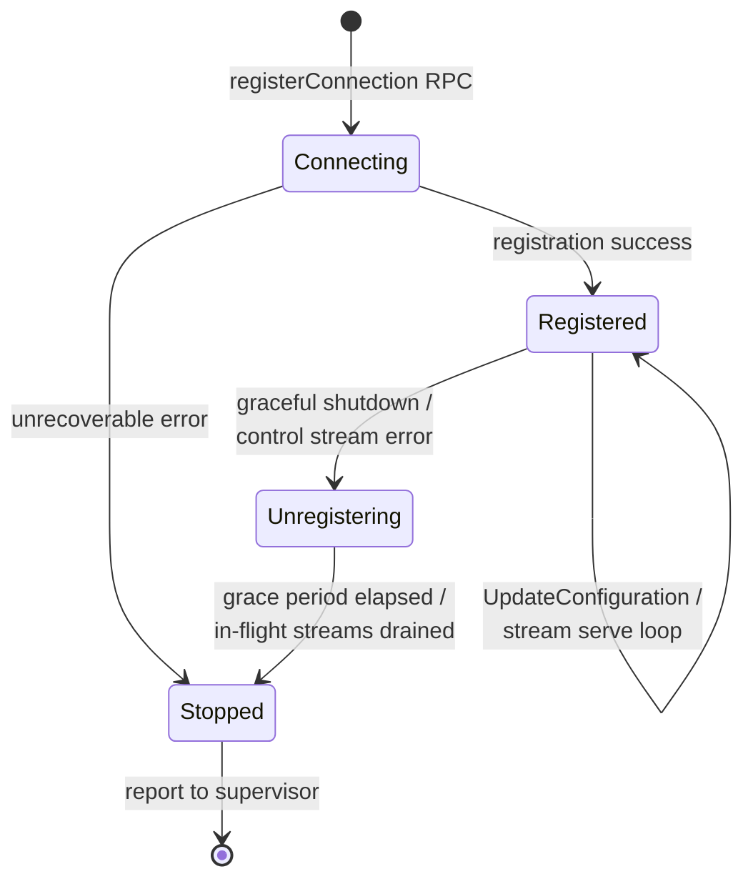

**Imports:** `tunnel-core`, `tunnel-transport`, `tunnel-rpc`,
`common-retry`, `common-signal`, `common-observability`.

**ADR linkage:**
[ADR-019](adr/019-cancellation-timeout-propagation-contract.md),
[ADR-012](adr/012-error-taxonomy-and-recoverability-policy.md)

**S1 evidence:**
[atoms/connection/control](../s1/atoms/connection/control.md),
[atoms/connection/quic_connection](../s1/atoms/connection/quic_connection.md),
[atoms/connection/protocol](../s1/atoms/connection/protocol.md)

---

#### `tunnel-session`

**Behavioral identity:** UDP datagram session lifecycle — stateful
session registration, bidirectional data motion, migration, idle
timeout.

**Contents:** `Session` (read/write task split, idle timer reset on
activity, idempotent close), `SessionManager` (v2 single-task event
loop, v3 concurrent with locking), datagram muxer (`DatagramConn.Serve`
errgroup: session manager + datagram receive + ICMP router), session
migration state machine (context rebinding on migration — old context
cancellation does not kill migrated session), rate-limited registration,
duplicate registration handling (resets idle timer, returns
`ResponseOk`), `PipeBidirectional` stream pipe (half-close propagation,
panic recovery), packet encode/decode, ICMP packet router (Linux
`SOCK_DGRAM` via `common-sys::network`).

**Imports:** `tunnel-core`, `common-wire-primitives`, `common-signal`,
`common-observability`.

**ADR linkage:**
[ADR-016](adr/016-session-migration-lifecycle.md),
[ADR-008](adr/008-icmp-raw-socket.md)

**S1 evidence:**
[atoms/quic/v3/session](../s1/atoms/quic/v3/session.md),
[atoms/datagramsession/session](../s1/atoms/datagramsession/session.md),
[atoms/quic/v3/muxer](../s1/atoms/quic/v3/muxer.md),
[atoms/stream/stream](../s1/atoms/stream/stream.md)

---

#### `tunnel-ingress-proxy`

**Behavioral identity:** Request arrival to proxied response — fat enum
dispatch, ingress rule matching, origin service selection, proxy
execution. Also houses WebSocket carrier lifecycle for access
forwarding, and OIDC/URL validation middleware.

**`ingress` module:** Ingress rule matching (hostname glob, path regex,
catch-all validation bidirectionality, punycode auto-conversion, port
stripping, internal rules negative index), origin service taxonomy
(http, https, tcp, unix, socks-proxy, bastion, hello-world,
http_status, DNS), 4-layer config merge precedence (pointer-nil gating
quirk), JWT middleware (SkipClientIDCheck quirk), IP access policy
enforcement, path-in-origin-URL rejection quirk.

**`proxy` module:** Fat enum dispatch (ARCH-1, ARCH-4 — no `Box<dyn>`
on hot path), HTTP proxy (SSE/gRPC flushing, header canonicalization),
WebSocket proxy, TCP stream relay, SOCKS5 inbound server over WebSocket
carrier (NoAuth + UserPassAuth, CONNECT only — ADR-007 resolved inline
in [dependency-decisions](dependency-decisions.md)), hello-world server,
error → HTTP status mapping (502, 504, 404).

**`carrier` module:** WebSocket carrier lifecycle for access forwarding
(`StartForwarder`, `StartClient`, `Serve`), stdio stream wrapper,
access control-plane HTTP request builder, bastion header routing,
WebSocket upgrade orchestration (token/OIDC auth injection, scheme
conversion, access-authenticated stream setup).

**`validation` module:** Access JWT validation (`NewAccessValidator`,
OIDC token verification), URL/hostname sanitization (RFC label checks,
IDN support, scheme/port enforcement, IP restriction rules).

**`websocket` module:** Dual WebSocket wrapper (gorilla + gobwas
equivalent), keepalive pinger goroutine, read/write multiplexing,
deadline control.

**Implements** `OriginProxy` from `tunnel-core`.

**S3 note — buffer pool policy:** The proxy data path involves at
least two buffer copies per request (edge → proxy, proxy → origin).
`tokio-quiche`'s `BufFactory` covers QUIC frame buffers. The bump
arena (ARCH-5) covers session temporaries. Origin-facing TCP/HTTP
read buffers are neither — they outlive individual operations but are
not QUIC frames. S3 must decide: reuse pool (e.g. `bytes::BytesMut`
pool), `BufFactory` extension, or per-request allocation. Wrong
choice here is expensive to retrofit.

**Imports:** `tunnel-core`, `tunnel-session` (for UDP session dispatch),
`common-wire-primitives`, `common-observability`.

**S1 evidence:**
[atoms/proxy/proxy](../s1/atoms/proxy/proxy.md),
[atoms/ingress/ingress](../s1/atoms/ingress/ingress.md),
[atoms/ingress/rule](../s1/atoms/ingress/rule.md),
[atoms/socks/connection_handler](../s1/atoms/socks/connection_handler.md),
[atoms/carrier/carrier](../s1/atoms/carrier/carrier.md),
[atoms/carrier/websocket](../s1/atoms/carrier/websocket.md),
[atoms/validation/validation](../s1/atoms/validation/validation.md),
[atoms/websocket/connection](../s1/atoms/websocket/connection.md)

#### Request data flow (edge → origin)

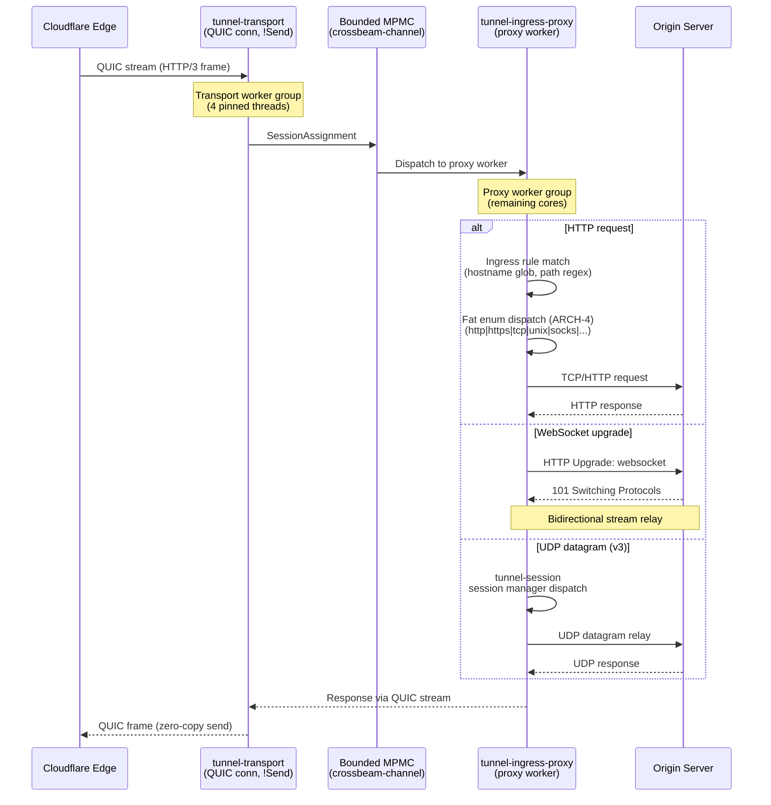

---

#### `tunnel-supervisor`

**Behavioral identity:** HA connection lifecycle — manages N
tunnel-connections, reacts to failures, maintains high availability.

**Contents:** Supervisor fan-out (start connection 0, wait for
`connectedSignal`, stagger 1..N-1 with 1s `registrationInterval`),
`tunnelErrors` channel fan-in, protocol selection and PQ fallback
(`selectNextProtocol`, FNV hash threshold), QUIC-broken classifier,
`listenReconnect` (reconnect signal + graceful shutdown + context done),
`ConnTracker` (active connection index set, observer pattern),
`ConnectedFuse` one-shot signal (`sync.Once` semantics), backoff
coordination per connection, HA slot management (`tunnelsForHA`
connection index tracking).

**S3 note:** [ractor](https://crates.io/crates/ractor) actor framework
used directly for supervision tree — no standalone actor crate.

**Imports:** `tunnel-core`, `tunnel-connection`, `common-retry`,
`common-signal`, `common-observability`.

**S1 evidence:**
[atoms/supervisor/supervisor](../s1/atoms/supervisor/supervisor.md),
[atoms/supervisor/tunnel](../s1/atoms/supervisor/tunnel.md),
[atoms/tunnelstate/conntracker](../s1/atoms/tunnelstate/conntracker.md),
[atoms/supervisor/fuse](../s1/atoms/supervisor/fuse.md),
[atoms/connection/tunnelsforha](../s1/atoms/connection/tunnelsforha.md)

#### Supervisor HA connection lifecycle

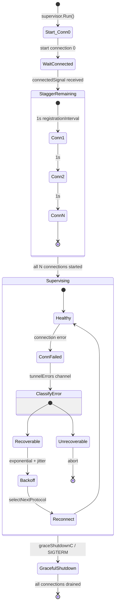

---

#### `tunnel-management`

**Behavioral identity:** Operator and dashboard observation interface
served over HTTP and WebSocket.

**Contents:** Management HTTP service (`/ping`, `/host_details`, `/logs`
WebSocket), WebSocket log stream (start/stop_streaming, filters, idle
5min timeout, heartbeat 15s, 1 concurrent session, preemption, close
codes 4001/4002/4003), management access token middleware (`access_token`
query param, JWT claims), `host_details` response (connector ID, optional
IP via 1s TCP dial, hostname).

**Imports:** `tunnel-core`, `common-wire-primitives`,
`common-observability`.

**ADR linkage:**
[ADR-006](adr/006-management-http-stack.md)

**S1 evidence:**
[atoms/management/service](../s1/atoms/management/service.md),
[atoms/management/logger](../s1/atoms/management/logger.md),
[atoms/management/session](../s1/atoms/management/session.md)

---

#### `tunnel-metrics`

**Behavioral identity:** Metrics server and Prometheus adapter.
**Imported only by `app/`.**

**Contents:** `prometheus::Registry` owner, `/metrics` HTTP endpoint
(`promhttp::Handler`), `/ready` readiness endpoint (200 when
`ConnTracker` active, 503 when not), Prometheus adapter implementing
`MetricsRegistrar` from `common-observability`, GCRA rate limiter ([governor](https://crates.io/crates/governor) crate, token-bucket algorithm, 64-bit
atomic state — replaces `flow/limiter` per
[dependency-decisions](dependency-decisions.md) Layer 1.7), metrics server lifecycle (500ms startup guard,
15s shutdown timeout, `ErrServerClosed` = success quirk), port binding
with known-address fallback.

**S1 evidence:**
[atoms/metrics/metrics](../s1/atoms/metrics/metrics.md),
[atoms/metrics/readiness](../s1/atoms/metrics/readiness.md),
[atoms/flow/limiter](../s1/atoms/flow/limiter.md)

---

## `host/` Group

Host OS integration behavior. Everything that makes cloudflared a
well-behaved Linux citizen. No tunnel knowledge.

### Crate definitions

#### `host-service`

**Behavioral identity:** Linux service lifecycle — install, uninstall,
sd-notify.

**Contents:** Systemd service install (probes `/run/systemd/system`,
explicit fail with clear error if absent — sysv deferred to FC),
systemd unit template generation, sd-notify `READY=1` + `STOPPING=1`
only (ADR-009), service uninstall.

**Imports:** `common-sys` (signal module).

**S1 evidence:**
[atoms/cmd/cloudflared/linux_service](../s1/atoms/cmd/cloudflared/linux_service.md)

---

#### `host-diagnostic`

**Behavioral identity:** System state collection and diagnostic
exposure.

**Contents:** Linux system collector (`/proc/meminfo`, `/proc/cpuinfo`,
`/proc/fd/`, `lsb_release`, `uname`), log collectors (journalctl host
path, Docker `docker logs`, Kubernetes `kubectl logs`), network
traceroute (Unix `traceroute` only — Windows `tracert` FC-deferred),
diagnostic HTTP handlers (`/diag/system`, `/diag/tunnel`,
`/diag/configuration`), diagnostic zip bundler, diagnostic client
(remote queries from `tunnel diagnose`).

**Imports:** `common-sys` (file + network), `common-observability`.

**S1 evidence:**
[atoms/diagnostic/system_collector_linux](../s1/atoms/diagnostic/system_collector_linux.md),
[atoms/diagnostic/log_collector_host](../s1/atoms/diagnostic/log_collector_host.md),
[atoms/diagnostic/handlers](../s1/atoms/diagnostic/handlers.md)

---

## `operator/` Group

CLI surface and credential flows. Diamond dependency pattern:
`operator-cli` resolves which CLI implementation is active via
feature flag.

### Dependency graph

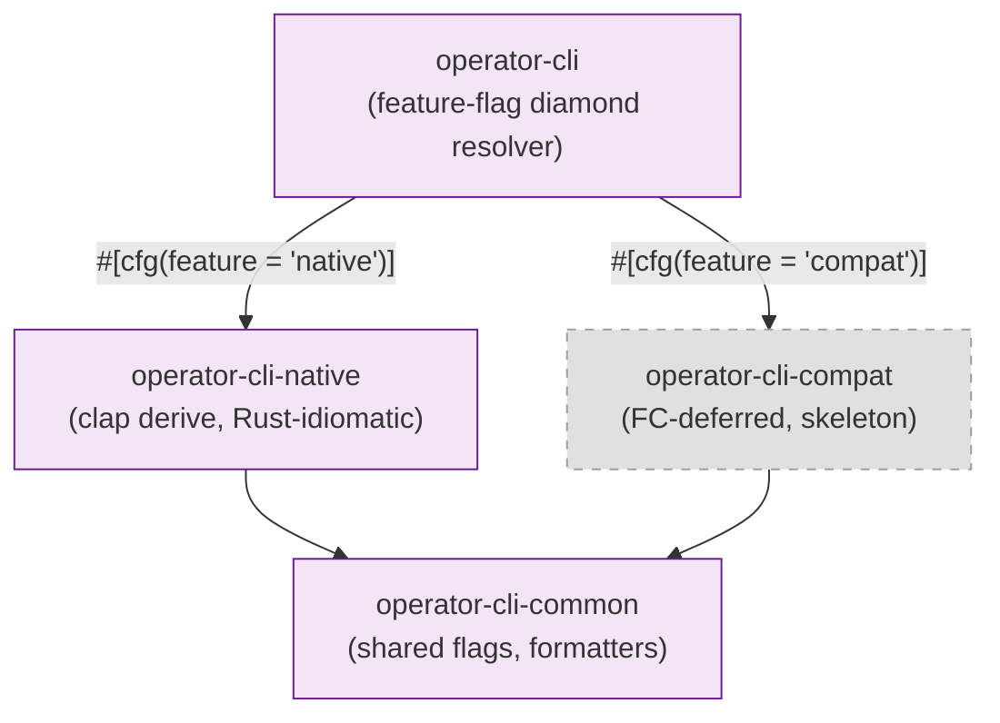

```text
operator-cli-common
  ↑                ↑
operator-cli-native  operator-cli-compat (FC-deferred)
  ↑                ↑
      operator-cli    (feature flag selects one)
```

### Crate definitions

#### `operator-cli-common`

**Contents:** Shared flag types, output formatting helpers, error
wrappers, build info display, deprecated command handling, logger
construction from CLI context, management token helper.

**S1 evidence:**
[atoms/cmd/cloudflared/cliutil/handler](../s1/atoms/cmd/cloudflared/cliutil/handler.md),
[atoms/cmd/cloudflared/cliutil/build_info](../s1/atoms/cmd/cloudflared/cliutil/build_info.md)

---

#### `operator-cli-native`

**Behavioral identity:** Idiomatic Rust CLI — clap derive command tree.

**Contents:** Full command tree (tunnel run/create/delete/list/info/
token/route/cleanup/ingress, access login/curl/ssh/rdp/smb/tcp, service
install/uninstall, proxydns, tail, version, management token), flag
definitions and env-var bindings, tunnel subcommand context, credential
finder, quick tunnel provisioning, stdin control (`--stdin-control`,
`reconnect [delay]`).

**ADR linkage:**
[ADR-010](adr/010-cli-compat.md)

**S1 evidence:**
[atoms/cmd/cloudflared/tunnel/cmd](../s1/atoms/cmd/cloudflared/tunnel/cmd.md),
[atoms/cmd/cloudflared/flags/flags](../s1/atoms/cmd/cloudflared/flags/flags.md)

---

#### `operator-cli-compat`

**Status:** FC-deferred. Skeleton crate only in RR. Activated if S4
parity tests reveal behavioral divergence in flag parsing.

**ADR linkage:** [ADR-010](adr/010-cli-compat.md)

---

#### `operator-cli`

**Behavioral identity:** Diamond dependency resolver. Feature-flag-gated
re-export of either `operator-cli-native` or `operator-cli-compat`.
No logic of its own.

---

## `app/` Group

Assembly, binary entry point, system test boundary. The only crate
that sees all 25 other crates simultaneously.

### Internal modules

| Module | Responsibility |
| --- | --- |
| `main.rs` | Binary entry point |
| `startup.rs` | Startup DAG — explicit phase ordering (ADR-014) |
| `shutdown.rs` | Two-phase shutdown contract (ADR-015) |
| `overwatch.rs` | `AppManager` — plugin-style service registry and lifecycle orchestrator (`overwatch/app_manager` and `overwatch/manager` atoms) |
| `registry.rs` | `prometheus::Registry` construction, `Registerer` injection |
| `wire.rs` | Dependency injection — constructs every crate with its deps |

#### Graceful shutdown sequence

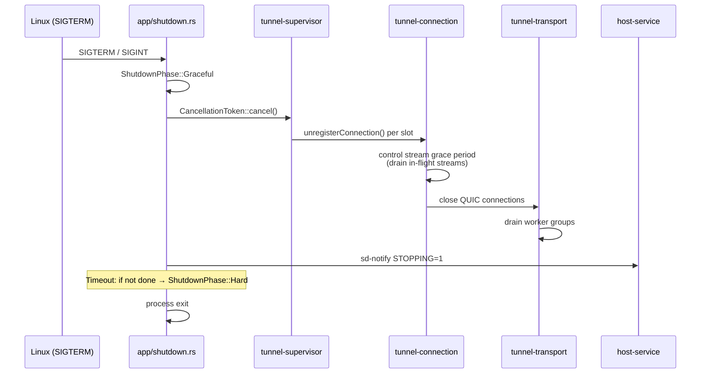

### Test boundary

```text
app/tests/
  integration/    cross-crate behavioral tests
  system/         full binary behavioral tests
  e2e/            oracle-driven parity tests (S4)
```

### Startup DAG (phase order)

1. Logger — tracing subscriber, journald output, log bridge
2. Metrics — `Registry` construction, `Registerer` distributed,
   `tunnel-metrics` server started
3. Config — `config-core` file discovery and parse, `config-runtime`
   orchestrator constructed
4. Platform — `host-service` readiness path prepared,
   `host-diagnostic` handlers registered
5. Transport — `tunnel-transport` worker group threads pinned, QUIC
   socket initialized, edge discovery primed
6. RPC — `tunnel-rpc` Cap'n Proto runtime initialized
7. Connection — `tunnel-connection` registration client prepared
8. Session — `tunnel-session` session manager initialized
9. Ingress/Proxy — `tunnel-ingress-proxy` fat enum constructed with
   initial ingress from `config-runtime`
10. Supervisor — `tunnel-supervisor` started, `connectedSignal` created
11. Management — `tunnel-management` HTTP server started
12. sd-notify — `READY=1` sent after first successful connection
13. Wait — `waitToShutdown` blocks on error channel or `graceShutdownC`

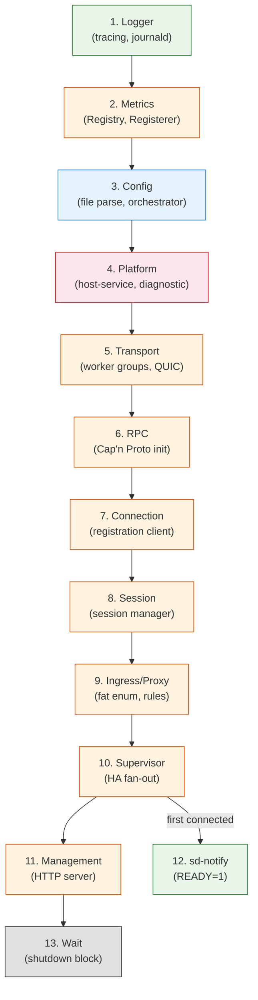

**ADR linkage:**
[ADR-014](adr/014-startup-dag-contract.md),
[ADR-015](adr/015-graceful-shutdown-contract.md)

**S1 evidence:**
[atoms/cmd/cloudflared/tunnel/cmd](../s1/atoms/cmd/cloudflared/tunnel/cmd.md),
[catalogs/cross-cutting/init-teardown](../s1/catalogs/cross-cutting/init-teardown/README.md)

---

## ADR-011 Resolution — CLOSED

The worker group architecture is formalized as follows:

```mermaid
graph LR
    subgraph "tokio multi-thread runtime"
        subgraph TW["Transport Worker Group (4 threads)"]
            T1["Thread 0<br/>QUIC conn serve"]
            T2["Thread 1<br/>QUIC conn serve"]
            T3["Thread 2<br/>QUIC conn serve"]
            T4["Thread 3<br/>QUIC conn serve"]
        end

        MPMC["Bounded MPMC<br/>crossbeam-channel<br/>SessionAssignment"]

        subgraph PW["Proxy Worker Group (remaining cores)"]
            P1["Thread 4<br/>proxy dispatch"]
            P2["Thread 5<br/>proxy dispatch"]
            P3["Thread ...<br/>proxy dispatch"]
            PN["Thread N<br/>proxy dispatch"]
        end

        TW -->|"!Send boundary"| MPMC
        MPMC --> PW
    end

    EDGE["Cloudflare Edge"] -->|"QUIC"| TW
    PW -->|"TCP/HTTP/WS"| ORIGIN["Origin Servers"]

    style TW fill:#fff3e0,stroke:#e65100
    style PW fill:#e3f2fd,stroke:#1565c0
    style MPMC fill:#fce4ec,stroke:#c62828
    style EDGE fill:#e0e0e0,stroke:#424242
    style ORIGIN fill:#e0e0e0,stroke:#424242
```

**Two worker group types, owned by `tunnel-transport::workers` module:**

| Worker group | Threads | Pinning | Hosts |
| --- | --- | --- | --- |
| Transport worker group | 4 | tokio `on_thread_start` | QUIC connection serve loops |
| Proxy worker group | Remaining cores | tokio `on_thread_start` | Session serve loops, proxy dispatch |

**Assignment:** `min_by_key` on atomic counter per proxy worker group
thread. No migration after assignment. `quiche::Connection` is `!Send`
— pinned to birth thread forever.

**Worker boundary types** (in `tunnel-core`): `TunnelWorkerHandle`
(`!Send`), `ProxyWorkerHandle` (`!Send`), `SessionAssignment`,
`WorkerIndex`.

**MPMC channel at worker boundary:** `SessionAssignment` messages cross
from transport worker group to proxy worker group via bounded MPMC
(`crossbeam-channel`). tokio channels used internally within tasks only.

**S1 evidence:**
[dependency-decisions](dependency-decisions.md) § 1.1,
[atoms/connection/quic_connection](../s1/atoms/connection/quic_connection.md),
[catalogs/cross-cutting/concurrency](../s1/catalogs/cross-cutting/concurrency/README.md)

---

## Dependency Direction Invariants

| Invariant | Rule |
| --- | --- |
| Direction | `common/` ← `config/`, `tunnel/`, `host/`, `operator/`, `app/` |
| Direction | `tunnel/` never imports `host/` |
| Direction | `host/` never imports `tunnel/` |
| Direction | `config/` imports `tunnel-core` only (one-way) |
| Isolation | `tunnel-metrics` imported only by `app/` |
| Isolation | `common-sys` unsafe never leaks past its safe public API |
| Acyclicity | `common/` internal dep graph is a DAG |
| Acyclicity | `tunnel/` internal dep graph is a DAG |
| Publishing | All crates `publish = false` except `app/` |

---

## Atom-to-Crate Mapping

Every Must-tier atom from [scope](scope.md) and every hub atom with
membership ≥ 10 is assigned to exactly one crate below. This table is
the exit gate artifact for atom coverage.

### Must-tier atoms (33)

| Atom | Crate |
| --- | --- |
| [cmd/cloudflared/flags/flags](../s1/atoms/cmd/cloudflared/flags/flags.md) | `operator-cli-native` |
| [cmd/cloudflared/tunnel/cmd](../s1/atoms/cmd/cloudflared/tunnel/cmd.md) | `operator-cli-native` |
| [cmd/cloudflared/tunnel/configuration](../s1/atoms/cmd/cloudflared/tunnel/configuration.md) | `operator-cli-native` |
| [cmd/cloudflared/tunnel/credential_finder](../s1/atoms/cmd/cloudflared/tunnel/credential_finder.md) | `operator-cli-native` |
| [config/configuration](../s1/atoms/config/configuration.md) | `config-core` |
| [config/model](../s1/atoms/config/model.md) | `config-core` |
| [credentials/credentials](../s1/atoms/credentials/credentials.md) | `common-token` |
| [connection/control](../s1/atoms/connection/control.md) | `tunnel-connection` |
| [connection/protocol](../s1/atoms/connection/protocol.md) | `tunnel-connection` |
| [tunnelrpc/pogs/registration_server](../s1/atoms/tunnelrpc/pogs/registration_server.md) | `tunnel-rpc` |
| [tunnelrpc/registration_client](../s1/atoms/tunnelrpc/registration_client.md) | `tunnel-rpc` |
| [tunnelrpc/registration_server](../s1/atoms/tunnelrpc/registration_server.md) | `tunnel-rpc` |
| [supervisor/supervisor](../s1/atoms/supervisor/supervisor.md) | `tunnel-supervisor` |
| [supervisor/tunnel](../s1/atoms/supervisor/tunnel.md) | `tunnel-supervisor` |
| [management/service](../s1/atoms/management/service.md) | `tunnel-management` |
| [ingress/config](../s1/atoms/ingress/config.md) | `tunnel-ingress-proxy` |
| [ingress/ingress](../s1/atoms/ingress/ingress.md) | `tunnel-ingress-proxy` |
| [ingress/origin_connection](../s1/atoms/ingress/origin_connection.md) | `tunnel-ingress-proxy` |
| [ingress/origin_dialer](../s1/atoms/ingress/origin_dialer.md) | `tunnel-ingress-proxy` |
| [ingress/origin_proxy](../s1/atoms/ingress/origin_proxy.md) | `tunnel-ingress-proxy` |
| [ingress/origin_service](../s1/atoms/ingress/origin_service.md) | `tunnel-ingress-proxy` |
| [ingress/rule](../s1/atoms/ingress/rule.md) | `tunnel-ingress-proxy` |
| [proxy/proxy](../s1/atoms/proxy/proxy.md) | `tunnel-ingress-proxy` |
| [edgediscovery/allregions/address](../s1/atoms/edgediscovery/allregions/address.md) | `tunnel-transport` |
| [edgediscovery/allregions/discovery](../s1/atoms/edgediscovery/allregions/discovery.md) | `tunnel-transport` |
| [edgediscovery/allregions/region](../s1/atoms/edgediscovery/allregions/region.md) | `tunnel-transport` |
| [edgediscovery/allregions/regions](../s1/atoms/edgediscovery/allregions/regions.md) | `tunnel-transport` |
| [edgediscovery/allregions/usedby](../s1/atoms/edgediscovery/allregions/usedby.md) | `tunnel-transport` |
| [edgediscovery/dial](../s1/atoms/edgediscovery/dial.md) | `tunnel-transport` |
| [edgediscovery/edgediscovery](../s1/atoms/edgediscovery/edgediscovery.md) | `tunnel-transport` |
| [overwatch/app_manager](../s1/atoms/overwatch/app_manager.md) | `app` |
| [overwatch/manager](../s1/atoms/overwatch/manager.md) | `app` |
| [signal/safe_signal](../s1/atoms/signal/safe_signal.md) | `common-signal` |

### Hub atoms (membership ≥ 10)

| Atom | Membership | Crate |
| --- | --- | --- |
| [cmd/cloudflared/tunnel/configuration](../s1/atoms/cmd/cloudflared/tunnel/configuration.md) | 14 | `operator-cli-native` |
| [connection/control](../s1/atoms/connection/control.md) | 14 | `tunnel-connection` |
| [cmd/cloudflared/tunnel/cmd](../s1/atoms/cmd/cloudflared/tunnel/cmd.md) | 13 | `operator-cli-native` |
| [connection/protocol](../s1/atoms/connection/protocol.md) | 13 | `tunnel-connection` |
| [management/service](../s1/atoms/management/service.md) | 12 | `tunnel-management` |
| [quic/v3/session](../s1/atoms/quic/v3/session.md) | 12 | `tunnel-session` |
| [supervisor/tunnel](../s1/atoms/supervisor/tunnel.md) | 12 | `tunnel-supervisor` |
| [carrier/carrier](../s1/atoms/carrier/carrier.md) | 10 | `tunnel-ingress-proxy` |
| [connection/http2](../s1/atoms/connection/http2.md) | 10 | `tunnel-transport` |
| [connection/observer](../s1/atoms/connection/observer.md) | 10 | `tunnel-connection` |
| [connection/quic_connection](../s1/atoms/connection/quic_connection.md) | 10 | `tunnel-connection` |
| [connection/quic_datagram_v2](../s1/atoms/connection/quic_datagram_v2.md) | 10 | `tunnel-session` |
| [connection/quic_datagram_v3](../s1/atoms/connection/quic_datagram_v3.md) | 10 | `tunnel-session` |
| [orchestration/orchestrator](../s1/atoms/orchestration/orchestrator.md) | 10 | `config-runtime` |
| [quic/v3/muxer](../s1/atoms/quic/v3/muxer.md) | 10 | `tunnel-session` |
| [supervisor/supervisor](../s1/atoms/supervisor/supervisor.md) | 10 | `tunnel-supervisor` |
| [tunnelrpc/quic/cloudflared_client](../s1/atoms/tunnelrpc/quic/cloudflared_client.md) | 10 | `tunnel-rpc` |
| [tunnelrpc/quic/session_client](../s1/atoms/tunnelrpc/quic/session_client.md) | 10 | `tunnel-rpc` |
| [tunnelrpc/registration_client](../s1/atoms/tunnelrpc/registration_client.md) | 10 | `tunnel-rpc` |
| [config/configuration](../s1/atoms/config/configuration.md) | 10 | `config-core` |

---

## S2.6 Exit Gate

| Criterion | Status |
| --- | --- |
| Every Must-tier atom assigned to exactly one crate | ✅ |
| Dependency graph is acyclic | ✅ |
| ADR-011 resolved and closed | ✅ |
| ADR-003 metrics facade satisfied via `common-observability` | ✅ |
| ADR-007 SOCKS5 placed in `tunnel-ingress-proxy` | ✅ |
| ADR-008 ICMP raw socket in `common-sys::network` + `tunnel-session` | ✅ |
| ADR-018 connection ownership in `tunnel-transport::workers` | ✅ |
| Dependency direction invariants documented | ✅ |
| HTTP/2 extensibility preserved via `tunnel-transport::http2` module stub | ✅ |
| `operator-cli-compat` FC-deferred, skeleton only | ✅ |
| `app/` is the system test boundary | ✅ |
| 26 crates total, none orphaned | ✅ |
| Atom-to-crate mapping table covers all Must-tier and ≥10-hub atoms | ✅ |
