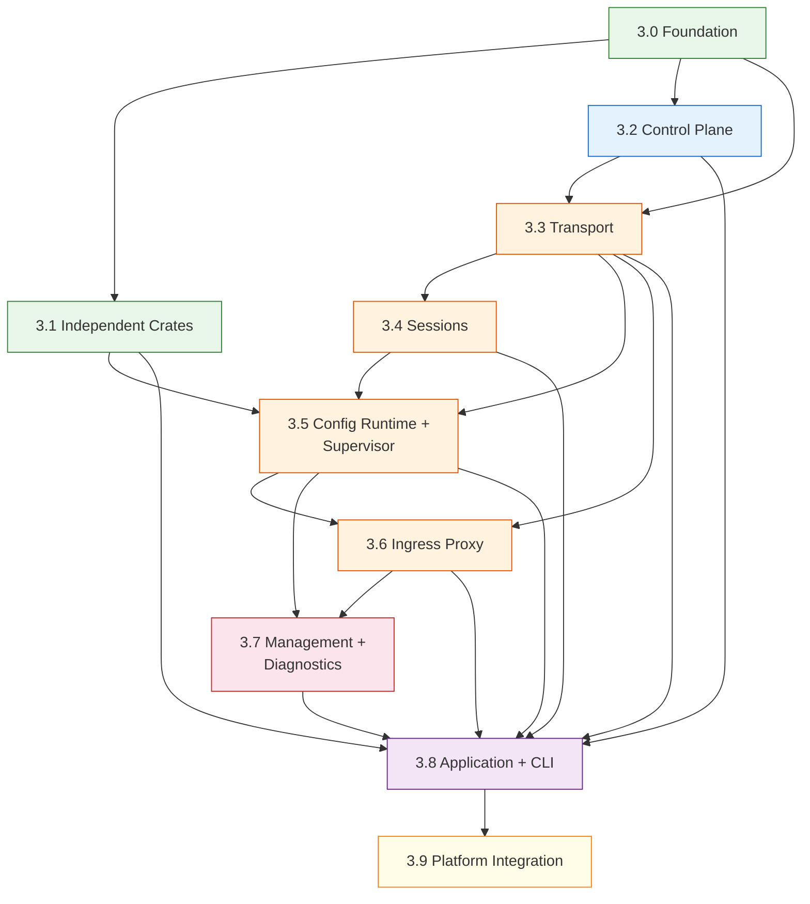

# S2.8 — Stages Plan

| | |
| --- | --- |
| Baseline | cloudflare/cloudflared @ tag `2026.3.0` |
| Phase | 01-RR / S2 - SUBSTRATE |
| S2.8 status | Closed |
| Consumes | [architecture](../architecture.md), [parity-design](../parity-design.md), [scope](../scope.md), [risks](../risks.md), [invariants](../invariants.md) |
| Produces | Per-stage implementation plans with entry/exit gates, crate ordering, parity gates, risk callouts. Inputs to S2.9 environment and S2.10 coherency audit |

This document indexes the phased implementation plan for S3/COOK.
Each stage is bounded by a parity gate — advancement requires all
Must-tier contracts for that stage to be green.

**Session rule:** One crate per session. One stage may span multiple
sessions. Never work on crates from two different stages in one session.

---

## Stage Dependency DAG



---

## Critical Path

The longest dependency chain through the DAG determines the minimum
number of sequential stages before a working binary:

```text
3.0 → 3.3 → 3.4 → 3.5 → 3.6 → 3.8 → 3.9
 │          │      │      │      │
 └── 3.2 ───┘      │      │      └── 3.7
 └── 3.1 ───────────┴──────┴──────────┘
```

Stages 3.1, 3.2, and 3.7 are off the critical path and can overlap
with other stages when session capacity allows.

---

## Parity Gate Policy

**Must-tier contracts gate stage advancement.** Before starting any
crate in stage N+1, all Must-tier contracts assigned to stage N must
be `green` or `skip`. Should-tier contracts do not block advancement
but are tracked for overall coverage.

**Fuzz contracts are continuous.** Fuzz targets run in CI from the
stage they are introduced onward. They never gate advancement but
divergences are logged and triaged.

See [parity-design](../parity-design.md) for the full contract
lifecycle and gate criteria.

---

## Per-Stage Summary

| Stage | Scope | Crates | Must | Should | Skip | Fuzz | Total | Context | Phase doc |
| --- | --- | --- | --- | --- | --- | --- | --- | --- | --- |
| 3.0 | Foundation | 3 | 6 | 0 | 0 | 0 | 6 | Low | [phase-3.0](phase-3.0.md) |
| 3.1 | Independent crates | 7 | 6 | 46 | 11 | 1 | 64 | Medium | [phase-3.1](phase-3.1.md) |
| 3.2 | Control plane | 1 | 10 | 0 | 0 | 0 | 10 | Medium | [phase-3.2](phase-3.2.md) |
| 3.3 | Transport | 2 | 30 | 8 | 6 | 0 | 44 | High | [phase-3.3](phase-3.3.md) |
| 3.4 | Sessions | 1 | 52 | 11 | 0 | 6 | 69 | Critical | [phase-3.4](phase-3.4.md) |
| 3.5 | Config runtime + supervisor | 2 | 1 | 19 | 0 | 0 | 20 | High | [phase-3.5](phase-3.5.md) |
| 3.6 | Ingress proxy | 1 | 37 | 26 | 0 | 1 | 64 | Critical | [phase-3.6](phase-3.6.md) |
| 3.7 | Management + diagnostics | 2 | 6 | 32 | 1 | 0 | 39 | High | [phase-3.7](phase-3.7.md) |
| 3.8 | Application + CLI | 5 | 9 | 2 | 0 | 0 | 11 | Critical | [phase-3.8](phase-3.8.md) |
| 3.9 | Platform integration | 1 | 0 | 0 | 0 | 0 | 0 | Low | [phase-3.9](phase-3.9.md) |
| **Total** | | **25** | **157** | **144** | **18** | **8** | **327** | | |

**Note:** `common-sys` (the 26th crate) is consumed transitively by
stages 3.3, 3.4, and 3.7 but has no standalone parity contracts — its
safe API surface is verified through its consumer crates.

---

## Context Budget Estimates

AI agent context windows are a hard constraint. Every session
accumulates tokens from: doc reads, parity TOMLs, source code,
compiler feedback, conversation history, and tool output overhead.
Empirically the practical session footprint runs **8–10× the static
content minimum** once tool round-trips and conversation growth are
included.

### Agent usable budgets

| Agent class | Context window | Usable budget |
| --- | --- | --- |
| Standard (Copilot) | ~128K tokens | ~80K tokens |
| Extended (Claude Code, Codex) | ~200K tokens | ~120K tokens |

### Risk tiers (against 80K binding constraint)

| Tier | Practical load | Headroom (80K) | Action |
| --- | --- | --- | --- |
| Low | ≤40K | >50% | Single session per crate |
| Medium | 40–80K | 0–50% | Plan → breakdown before entry |
| High | 80–120K | Exceeds 80K | Sub-stage split mandatory; Extended agent recommended |
| Critical | >120K | Exceeds both | Sub-stage split mandatory; pre-built API summaries |

### Per-stage estimates

Static content minimum includes: phase doc, referenced ADRs,
relevant invariants and risks, parity TOML contracts (~150 tokens
per contract), and upstream crate API surface reads. The practical
column applies the ×8 calibration factor.

| Stage | Static min | Practical (×8) | Tier (80K) | Tier (120K) | Sub-stages |
| --- | --- | --- | --- | --- | --- |
| 3.0 | ~5K | ~40K | Low | Low | — |
| 3.1 | ~8K | ~64K | Medium | Low | 5 |
| 3.2 | ~7K | ~56K | Medium | Low | — |
| 3.3 | ~14K | ~112K | High | Medium | 2 |
| 3.4 | ~21K | ~168K | Critical | Critical | 3 |
| 3.5 | ~13K | ~104K | High | Medium | 2 |
| 3.6 | ~20K | ~160K | Critical | Critical | 3 |
| 3.7 | ~12K | ~96K | High | Medium | 2 |
| 3.8 | ~24K | ~192K | Critical | Critical | 3 |
| 3.9 | ~6K | ~48K | Low | Low | — |

### Stage entry protocol

Every stage follows the same entry sequence:

1. **Plan** — Read the phase doc, referenced ADRs, and relevant
   invariants. Confirm the session fits the agent's usable budget.
2. **Breakdown** — For Medium+ stages, split into sub-stages along
   contract domain boundaries. Each sub-stage must fit within the
   agent's usable budget as a standalone session.
3. **Execute** — One sub-stage per session. Carry forward only the
   sub-stage's parity contracts and the crate's public API surface
   from prior sub-stages. Do not reload the full phase doc.

### Sub-stage recommendations

Stages at Medium or above should be broken down before entry.
These breakdowns are recommendations — the cook may adjust based
on actual session measurements.

#### Stage 3.1 — Independent crates (Medium, 5 sub-stages)

| Sub-stage | Crates | Contracts | Domain |
| --- | --- | --- | --- |
| 3.1a | common-signal | 2 Must | Lifecycle signals |
| 3.1b | common-retry | 6 Should | Backoff semantics |
| 3.1c | common-observability, tunnel-metrics | 13 Should, 1 Fuzz | Metrics + tracing |
| 3.1d | common-cfapi, common-token | 2 Must, 25 Should, 11 Skip | Credentials + API |
| 3.1e | config-core | 2 Must | Config parsing |

Sequencing: 3.1a first (dependency), then 3.1b–3.1e in parallel.

#### Stage 3.3 — Transport (High, 2 sub-stages)

| Sub-stage | Crates | Contracts | Domain |
| --- | --- | --- | --- |
| 3.3a | common-sys, tunnel-transport | 13 Must, 3 Should, 6 Skip | QUIC + edge discovery |
| 3.3b | tunnel-connection | 17 Must, 5 Should | Connection lifecycle |

Sequencing: strictly sequential (3.3b depends on 3.3a).

#### Stage 3.4 — Sessions (Critical, 3 sub-stages)

| Sub-stage | Scope | Contracts | Domain |
| --- | --- | --- | --- |
| 3.4a | Datagram encode/decode, muxer registration | ~20 Must | Wire format + muxer |
| 3.4b | Session manager event loop, serve semantics | ~22 Must | State machine |
| 3.4c | Migration, pipes, close, fuzz | ~10 Must, 6 Fuzz | Lifecycle edges |

Sequencing: 3.4a → 3.4b → 3.4c (state machine depends on wire
format; migration depends on state machine).

#### Stage 3.5 — Config runtime + supervisor (High, 2 sub-stages)

| Sub-stage | Crates | Contracts | Domain |
| --- | --- | --- | --- |
| 3.5a | config-runtime | 17 Should | Orchestrator + config authority |
| 3.5b | tunnel-supervisor | 1 Must, 2 Should | HA supervisor + protocol fallback |

Sequencing: parallel (no mutual dependency).

#### Stage 3.6 — Ingress proxy (Critical, 3 sub-stages)

| Sub-stage | Scope | Contracts | Domain |
| --- | --- | --- | --- |
| 3.6a | Ingress rules, origin taxonomy, validation | ~10 Must | Parsing + auth |
| 3.6b | HTTP/WS/TCP proxy dispatch, SOCKS5 | ~21 Must, 1 Fuzz | Protocol dispatch |
| 3.6c | WebSocket carrier, error mapping | ~6 Must | Carrier + errors |

Sequencing: 3.6a → 3.6b → 3.6c (dispatch depends on rule
matching; carrier depends on dispatch).

#### Stage 3.7 — Management + diagnostics (High, 2 sub-stages)

| Sub-stage | Crates | Contracts | Domain |
| --- | --- | --- | --- |
| 3.7a | tunnel-management | 6 Must, 21 Should | Management HTTP + WebSocket |
| 3.7b | host-diagnostic | 11 Should, 1 Skip | System diagnostics |

Sequencing: parallel (no mutual dependency).

#### Stage 3.8 — Application + CLI (Critical, 3 sub-stages)

| Sub-stage | Crates | Contracts | Domain |
| --- | --- | --- | --- |
| 3.8a | operator-cli-common, operator-cli-native | 6 Must, 2 Should | CLI command tree |
| 3.8b | operator-cli-compat, operator-cli | — | Feature-flag diamond |
| 3.8c | app | 3 Must | Binary assembly + startup DAG |

Sequencing: 3.8a → 3.8b → 3.8c. For 3.8c, pre-build an API
surface summary from stages 3.0–3.7 before entering the session
to avoid re-reading all upstream crates.

---

## Parallelism Opportunities

Some stages have no dependency relationship and can proceed
concurrently when session capacity allows:

| Parallel pair | Condition |
| --- | --- |
| 3.1 + 3.2 | Both depend only on 3.0 |
| 3.1 + 3.3 | 3.1 depends on 3.0; 3.3 depends on 3.0 + 3.2 |
| 3.7 alongside 3.6 | 3.7 needs 3.5 + 3.6; can start once 3.6 Must contracts are green |

Within a single stage, crates with no intra-stage dependency can
also be implemented in parallel sessions.

---

## Risk Exposure by Stage

Risks from [risks](../risks.md) concentrated in specific stages:

| Stage | Key risks | Priority |
| --- | --- | --- |
| 3.0 | R1.1 (trait design churn), R1.3 (error enum mapping), R3.1 (error misclassification) | P0/P1 |
| 3.1 | R1.6 (`CustomDuration` round-trip) | P1 |
| 3.3 | R2.1 (unbounded stream fan-out), R2.6 (`!Send` thread pinning), R5.1 (QUIC wire parity) | P0 |
| 3.4 | R2.2 (session migration stale bindings), R2.3 (channel capacity), R3.4 (session close errors) | P1 |
| 3.5 | R4.1 (startup DAG ordering), R4.2 (shutdown race) | P1 |
| 3.6 | R1.1 (trait interface gaps in proxy), R2.4 (goroutine accumulation) | P0/P2 |
| 3.8 | R4.1 (startup DAG integration), R6.1 (scope creep) | P1/P2 |

---

## S2.8 Exit Gate

| Criterion | Status |
| --- | --- |
| Every crate from [architecture](../architecture.md) assigned to exactly one stage | ✅ |
| Every stage has explicit entry and exit conditions | ✅ |
| Every stage lists its Must-tier parity contracts | ✅ |
| Stage dependency DAG is acyclic | ✅ |
| Critical path identified | ✅ |
| Risk callouts traced to [risks](../risks.md) | ✅ |
| Invariant assignments traced to [invariants](../invariants.md) | ✅ |
| All 10 phase docs created | ✅ |
