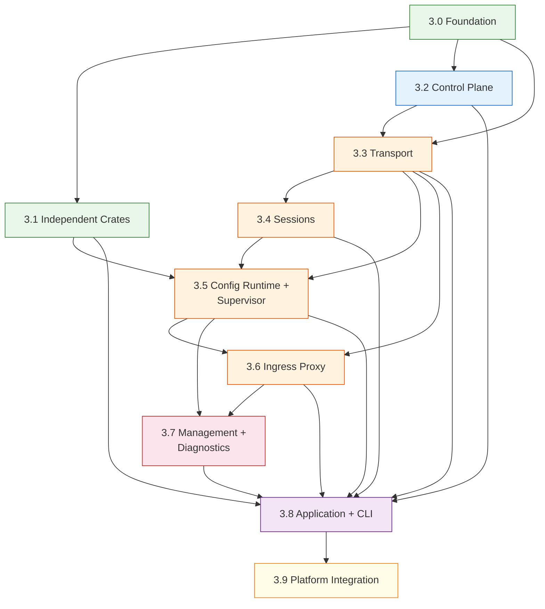

# S2.8 — Stages Plan

| | |
| --- | --- |
| Baseline | cloudflare/cloudflared @ tag `2026.3.0` |
| Phase | 01-RR / S2 - SUBSTRATE |
| S2.8 status | Closed |
| Consumes | [architecture](../architecture.md), [parity-design](../parity-design.md), [scope](../scope.md), [risks](../risks.md), [invariants](../invariants.md) |
| Produces | Per-stage implementation plans with entry/exit gates, crate ordering, parity gates, risk callouts. Inputs to S2.9 environment and S2.10 coherency audit |

This document indexes the phased implementation plan for S3/COOK.
Each stage is bounded by a parity gate — advancement requires all
Must-tier contracts for that stage to be green.

**Session rule:** One crate per session. One stage may span multiple
sessions. Never work on crates from two different stages in one session.

---

## Stage Dependency DAG



---

## Critical Path

The longest dependency chain through the DAG determines the minimum
number of sequential stages before a working binary:

```text
3.0 → 3.3 → 3.4 → 3.5 → 3.6 → 3.8 → 3.9
 │          │      │      │      │
 └── 3.2 ───┘      │      │      └── 3.7
 └── 3.1 ───────────┴──────┴──────────┘
```

Stages 3.1, 3.2, and 3.7 are off the critical path and can overlap
with other stages when session capacity allows.

---

## Parity Gate Policy

**Must-tier contracts gate stage advancement.** Before starting any
crate in stage N+1, all Must-tier contracts assigned to stage N must
be `green` or `skip`. Should-tier contracts do not block advancement
but are tracked for overall coverage.

**Fuzz contracts are continuous.** Fuzz targets run in CI from the
stage they are introduced onward. They never gate advancement but
divergences are logged and triaged.

See [parity-design](../parity-design.md) for the full contract
lifecycle and gate criteria.

---

## Per-Stage Summary

| Stage | Scope | Crates | Must | Should | Skip | Fuzz | Total | Phase doc |
| --- | --- | --- | --- | --- | --- | --- | --- | --- |
| 3.0 | Foundation | 3 | 6 | 0 | 0 | 0 | 6 | [phase-3.0](phase-3.0.md) |
| 3.1 | Independent crates | 7 | 6 | 46 | 11 | 1 | 64 | [phase-3.1](phase-3.1.md) |
| 3.2 | Control plane | 1 | 10 | 0 | 0 | 0 | 10 | [phase-3.2](phase-3.2.md) |
| 3.3 | Transport | 2 | 30 | 8 | 6 | 0 | 44 | [phase-3.3](phase-3.3.md) |
| 3.4 | Sessions | 1 | 52 | 11 | 0 | 6 | 69 | [phase-3.4](phase-3.4.md) |
| 3.5 | Config runtime + supervisor | 2 | 1 | 19 | 0 | 0 | 20 | [phase-3.5](phase-3.5.md) |
| 3.6 | Ingress proxy | 1 | 37 | 26 | 0 | 1 | 64 | [phase-3.6](phase-3.6.md) |
| 3.7 | Management + diagnostics | 2 | 6 | 32 | 1 | 0 | 39 | [phase-3.7](phase-3.7.md) |
| 3.8 | Application + CLI | 5 | 9 | 2 | 0 | 0 | 11 | [phase-3.8](phase-3.8.md) |
| 3.9 | Platform integration | 1 | 0 | 0 | 0 | 0 | 0 | [phase-3.9](phase-3.9.md) |
| **Total** | | **25** | **157** | **144** | **18** | **8** | **327** | |

**Note:** `common-sys` (the 26th crate) is consumed transitively by
stages 3.3, 3.4, and 3.7 but has no standalone parity contracts — its
safe API surface is verified through its consumer crates.

---

## Parallelism Opportunities

Some stages have no dependency relationship and can proceed
concurrently when session capacity allows:

| Parallel pair | Condition |
| --- | --- |
| 3.1 + 3.2 | Both depend only on 3.0 |
| 3.1 + 3.3 | 3.1 depends on 3.0; 3.3 depends on 3.0 + 3.2 |
| 3.7 alongside 3.6 | 3.7 needs 3.5 + 3.6; can start once 3.6 Must contracts are green |

Within a single stage, crates with no intra-stage dependency can
also be implemented in parallel sessions.

---

## Risk Exposure by Stage

Risks from [risks](../risks.md) concentrated in specific stages:

| Stage | Key risks | Priority |
| --- | --- | --- |
| 3.0 | R1.1 (trait design churn), R1.3 (error enum mapping), R3.1 (error misclassification) | P0/P1 |
| 3.1 | R1.6 (`CustomDuration` round-trip) | P1 |
| 3.3 | R2.1 (unbounded stream fan-out), R2.6 (`!Send` thread pinning), R5.1 (QUIC wire parity) | P0 |
| 3.4 | R2.2 (session migration stale bindings), R2.3 (channel capacity), R3.4 (session close errors) | P1 |
| 3.5 | R4.1 (startup DAG ordering), R4.2 (shutdown race) | P1 |
| 3.6 | R1.1 (trait interface gaps in proxy), R2.4 (goroutine accumulation) | P0/P2 |
| 3.8 | R4.1 (startup DAG integration), R6.1 (scope creep) | P1/P2 |

---

## S2.8 Exit Gate

| Criterion | Status |
| --- | --- |
| Every crate from [architecture](../architecture.md) assigned to exactly one stage | ✅ |
| Every stage has explicit entry and exit conditions | ✅ |
| Every stage lists its Must-tier parity contracts | ✅ |
| Stage dependency DAG is acyclic | ✅ |
| Critical path identified | ✅ |
| Risk callouts traced to [risks](../risks.md) | ✅ |
| Invariant assignments traced to [invariants](../invariants.md) | ✅ |
| All 10 phase docs created | ✅ |
